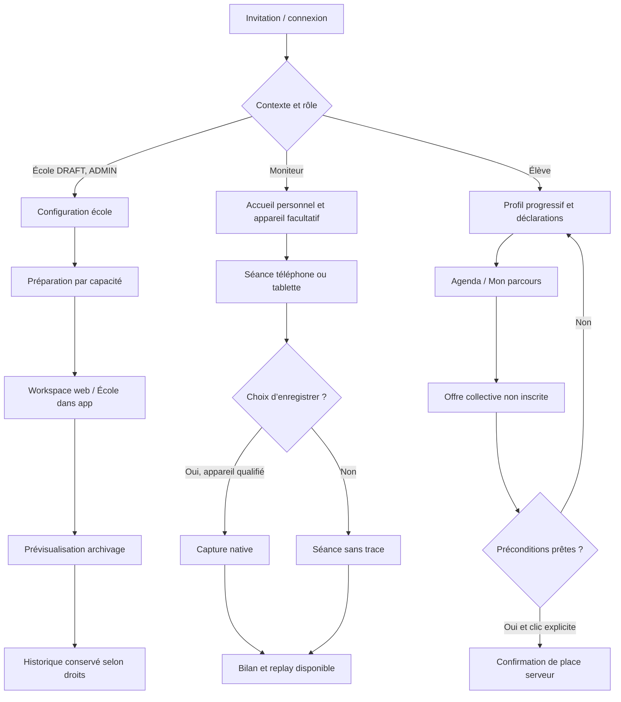

# Architecture de l’information : terrain, apprentissage et gestion

**Illustration courante :** [APPLICATION.html](../DESIGN/APPLICATION.html) reprend ces destinations, sans nouvelle rubrique de premier niveau. Le [registre DS](../DESIGN/composants-usage.json) relie les 49 fiches au même répertoire. Les mêmes composants servent un usage identique ; l’espace élève garde ses projections publiées et ne réutilise jamais un écran privé en masquant seulement ses boutons. La réutilisation visuelle ne remplace pas l’autorisation serveur.

> Drivy · Référence de conception 3.14 · 20 septembre 2026
> Exigences intégrées ; solutions proposées, à valider avant réalisation. [Index](../README.md).

**Parcours carte central :** depuis la séance, le moniteur ouvre « Signaler », choisit un thème puis un statut explicitement enregistrable. Le moment et l’ancre candidate sont ceux de l’ouverture ; rien n’est créé à l’annulation. Les repères sont retrouvables dans le replay privé et repris au bilan après sélection, sans publication ni note automatique. Les détails de [E23/E24](ecrans.md#e23) et de [R46](../03-fonctionnel/regles-etats.md#r46) prévalent sur les schémas anciens plus généraux. Pas de bouton photo live ni de remplacement par une saisie uniquement après la leçon.

## Un produit, trois contextes d’usage

**Sur le terrain**, la leçon et sa relecture priment. **Pour l’élève**, les prochaines étapes, l’agenda et les bilans priment. **Au bureau**, le personnel organise et contrôle ses dossiers en détail. Ces contextes partagent personnes, formations, cours, droits et règles ; le web ne devient pas un autre produit administratif.

## App du personnel, téléphone et tablette

**Séance** : préparer la prochaine leçon, retrouver l’enregistrement actif, terminer/revoir. **Agenda** : engagements individuels/collectifs, publication autorisée. **Élèves** : recherche et dossier pédagogique avec formation choisie. **École** : paramètres, offres, droits et activité selon rôle. Compte et avis dans l’en-tête. Sur tablette, rail et listes/détails remplacent la barre inférieure quand cela aide ; aucune dépendance stricte au format paysage.

La carte est centrale pendant capture/replay, pas un fond décoratif ni une carte vide forcée à l’accueil. Un formateur de cours collectifs retrouve sa prochaine occurrence plutôt qu’un GPS sans utilité.

## Workspace web du personnel

Navigation latérale : **Vue d’ensemble, Agenda, Élèves, Cours, Offres et packs, Activité, Paramètres**. Sections masquées si module inutilisé ou droits absents, et absence confirmée côté API. Le dossier élève en grand écran relie identité, formations, planning, cours, documents, droits et comptes. Les onglets pédagogiques nécessitent leurs autorisations. Archivage et actions de lot ne polluent pas l’écran de conduite.

Le moniteur peut se connecter avec le même compte, sans devenir administrateur. Le web est connecté ; la capture de fond reste une fonction native qualifiée. L’élève dispose d’une entrée web personnelle, pas du workspace de gestion.

## Espace élève dans l’app et le navigateur

**Mes leçons** : dernier bilan publié, replay disponible, objectifs et prochaine séance. **Agenda** : engagements et offres distincts. **Mon parcours** : permis, exigences, documents, achats/règlements propres. L’onboarding peut être réalisé entièrement dans le navigateur avant d’installer l’app ; aucune installation n’est obligatoire pour accepter une invitation ou consulter/s’inscrire à un cours autorisé. Le choix GPS de séance n’est pas absorbé dans l’accueil.

## Entrées et parcours guidés

## Séparation des états visible

Voir une offre ne signifie pas être inscrit. Terminer un onboarding ne signifie pas avoir validé un permis. Archiver n’est ni supprimer ni révoquer. Encaissement n’est pas bénéfice. Refus GPS n’est pas profil incomplet. Les libellés, liens profonds et retours de formulaires doivent maintenir ces distinctions.

## Correspondance

E01–E32 couvrent le cœur existant. E33–E48 ajoutent gestion web, statistiques, étapes d’accueil et diagnostic. [Ecrans](ecrans.md), [parcours](parcours.md), [plateformes](plateformes-tablette-web.md), [wireframes](wireframes.md). Pas de tableau de surveillance des positions, de chat ou de module vide présenté comme disponible.

## Compte indépendant d’une école

Compte et le parcours E49 restent accessibles quand la liste des écoles actives est vide. L’écran « Rejoindre une école » ne remplace pas toute la navigation par un tunnel obligatoire. Le suivi limité après révocation est distinct de l’espace métier : pas de retour vers un dossier par cache ou lien ancien. J29 ne donne aucun pouvoir de suppression globale au web ADMIN scolaire.

## Destinations illustrées et respect des rôles
La consultation d’une leçon depuis l’espace élève reste E14/E04 sous projection élève, puis E09/E24 pour le bilan publié. E22/E23 sont des commandes du personnel, non un détour de navigation commun. Dans le workspace, catalogue scolaire et cours à administrer ne pointent pas vers « Mes achats » et « M’inscrire » de l’élève. Les contrôles serveur demeurent obligatoires même lorsque l’interface masque une commande.

Le sélecteur de rôles/supports des maquettes est un outil de revue hors application. Une fonction non illustrée renvoie à sa spécification et ne simule pas sa disponibilité par un écran d’un autre rôle. [Couverture visuelle](../DESIGN/04-ecrans-reference.md).
