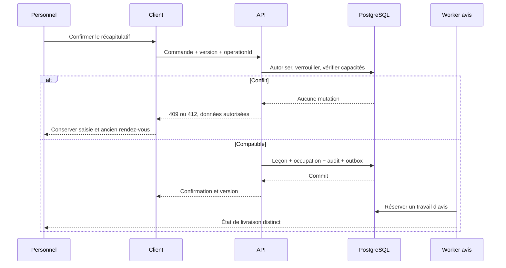

# Parcours de bout en bout et exceptions

> Drivy · Dossier de conception 3.13 · 20 septembre 2026
> Statut : proposition de référence, à valider avant réalisation. [Index](../README.md).

**Parcours carte central :** depuis la séance, le moniteur ouvre « Signaler », choisit un thème puis un statut explicitement enregistrable. Le moment et l’ancre candidate sont ceux de l’ouverture ; rien n’est créé à l’annulation. Les repères sont retrouvables dans le replay privé et repris au bilan après sélection, sans publication ni note automatique. Les détails de [E23/E24](ecrans.md#e23) et de [R46](../03-fonctionnel/regles-etats.md#r46) prévalent sur les schémas anciens plus généraux. Pas de bouton photo live ni de remplacement par une saisie uniquement après la leçon.

## Vue d’ensemble

Les parcours décrivent une chaîne de valeur et les responsabilités, pas une succession décorative d’écrans. Les règles sont dans [R01–R108](../03-fonctionnel/regles-etats.md). Les exemples ci-dessous utilisent des personnes fictives et ne sont pas issus d’une base de production.

## J01 · Accueillir une nouvelle personne

**Acteurs :** ADMIN ou moniteur habilité, puis élève. **Fonctions :** F01 F02 F03 F09 F11 F13. **Chemin :** E01 → E16 → E02 → E07 → E20.

**Déroulement et résultat :** L’école prépare son offre et ses accès. Elle invite l’élève, qui accepte sous la bonne identité et voit l’information sur ses données. L’ADMIN ouvre la première formation et affecte un moniteur ; un moniteur seul n’obtient pas un droit implicite sur un dossier seulement parce qu’il a envoyé l’invitation. La pièce de permis est déposée ou examinée physiquement, puis contrôlée par une personne habilitée. Le résultat observable est un dossier correctement rattaché et une formation identifiable, pas une autorisation de conduire délivrée par Drivy.

**Interruptions et exceptions :** Invitation expirée, adresse différente, double acceptation, pièce illisible, contrôleur non habilité, offre sans référentiel, élève déjà présent. Une étape incomplète conserve son statut et son responsable. La réservation peut être préparée avec alerte permis, sans transformer l’absence de pièce en approbation.

## J02 · Fixer un engagement compatible

**Acteurs :** Moniteur ou ADMIN. **Fonctions :** F03 F04 F05 F11. **Chemin :** E03/E07 → E05 → E04.

**Déroulement et résultat :** Choisir formation puis moniteur, date, durée, lieu et prix convenu. Examiner les créneaux calculés. Confirmer après récapitulatif. Le serveur vérifie à nouveau sous transaction. L’utilisateur reçoit un rendez-vous versionné ; l’élève reçoit une entrée in-app et un avis email séparément suivi.

**Interruptions et exceptions :** Course sur le dernier créneau, collision élève multi-permis, fermeture ajoutée, changement de droits, réponse réseau perdue. La saisie est conservée en cas de refus et l’app ne crée pas une seconde réservation pour compenser une réponse inconnue.

## J03 · Préparer, conduire puis partager une prochaine étape

**Acteurs :** Moniteur et élève. **Fonctions :** F06 F07 F08 F10 F11. **Chemin :** E14/E04 → conduite hors interaction → E08 → E09/E15.

**Déroulement et résultat :** Avant la leçon et à l’arrêt : consulter permis, dernier bilan et souhait ; préparer quelques objectifs. Pendant la conduite : aucune interaction obligatoire avec l’app. Après, véhicule stationné : constater les heures réelles, rédiger le bilan, observer seulement les compétences pertinentes, puis publier connecté. L’élève lit une prochaine étape concrète et le bilan source ; un éventuel règlement reste une dimension indépendante.

**Interruptions et exceptions :** Pas de bilan précédent, leçon passée non renseignée, compétence non observée, pièce en cours de transfert, contrôle de permis encore en anomalie. Le fait réel est enregistré sans maquiller l’anomalie. Le moniteur ne doit pas remplir toute une grille pour pouvoir publier.

## J04 · Déplacer ou annuler sans perdre la trace

**Acteurs :** Personnel habilité. **Fonctions :** F04 F05 F11. **Chemin :** E03 → E04 → E05 → E04.

**Déroulement et résultat :** Convenir du changement hors app au pilote. Ouvrir le rendez-vous et choisir déplacer ou annuler. Montrer avant/après ou motif. La confirmation de déplacement est atomique ; l’annulation conserve la leçon et son historique. Les destinataires reçoivent l’état confirmé, pas une proposition trompeuse.

**Interruptions et exceptions :** Conflit au nouveau créneau : ancien conservé. Échec email : rendez-vous confirmé mais avis en attente. Annulation après réalisation : commande de correction distincte, pas simple bouton. Aucune pénalité automatique.

## J05 · Récupérer un bilan après perte du réseau

**Acteurs :** Moniteur mobile. **Fonctions :** F07 F08 F12. **Chemin :** E08 → E17 → E21 si conflit → E08.

**Déroulement et résultat :** Écrire dans un brouillon durable sur l’appareil. L’état précise qu’aucune publication n’a encore eu lieu. Au retour réseau, renouveler la session et valider les droits avant de transmettre. L’opération retrouve son résultat ou devient un conflit explicite. Le moniteur vérifie la version serveur avant publication.

**Interruptions et exceptions :** App tuée, disque plein, lease expirée, leçon annulée ailleurs, rôle retiré ou bilan déjà publié par un remplaçant. Une révocation ne permet pas l’export libre des notes ; une panne de disque n’autorise pas un faux message enregistré.

## J06 · Accompagner deux permis sans mélanger les acquis

**Acteurs :** Élève et moniteur. **Fonctions :** F03 F06 F08. **Chemin :** E06 → E07 → E04/E15.

**Déroulement et résultat :** La personne est unique, les formations sont distinctes. Choisir explicitement B ou une autre offre activée. La prochaine leçon, le document de permis et les observations suivent la formation choisie. Le titre rappelle la catégorie dans l’éditeur et la version élève.

**Interruptions et exceptions :** Changement de formation alors qu’un brouillon est ouvert : garder son rattachement et demander de revenir au contexte correct. Aucune moyenne entre permis, aucune pièce approuvée automatiquement par analogie, collision de planning contrôlée au niveau élève dans l’école.

## J07 · Déposer puis partager une pièce

**Acteurs :** Élève ou personnel autorisé. **Fonctions :** F03 F08 F09. **Chemin :** E10/E20 → transfert → E10/E08.

**Déroulement et résultat :** Choisir finalité et audience, sélectionner le fichier, suivre transfert puis analyse. READY autorise consultation et rattachement. Une photo de bilan se partage explicitement à la publication ou à une révision ; un document de permis suit son contrôle séparé.

**Interruptions et exceptions :** Permission photo refusée, format invalide, malware, interruption, objet absent, droit retiré. La version texte d’un bilan peut être publiée sans attendre une photo, en montrant qu’elle a été exclue. Pas de lien partagé vers la zone de quarantaine.

## J08 · Rapprocher un règlement et corriger une erreur

**Acteurs :** ADMIN ou moniteur habilité, élève en lecture. **Fonctions :** F07 F10 F11. **Chemin :** E04 → E11.

**Déroulement et résultat :** Lire charge actuelle et encaissements nets. Enregistrer le montant réellement reçu et son mode externe. Confirmer ; le solde est recalculé sous verrou. Pour corriger, retrouver l’écriture source, préparer contre-écriture et bonne écriture, puis confirmer avec motif.

**Interruptions et exceptions :** Double clic, paiement partiel, remboursement trop grand, deux employés simultanés, prix réduit après encaissement, ancienne donnée paid=true sans montant. Ne pas inventer une valeur manquante ; utiliser une anomalie de migration à rapprocher.

## J09 · Remplacer un moniteur et retirer ses accès

**Acteurs :** ADMIN et moniteurs concernés. **Fonctions :** F01 F03 F12 F13. **Chemin :** E13 → E07 → E17.

**Déroulement et résultat :** Lister les formations, prochaines leçons et brouillons dépendant du moniteur. Affecter le remplaçant et réaffecter les leçons. Transférer explicitement la responsabilité des brouillons nécessaires. Retirer ensuite les accès, incrémenter epoch et invalider la projection au prochain échange.

**Interruptions et exceptions :** Révocation urgente, dernier ADMIN, moniteur hors ligne, conflit d’agenda du remplaçant. Les conséquences sont prévisualisées ; l’administration seule ne lit pas automatiquement les bilans. L’app reconnaît la limite d’effacement d’un appareil déconnecté.

## J10 · Clore la relation et traiter une demande de données

**Acteurs :** Élève, ADMIN, responsable de traitement. **Fonctions :** F14. **Chemin :** E18 → instruction → réponse/export.

**Déroulement et résultat :** Créer une demande et vérifier la portée. Examiner les rendez-vous futurs, la comptabilité et les données de tiers. Fournir l’accès ou la rectification ; décider de l’effacement et des éléments à conserver avec justification. Archiver la relation sans toucher aux autres écoles ; purge technique et tombstones suivent la décision.

**Interruptions et exceptions :** Demande d’un parent non habilité, identité non vérifiée, obligation de conservation, sauvegardes, plusieurs écoles. Aucune réponse automatique ne promet une suppression totale ; les motifs et responsables restent consultables.

## J11 · Revenir après interruption de session

**Acteurs :** Tous. **Fonctions :** F01 F12. **Chemin :** E01 → E02 → destination autorisée.

**Déroulement et résultat :** Une session expirée ramène au parcours de connexion sans perdre un brouillon local encore autorisé. Le retour restaure la destination après contrôle de l’école et de l’objet, pas avant. Le lien ne contient pas les données métier en clair.

**Interruptions et exceptions :** Compte différent de celui du brouillon, fournisseur indisponible, école archivée, lien obsolète. Offrir une sortie vers les espaces autorisés ; ne jamais afficher un aperçu sensible pour expliquer pourquoi l’accès est refusé.

## Séquence de réservation et de changement

## Frontière de sécurité en situation de conduite

La maquette ne doit pas inciter à saisir pendant que l’élève conduit. Les essais de prototype se déroulent à l’arrêt. Ne pas tester une interface de saisie avec un conducteur engagé dans la circulation. Le GPS du cœur est préparé avant départ ; collecte passive, état explicite et interruptions visibles. Il ne justifie aucune saisie obligatoire en mouvement. Voir J12/J13.

## J12 · Réaliser une leçon avec capture

**Fonctions :** F06 F07 F15 F16 F17. **Écrans :** E22 E04 E23 E08 E24.

**Préconditions :** Moniteur affecté, élève informé et choix compatible, autorisation en ligne.

**Parcours :** Préparer objectifs → autoriser la capture → démarrer sur appareil → collecter par segments → mémoriser un moment ou qualifier thème/statut lors d’un arrêt adapté → conserver les observations privées → arrêter localement → terminer la leçon → retrouver les observations déjà saisies, qualifier les repères et sélectionner explicitement les éléments du bilan → publier.

**Variantes et erreurs :** Refus système : J13 ; app tuée : rupture visible ; upload retardé : bilan publiable sans trajet, ajout ultérieur par nouvelle révision.

**État final vérifiable :** Une leçon réalisée, droits décomptés une seule fois, trace complète/partielle fidèle et accès publié seulement après décision.

**Règles :** [référence normative](../03-fonctionnel/regles-etats.md). **Recette :** [scénarios détaillés](../05-realisation/tests-recette.md).

**Complément V3.7 :** ignorer pour cette leçon les mesures antérieures à son segment, afficher l’attente du premier point réellement sauvegardé et ne pas réécrire leur horodatage. Les batches valides transférés tard restent admis selon R111.

## J13 · Réaliser sans enregistrement

**Fonctions :** F07 F08 F15 F16 F17. **Écrans :** E22 E04 E08 E09.

**Préconditions :** Choix élève ou moniteur, ou absence de permission/réseau initial.

**Parcours :** Choisir sans enregistrement → consulter objectifs → conduire → ajouter une observation textuelle thème/statut lors d’un arrêt adapté, sans GPS → constater réalisation → rédiger/publier bilan.

**Variantes et erreurs :** Changement de choix pendant la leçon : capture seulement après nouvelle procédure explicite et autorisée, jamais reconstitution rétroactive.

**État final vérifiable :** Aucun point collecté dans le mode sans suivi ; mêmes droits pédagogiques et commerciaux.

**Règles :** [référence normative](../03-fonctionnel/regles-etats.md). **Recette :** [scénarios détaillés](../05-realisation/tests-recette.md).

**Exception couverte V3.6 :** aucune capture mais annotations textuelles sélectionnées ; publication par AP54 avec captureSelection=null et snapshot autonome. Aucun écran de permission GPS nécessaire.

## J14 · Publier une série de sensibilisation

**Fonctions :** F13 F18 F19 F11. **Écrans :** E03 E27 E26.

**Préconditions :** Personnel MANAGE_COURSES, profil approuvé, produit et ressources.

**Parcours :** Créer série → saisir tous les blocs et capacité → vérifier aperçu/prix/audience → publier atomiquement → offres visibles → campagne ciblée.

**Variantes et erreurs :** Salle/moniteur occupé, profil non validé ou date passée : brouillon intact et message précis.

**État final vérifiable :** Offre publiée sans inscription automatique, audience et notifications différenciées.

**Règles :** [référence normative](../03-fonctionnel/regles-etats.md). **Recette :** [scénarios détaillés](../05-realisation/tests-recette.md).

## J15 · Découvrir et réserver une place

**Fonctions :** F18 F19 F17. **Écrans :** E25 E26 E30.

**Préconditions :** Élève actif, exigence vérifiée, réseau et conditions acceptables.

**Parcours :** Ouvrir agenda/notification → consulter toutes dates → choisir droit ou tarif → confirmer inscription → serveur contrôle la dernière place → engagements visibles.

**Variantes et erreurs :** Complet, prix changé, doublon, conflit horaire ou droit insuffisant : aucun état partiel ; réessai idempotent.

**État final vérifiable :** Une place, toutes les occurrences et un seul HOLD/compte, même après double clic.

**Règles :** [référence normative](../03-fonctionnel/regles-etats.md). **Recette :** [scénarios détaillés](../05-realisation/tests-recette.md).

## J16 · Gérer une modification ou annulation

**Fonctions :** F18 F19 F10 F17. **Écrans :** E27 E31 E26.

**Préconditions :** Cours publié, auteur habilité ; ou élève inscrit dans son délai.

**Parcours :** Contrôler impacts → déplacer atomiquement ou annuler → notifier les inscrits → reconfirmation ou libération des places et compensations.

**Variantes et erreurs :** Conflit avec un engagement d’un participant : changement refusé ; absence de réponse : place conservée.

**État final vérifiable :** Aucune disparition silencieuse ni remboursement inventé.

**Règles :** [référence normative](../03-fonctionnel/regles-etats.md). **Recette :** [scénarios détaillés](../05-realisation/tests-recette.md).

## J17 · Valider une présence et une exigence

**Fonctions :** F18 F03 F09 F17. **Écrans :** E28 E15 E10.

**Préconditions :** Formateur de l’occurrence, inscrit résolu et preuves nécessaires.

**Parcours :** Marquer chaque présence → consommer droit selon politique à première présence → vérifier tous les blocs → valider l’exigence avec preuve.

**Variantes et erreurs :** Absence/partiel : aucune validation globale ; preuve externe soumise : contrôle humain sans débit fictif.

**État final vérifiable :** Présences, accomplissement et paiement restent distincts ; cible des prochaines annonces actualisée.

**Règles :** [référence normative](../03-fonctionnel/regles-etats.md). **Recette :** [scénarios détaillés](../05-realisation/tests-recette.md).

**Clôture V3.6 :** après tous les blocs, traiter les HOLD sans première présence par décisions RELEASE explicites. Ne pas forcer PRESENT ; conflit si un relevé change. Les absences, conditions et suivis financiers restent conservés.

**Complément V3.7 :** corriger un fait après libération du droit suit R109, puis validation sur les vraies preuves R110. Le responsable résout le droit sans créer une présence ; le formateur peut corriger le fait sans créer un débit. Tests T351–T370.

## J18 · Acheter et utiliser un pack composite

**Fonctions :** F13 F17 F10 F05 F18. **Écrans :** E29 E30 E05 E26 E11.

**Préconditions :** Produits/conditions versionnés et bénéficiaire résolu.

**Parcours :** Choisir composants → confirmer achat/prix → enregistrer paiement selon politique → accorder droits → réserver une prestation → consommer ou libérer selon événement.

**Variantes et erreurs :** Deux usages du dernier droit : un succès ; nouvelle grille : achats antérieurs inchangés ; formation externe : pas de consommation.

**État final vérifiable :** Pas de double facturation ni mélange entre conduite, sensibilisation et examen.

**Règles :** [référence normative](../03-fonctionnel/regles-etats.md). **Recette :** [scénarios détaillés](../05-realisation/tests-recette.md).

**Complément V3.6 :** calculer base+options avant vente ; montrer toute dérogation approuvée. Plus tard, la remise d’un accès théorique ou de l’accompagnement examen consomme le droit par AP199, sans fictive leçon ni second encaissement.

## J19 · Configurer l’école sur le web

**Acteurs :** ADMIN invité comme responsable. **Fonctions :** F01 F13 F17 F20. **Chemin :** E01 → E38 → E39 → E33.

**Déroulement et résultat :** L’école DRAFT existe via une invitation opérateur. Le responsable confirme identité et contact, choisit les catégories validées qu’il propose, configure une offre de conduite et ses horaires. Il laisse les packs ou cours non utilisés désactivés, renseigne la politique de données et consulte le résumé. L’activation utilise activationReady, calculé avant ACTIVE ; après activation serveur, le workspace présente les capacités prêtes et les compléments requis.

**Interruptions et exceptions :** Une catégorie sans référentiel ou un prix vide reste brouillon. Perte de session : reprise au dernier enregistrement serveur. Deux administrateurs modifiant le même paramètre reçoivent un conflit, sans réécriture des engagements historiques.

**Règles :** R73 R74 R75 R76 R99 R100. Les recettes associées sont indexées dans la [traçabilité](../06-gouvernance/tracabilite.md).

## J20 · Accueillir un moniteur sur sa tablette

**Acteurs :** INSTRUCTOR invité. **Fonctions :** F01 F02 F15 F21. **Chemin :** E02 → E47 → E44 → E22.

**Déroulement et résultat :** Le moniteur accepte son invitation dans son propre compte, confirme les informations utiles, découvre les rôles accordés et ses élèves affectés. Il prépare son appareil à l’arrêt ; le diagnostic explique la différence réseau/localisation, vérifie la qualification et demande les permissions au bon moment. Il arrive dans Séance, en composition tablette.

**Interruptions et exceptions :** Il n’a pas à reconfigurer l’école ni à acheter une offre. Appareil non qualifié : agenda, dossiers et séances sans capture restent disponibles. Refuser la localisation ne retire pas le rôle INSTRUCTOR.

**Règles :** R80 R82 R83 R84 R85 R97. Les recettes associées sont indexées dans la [traçabilité](../06-gouvernance/tracabilite.md).

## J21 · Accepter l’invitation élève dans le navigateur puis continuer dans l’app

**Acteurs :** LEARNER. **Fonctions :** F01 F02 F03 F09 F21. **Chemin :** E02 → E40 → E41 → E42 → E43 → E14.

**Déroulement et résultat :** L’élève s’identifie, confirme son école, renseigne prénom et nom, choisit la formation souhaitée parmi les offres activées et déclare les cours déjà suivis. Les données conditionnelles sont expliquées ; la photo est skippable. Une fois l’état minimal confirmé, il accède au calendrier et à son parcours. En ouvrant l’app avec le même compte, le serveur restitue ses étapes, sans second dossier.

**Interruptions et exceptions :** La catégorie souhaitée est en attente de validation. Une pièce déposée n’est pas approuvée. L’email de connexion et les contacts scolaires ne se remplacent pas mutuellement. Aucun choix GPS de séance n’est pré-coché par le wizard.

**Règles :** R76 R77 R78 R79 R80 R100. Les recettes associées sont indexées dans la [traçabilité](../06-gouvernance/tracabilite.md).

## J22 · Rejoindre une deuxième auto-école

**Acteurs :** Personne déjà membre de A, invitée dans B. **Fonctions :** F01 F02 F03 F21. **Chemin :** E02 → E40 → E41 → E43.

**Déroulement et résultat :** Après acceptation pour B, Drivy ouvre un dossier scolaire distinct. L’élève voit qui recevra les données et peut reprendre explicitement des coordonnées personnelles adéquates. Formations, pièces, packs, permissions et publications de A ne sont pas copiés. Le sélecteur d’école reste explicite.

**Interruptions et exceptions :** Homonyme non fusionné. Le personnel de B ne découvre pas les appartenances à A. Refuser B ne révoque pas A. Un permis choisi dans B exige validation dans B.

**Règles :** R01 R03 R78 R79. Les recettes associées sont indexées dans la [traçabilité](../06-gouvernance/tracabilite.md).

## J23 · Conduire avec une tablette sans perdre la séance au redimensionnement

**Acteurs :** INSTRUCTOR et élève. **Fonctions :** F07 F12 F15 F16. **Chemin :** E22 → E44 → E23 → E24 → E08.

**Déroulement et résultat :** Avant départ, choisir la leçon, confirmer le choix de l’élève et lancer sur un appareil qualifié. La carte et les objectifs se disposent en panneaux. Un passage portrait/paysage ou fenêtre étroite réorganise l’UI sans modifier captureId. À l’arrêt, terminer la capture puis constater la leçon ; revoir seulement les points disponibles et publier le bilan.

**Interruptions et exceptions :** Réseau perdu : continuer la capture déjà autorisée jusqu’à sa limite, queue chiffrée. Une autre tablette ne prend pas automatiquement le relais. Une coupure système donne trace partielle et reste expliquée, non reconstituée.

**Règles :** R41 R42 R43 R82 R83 R84 R85. Les recettes associées sont indexées dans la [traçabilité](../06-gouvernance/tracabilite.md).

## J24 · Archiver puis réouvrir un dossier sur le web

**Acteurs :** ADMIN ou moniteur délégué et affecté. **Fonctions :** F03 F10 F14 F22. **Chemin :** E34 → E35 → E36 → E35 → E37.

**Déroulement et résultat :** Le personnel distingue clôture de formation et archivage, résout les engagements et vérifie les soldes. L’aperçu énumère blocages et droits résiduels ; l’archivage confirmé retire le dossier des listes actives. L’élève conserve son historique si son appartenance est active. Restaurer plus tard réactive seulement le dossier administratif.

**Interruptions et exceptions :** Un solde positif, une inscription future, une formation ACTIVE/PAUSED ou un remboursement restant à traiter, même à solde nul, bloque. Aucune annulation, remise ou expiration de droit n’est faite en cachette. Une appartenance révoquée reste révoquée après restauration.

**Règles :** R87 R88 R89 R91. Les recettes associées sont indexées dans la [traçabilité](../06-gouvernance/tracabilite.md).

## J25 · Archiver un lot avec un changement concurrent

**Acteurs :** Personnel délégué. **Fonctions :** F12 F14 F22. **Chemin :** E34 → E36 → E34.

**Déroulement et résultat :** Sélectionner explicitement jusqu’à 50 dossiers, demander l’aperçu, retirer les lignes bloquées, confirmer celles éligibles. Le worker recontrôle droits, versions et dépendances par ligne. La page affiche chaque résultat et garde les lignes en échec sélectionnables pour réexamen, pas pour un envoi automatique.

**Interruptions et exceptions :** Un rendez-vous ajouté entre aperçu et traitement bloque sa ligne. Les autres peuvent réussir ; statut PARTIAL. Perte de réponse : retrouver le job par son identifiant ou operationId, sans créer un nouveau lot.

**Règles :** R11 R12 R88 R90 R95. Les recettes associées sont indexées dans la [traçabilité](../06-gouvernance/tracabilite.md).

## J26 · Comprendre l’activité et exporter un résultat

**Acteurs :** ADMIN, personnel habilité ou moniteur en scope SELF. **Fonctions :** F10 F17 F22 F23. **Chemin :** E33 → E45 → E46.

**Déroulement et résultat :** Choisir période et filtres compatibles. Lire définition, unité et date de calcul ; distinguer séances réalisées, places occupées et montants encaissés. Un achat de pack est compté une seule fois au paiement. Pour exporter, confirmer jeu, colonnes et périmètre ; attendre le job et télécharger avec contrôle d’accès courant.

**Interruptions et exceptions :** Aucun résultat financier sans grant. Une ventilation par moniteur non documentée reste indisponible. Correction du journal rend le recalcul explicite. Export trop grand, droits retirés ou job expiré : pas de fichier servi.

**Règles :** R92 R93 R94 R95 R96. Les recettes associées sont indexées dans la [traçabilité](../06-gouvernance/tracabilite.md).

## J27 · Compléter seulement ce qui manque avant une inscription

**Acteurs :** Élève arrivé par notification de cours. **Fonctions :** F18 F19 F21. **Chemin :** E26 → E40/E41 → E43 → E26.

**Déroulement et résultat :** L’élève consulte toutes les dates du cours. Si un champ justifié manque pour cette action, le formulaire explique finalité et contexte ; les données déjà adéquates sont préremplies. Après sauvegarde, retour à la série actualisée. Il confirme personnellement S’inscrire ; le serveur arbitre la place.

**Interruptions et exceptions :** Photo non fournie et GPS refusé ne bloquent jamais. Une place peut disparaître pendant le formulaire : Complet, aucun droit immobilisé. Une attestation déclarée comme existante attend contrôle, sans qualification automatique.

**Règles :** R77 R79 R81 R98 R99 R100. Les recettes associées sont indexées dans la [traçabilité](../06-gouvernance/tracabilite.md).

## J28 · Reprendre un onboarding après modification de politique

**Acteurs :** Élève et école. **Fonctions :** F13 F20 F21. **Chemin :** E48 → E40 → E43.

**Déroulement et résultat :** L’ADMIN publie une politique versionnée avec finalité et date d’effet. Au retour de l’élève, Drivy compare les prérequis réellement applicables, conserve les champs déjà adéquats et ne demande que le complément utile à une action future. Un formulaire ouvert sur un autre appareil revalide sa version avant sauvegarde.

**Interruptions et exceptions :** Le système ne réécrit pas une acceptation passée et ne marque pas un cours accompli comme non accompli. L’élève peut continuer les usages sans ce complément ; une étape globale de collecte forcée est refusée.

**Règles :** R75 R76 R77 R81 R99 R100. Les recettes associées sont indexées dans la [traçabilité](../06-gouvernance/tracabilite.md).

## Continuité des parcours antérieurs

J01 se poursuit désormais par J21/J22 : l’acceptation de l’invitation ouvre le profil progressif avant la validation de formation F03. J03 décrit la séance sans capture ; J12 et J23 décrivent la capture facultative téléphone/tablette. Les parcours collectifs de V2 restent applicables sur app et web ; la fin d’onboarding ne les exécute pas automatiquement.

## Variantes de reprise rattachées aux parcours existants

Les parcours d’inscription et d’achat gardent la même intention à travers un résultat PENDING ; ceux de déplacement font accepter les effets commerciaux quand la durée change. Les parcours de cours séparent révision de l’offre future et conditions déjà acceptées ; la saisie de présence choisit le cycle courant. Les [scénarios V3.2](../05-realisation/tests-recette.md#t261) couvrent ces variantes, sans les transformer en nouvelles fonctionnalités autonomes.

## J29 · Demander une suppression globale et garder un suivi limité

**Acteur :** personne propriétaire, avec zéro, une ou plusieurs écoles. **Fonctions :** F01/F14. **Chemin :** E19 → E49 → authentification système → aperçu → confirmation → demande reçue → suivi.

**Nominal :** la personne comprend conséquences et traitement, obtient un aperçu courant, confirme et reçoit une demande SUBMITTED. Elle peut retirer avant PROCESSING. Après révocation de la session ordinaire, un reçu limité permet de suivre sans accéder aux données métier. Le passage COMPLETED attend les traitements réellement réconciliés.

**Exceptions :** aucune école active n’empêche d’ouvrir Compte ; dette et dernier ADMIN provoquent une coordination, pas un formulaire refusé. Un changement d’école dans l’aperçu impose une nouvelle lecture ; un timeout reprend la même clé. La perte de réseau, du reçu ou une panne de prestataire ne fabrique pas de succès. Le support ne devient pas propriétaire de l’école. Les rétentions nécessaires sont expliquées, pas dissimulées derrière « toutes vos données effacées ».

**Règles et recette :** [R103/R104](../03-fonctionnel/regles-etats.md#r103), T298–T310. La durée et le mode de continuité du dernier ADMIN nécessitent validation avant utilisation réelle.

**Complément V3.6 :** toutes les appartenances appartiennent au manifeste confirmé, même au-delà d’une page. Continuité du dernier ADMIN vérifiée avant révocation globale, sans empêcher le dépôt de demande.

