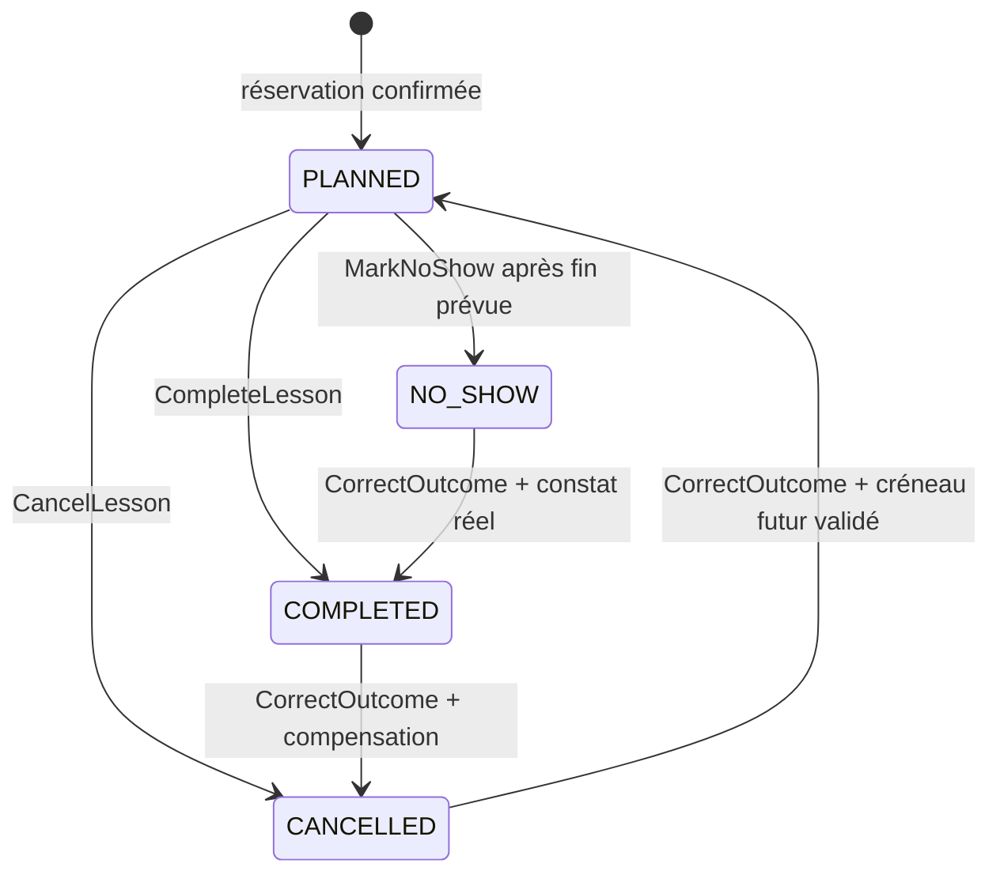
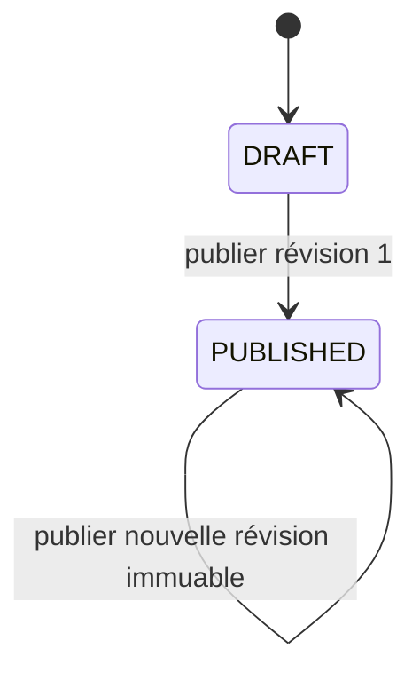
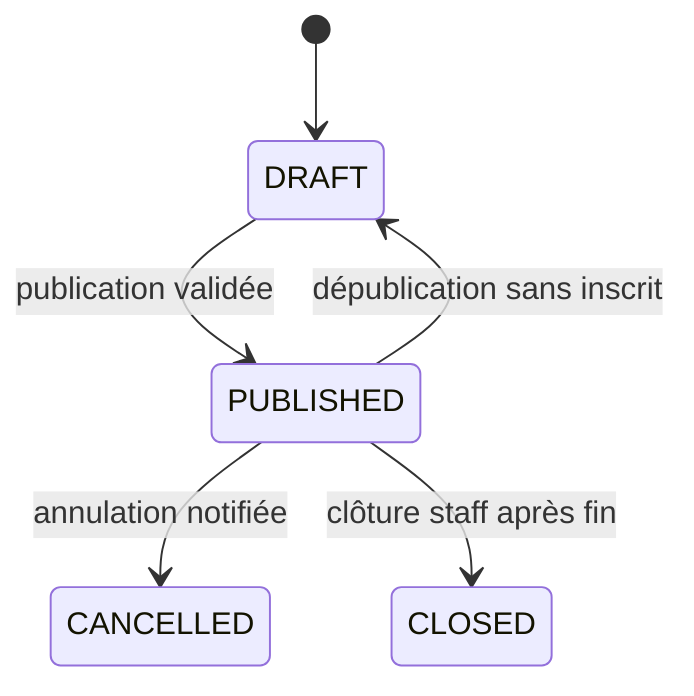
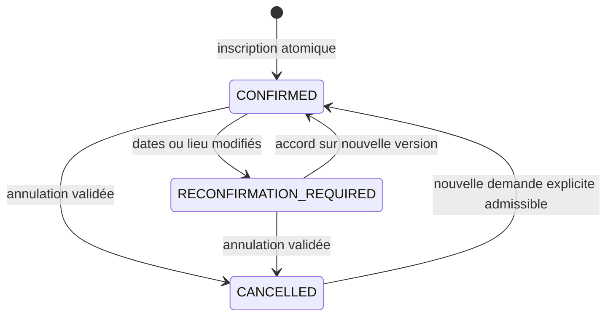

# Règles métier et machines à états

> Drivy · Dossier de conception 3.13 · 20 septembre 2026
> Statut : proposition de référence, à valider avant réalisation. [Index](../README.md).

## Autorité de ce document

Les règles ci-dessous constituent **l’unique référence normative proposée** pour le pilote. Les autres documents les citent et donnent des exemples ; ils ne créent pas de variantes implicites. Les exigences de la consigne sont validées par le porteur ; les choix métier ci-dessous restent des recommandations à approuver. Modifier une règle exige d’actualiser les tests et décisions concernés.

Les codes sont stables, même si le texte change. Les paramètres chiffrés sont des valeurs proposées pour cadrer la réalisation, non des statistiques, contraintes légales ou engagements de service acquis.

## R01 · Isolation école

Chaque objet métier scolaire porte schoolId ; Person et les commandes globales d’identité restent explicitement hors de ce périmètre scolaire. Une relation ne peut relier deux écoles. Toute lecture, écriture, URL de document et tâche asynchrone contrôle le contexte ; un identifiant fourni par le client ne suffit jamais. Une demande hors périmètre renvoie NOT_FOUND sans confirmer l’existence.

**Application :** Serveur, clés étrangères composites, politiques RLS. **Fonctions :** F01 F09 F14. Les tests correspondants sont indexés dans la [traçabilité](../06-gouvernance/tracabilite.md).

## R02 · Autorisation courante

L’identité provient du fournisseur ; les droits métier sont relus dans Drivy au traitement de chaque commande. Le rôle inclus dans un ancien token n’autorise pas une opération. Les décisions combinent rôle, école, affectation à une formation, état de l’objet et finalité. Refus par défaut.

**Application :** Service d’autorisation ; tests de matrice. **Fonctions :** F01 F03 F13. Les tests correspondants sont indexés dans la [traçabilité](../06-gouvernance/tracabilite.md).

**Frontière de révocation :** les droits ne sont pas seulement lus avant attente d’un verrou métier. Dans une mutation, verrouiller/lire la version de l’appartenance et des délégations avant les effets puis la conserver jusqu’au commit ; la révocation prend un verrou incompatible. Une commande ordonnée avant la révocation peut finir avant elle, jamais commiter après son effet en réutilisant un contrôle périmé. Tous les services respectent [l’ordre global](../04-technique/transactions-v2.md#autorisation-et-commit). Il s’agit d’un invariant à tester, pas d’une vulnérabilité reproduite.

## R03 · Personne et relations

Une personne peut appartenir à plusieurs écoles et cumuler des rôles au sein d’une école. Le dossier élève et ses formations appartiennent à une seule école. Une adresse email vérifiée aide à l’identification ; elle ne permet jamais à une école de découvrir toutes les autres appartenances.

**Application :** Identité ; modèle relationnel. **Fonctions :** F01 F02. Les tests correspondants sont indexés dans la [traçabilité](../06-gouvernance/tracabilite.md).

## R04 · Dernier administrateur

Une école active garde au moins un administrateur actif. Retirer le dernier est refusé ; transfert et désactivation utilisent un verrou d’école. Un administrateur ne reçoit pas automatiquement les droits pédagogiques d’un moniteur.

**Application :** Transaction d’habilitation. **Fonctions :** F01 F13. Les tests correspondants sont indexés dans la [traçabilité](../06-gouvernance/tracabilite.md).

Le nombre d’ADMIN actifs tient compte de l’accès global de Person. Un compte en clôture ne satisfait plus cet invariant. Les mutations de rôle et le passage global PROCESSING utilisent la [discipline identité puis école](../04-technique/transactions-v2.md#autorisation-et-commit), afin de vérifier la continuité avant de révoquer.

## R05 · Invitation à usage unique

Jeton aléatoire conservé haché, lié à une école, des rôles et une adresse vérifiée ; durée proposée de 7 jours. Acceptation atomique ; un renvoi révoque le jeton précédent. Une acceptation répétée par le même compte est idempotente ; un autre compte n’obtient aucune information personnelle.

**Application :** Service invitation ; unicité. **Fonctions :** F02. Les tests correspondants sont indexés dans la [traçabilité](../06-gouvernance/tracabilite.md).

## R06 · Formation explicite

Toute leçon individuelle, observation pédagogique de conduite et pièce spécifique à un permis possède trainingId. Une personne peut avoir plusieurs formations actives. Pour une même offre, une seule formation active ou en pause par dossier ; un nouveau cycle reçoit un nouvel identifiant. Un cours collectif concerne un learnerId dans une école, avec des exigences de formation reliées explicitement : il ne crée pas de fausses leçons ni une inscription par permis. Une preuve commune de sensibilisation peut satisfaire plusieurs exigences approuvées sans doubler l’inscription. Une catégorie n’est activable qu’avec son référentiel et sa politique validés. **Application :** formation et Requirements ; F03 F18.

## R07 · Vérification humaine du permis

Le statut de contrôle est PENDING, APPROVED ou REJECTED ; expiration est calculée depuis validUntil et non un quatrième statut mutable. Un dépôt n’approuve rien. APPROVED conserve contrôleur, date, pièce ou examen physique attesté et catégorie. Une pièce remplacée revient à PENDING. On peut planifier avec contrôle en attente, mais la préparation signale le point bloquant avant conduite. Une leçon réellement tenue reste enregistrable avec anomalie explicite et motif : ne pas falsifier le passé. L’app ne délivre aucune autorisation légale.

**Application :** Service de contrôle ; journal ; écran de préparation. **Fonctions :** F03 F07. Les tests correspondants sont indexés dans la [traçabilité](../06-gouvernance/tracabilite.md).

## R08 · Intervalles

Les réservations sont des intervalles UTC semi-ouverts [début, fin). Début strictement avant fin. Le tampon après la leçon fait partie de l’occupation du moniteur, pas de la durée pédagogique ni de la facture. Les valeurs sont photographiées sur la réservation et ne changent pas rétroactivement avec le réglage.

**Application :** Base ; moteur de planning. **Fonctions :** F04 F05. Les tests correspondants sont indexés dans la [traçabilité](../06-gouvernance/tracabilite.md).

## R09 · Disponibilité et fermeture

Un créneau appartient aux ouvertures des ressources nécessaires et ne recoupe pas de fermeture. Les leçons et occurrences de cours ne passent pas minuit local au pilote. Modifier des ouvertures ou une fermeture ne supprime aucun engagement : refuser et retourner les impacts autorisés à traiter. Les sessions de cours possèdent un horaire explicite qui peut être distinct des heures de conduite, sans contourner une indisponibilité du moniteur ou de la salle. **Application :** moteur de planning ; F04 F05 F18.

## R10 · Capacité

Dans une école, un moniteur et un élève ne peuvent avoir deux engagements confirmés qui se recoupent, même sur plusieurs permis ou entre leçon et cours collectif. Utiliser personId pour l’occupation élève, non trainingId. Une salle ne peut héberger deux occurrences simultanées. Une offre visible mais non réservée n’occupe jamais l’élève. Une inscription occupe toutes les occurrences de la série ; RECONFIRMATION_REQUIRED reste occupante. Les événements passés conservent leur occupation historique ; annuler libère seulement les occupations devenues inutiles. Pas de garantie automatique inter-écoles. **Application :** Reservation unifiée et contraintes d’exclusion ; F05 F18 F19.

## R11 · Concurrence par version

Toute mutation d’objet existant exige sa version connue. Version manquante : 428 PRECONDITION_REQUIRED ; version périmée : 412 VERSION_CONFLICT avec représentation actuelle autorisée. Pas de dernier écrivain gagnant pour planning, bilan, contrôles de permis ou finance. Exceptions strictes : chunks immuables identifiés par hash, événements append-only et arrêt GPS monotone de sécurité ; leur rejeu ne remplace aucune donnée existante ni ne prolonge une capture.

**Application :** API ; UPDATE conditionnel. **Fonctions :** F03 F05 F08 F10 F12. Les tests correspondants sont indexés dans la [traçabilité](../06-gouvernance/tracabilite.md).

**Première présence d’un cycle :** le relevé n’est pas précréé. AP146 identifie aussi `enrollmentCycle` dans son URI. Première écriture : `If-None-Match: *` ; modification : `If-Match` de l’objet existant. Aucun ETag fictif « 0 ». Un seul en-tête est exigé : 428 si aucun, 400 si les deux, 412 si la précondition échoue. Le rejeu idempotent d’un succès connu conserve son résultat sans nouvelle écriture. Voir [HTTP conditionnel](../04-technique/api.md#presence-conditionnelle).

## R12 · Idempotence

Chaque commande d’écriture porte operationId UUID et Idempotency-Key égale. Une même opération de même auteur/école et même charge utile produit au plus un effet métier. Réutiliser la clé avec une charge différente donne 409 IDEMPOTENCY_MISMATCH. Une clé est unique par personne émettrice et ne se réutilise pas dans une autre école ; le contexte de la preuve doit correspondre avant toute restitution. La preuve durable de l’opération est conservée avec l’agrégat ; une réponse HTTP mise en cache peut expirer sans autoriser un second effet.

**Application :** Table Operation ; contraintes uniques. **Fonctions :** F02 F05 F07 F08 F09 F10 F11 F12. Les tests correspondants sont indexés dans la [traçabilité](../06-gouvernance/tracabilite.md).

**Réponse non définitive :** `202 PendingOperationEnvelope` signifie une commande connue encore en cours, pas une place réservée ni un paiement enregistré. Conserver la clé et relire AP72 ou rejouer exactement la commande après `Retry-After`. Un `404` de recherche ne démontre ni succès ni échec ; reprendre avec la même clé. Un job accepté est un objet distinct de l’opération d’acceptation. Le contrat détaillé est dans [reprise d’opération](../04-technique/synchronisation.md#operation-en-cours).

## R13 · Déplacement atomique

Le déplacement d’une leçon remplace horaire, occupation et version dans une transaction ; si refus, ancien créneau conservé et aucun avis envoyé. Pour les leçons individuelles, l’accord est recueilli hors app au pilote. Les changements d’une série collective suivent R62 : impacts complets, nouvelle version acceptée par les participants, places maintenues pendant reconfirmation. **Application :** moteur de planning et outbox ; F05 F11 F18.

**Durée et conditions :** déplacer à durée contractuelle identique conserve la sélection et le prix. Changer la durée ou le financement exige `commercialChange` et un accord explicite ; l’API contrôle la quantité selon le produit, pas selon la trace GPS. Avant toute capture/constat, sur PLANNED seulement, remplacer occupations, snapshot commercial, HOLD et éventuel prix de compte dans la même transaction. Échec de droits, de version ou de solde : rien ne change. La version de conditions d’annulation existante n’est pas changée implicitement. Révision historique conservée selon [F05](planning-lecons.md#revision-commerciale).

## R14 · Annulation et absence

Annuler une leçon individuelle exige un motif ; l’élève ne modifie pas directement ces rendez-vous au pilote. Cette restriction ne s’applique pas à l’inscription volontaire à un cours collectif, traitée par R62. NO_SHOW se constate après la fin et par personnel habilité ; aucune pénalité automatique. Un événement passé sans constat n’est pas automatiquement réalisé. **Application :** machines à états distinctes ; F05 F07 F18.

## R15 · Constat de réalisation

Le moniteur affecté transmet après la conduite heures réelles et brouillon. CompleteLesson passe PLANNED à COMPLETED et crée le bilan DRAFT atomiquement avec le compte et la consommation éventuelle de droits (R23, R54). Les heures sont positives ; fin non future au-delà de 5 minutes de tolérance proposée. Les écarts ou anomalies demandent un motif, pas une falsification. Sous le même verrou de leçon, la création du brouillon rattache les observations LIVE actives du même auteur/formation qui n’ont pas encore de draftId, avec incrément de version ; aucune sélection ni publication automatiques (R46). La collecte GPS locale s’arrête avant cette commande, y compris hors réseau. Une trace absente, partielle ou en transfert ne bloque pas la clôture ; elle ne devient pas pour autant publiée. **Application :** F07 F08 F15 F17.

## R16 · Correction d’un résultat

COMPLETED, CANCELLED et NO_SHOW ne sont pas directement modifiables par PATCH. Une commande CorrectOutcome motivée et réservée à l’administration, avec habilitation pédagogique pour modifier un bilan, produit un audit et les compensations nécessaires. Un retour vers PLANNED exige un créneau futur disponible ; retour vers un passé PLANNED interdit. La correction n’efface ni révisions, ni règlements.

**Application :** Commande dédiée ; contrôle financier. **Fonctions :** F07 F10 F14. Les tests correspondants sont indexés dans la [traçabilité](../06-gouvernance/tracabilite.md).

## R17 · Observation pédagogique

Échelle proposée : DISCOVERING, GUIDED, INDEPENDENT ; NOT_OBSERVED n’est pas une note et ne compte pas comme zéro. Chaque observation réfère une compétence et une version de référentiel, un contexte et une date de leçon. Une révision contient au plus une observation par compétence ; les doublons sont refusés et non moyennés. Aucun score global, moyenne inter-permis, inférence de réussite à l’examen ou validation automatique.

**Application :** Bilan ; référentiel versionné. **Fonctions :** F08. Les tests correspondants sont indexés dans la [traçabilité](../06-gouvernance/tracabilite.md).

## R18 · Publication du bilan

L’élève ne lit que les révisions publiées. Publier exige au moins un point travaillé, un constat compréhensible et une prochaine étape, sans imposer de noter toutes les compétences. Publication du bilan, pointeur courant, projection et événement sont atomiques. Une pièce en attente peut être exclue explicitement sans empêcher la publication du texte.

**Application :** Transaction pédagogique. **Fonctions :** F08 F09 F11. Les tests correspondants sont indexés dans la [traçabilité](../06-gouvernance/tracabilite.md).

## R19 · Révisions immuables

Un bilan publié est une révision immuable ; une correction produit une nouvelle révision, jamais une édition silencieuse. La publication GPS possède son propre état et périmètre. Une demande d’effacement justifiée peut retirer des coordonnées, dérivés et marqueurs géographiques conformément à R48 sans prétendre préserver des données à effacer au nom de l’immutabilité. Le journal conserve la décision et l’existence de la révision, sans recopier les positions supprimées. **Application :** F08 F14 F16.

## R20 · Projection de progression

Pour chaque compétence de la formation, sélectionner la dernière observation publiée selon date de réalisation de la leçon, puis ordre stable lessonId en cas d’égalité. Une correction change l’observation de sa leçon, pas sa date de réalisation. Un bilan ancien envoyé tard ne remplace pas un bilan plus récent ; absence d’observation ne supprime pas l’acquis précédent. Afficher date, source et contexte, pas une vérité permanente.

**Application :** Projection recalculable serveur. **Fonctions :** F08 F12. Les tests correspondants sont indexés dans la [traçabilité](../06-gouvernance/tracabilite.md).

## R21 · Portée d’un document

Une pièce est scolaire, liée à une formation ou liée à une leçon de cette formation. Son audience est explicite : LEARNER_SHARED ou STAFF_RESTRICTED. L’élève voit ses propres dépôts et les documents partagés, jamais un autre élève. Le changement de portée ne peut pas traverser l’école ni la personne.

**Application :** API documents ; FK composites. **Fonctions :** F03 F09. Les tests correspondants sont indexés dans la [traçabilité](../06-gouvernance/tracabilite.md).

## R22 · Disponibilité d’une pièce

États serveur : PENDING_UPLOAD, QUARANTINED, READY, REJECTED, DELETED. Seul READY permet consultation ou rattachement public au bilan. READY identifie une génération de contenu scellée, contrôlée puis immuable, et non une clé de dépôt encore remplaçable. L’analyse porte sur ces octets précis ; le worker compare génération et version avant publication et ne peut pas réactiver un objet DELETED. Type réel et taille non nulle admissibles sont exigés jusque dans la projection API. Les limites de traitement incluent décodage, pages et ressources, pas seulement la taille compressée. Les droits, la finalité et les références restent contrôlés séparément. Le nom d’origine n’est pas une clé de stockage ; aucune URL publique permanente. [Pipeline et reprise](../04-technique/fichiers-temps-communications.md#scellement-fichiers).

**Application :** Service fichier ; scanner ; stockage privé. **Fonctions :** F09. Les tests correspondants sont indexés dans la [traçabilité](../06-gouvernance/tracabilite.md).

## R23 · Montants et prix

Tous les montants sont des entiers en centimes CHF. Un achat et une réservation conservent la version de prix et des conditions acceptées. Vente unitaire de conduite : charge convenue à la réalisation. Vente de pack : charge au compte Purchase, une seule fois ; une leçon couverte crée une charge nulle et un mouvement de droit, jamais une seconde facturation du prix catalogue. Inscription collective unitaire : compte propre à Enrollment, charge à confirmation selon conditions acceptées ; annulation implique compensation explicite. Une inscription couverte par pack n’est pas refacturée. NO_SHOW n’est jamais une preuve de présence ni une pénalité implicite. **Application :** F10 F17 F18.

## R24 · Règlements append-only

Encaissement et remboursement sont des écritures immuables positives distinguées par type, date, mode et auteur. Une erreur de saisie se corrige par une écriture administrative REVERSAL liée, puis un nouveau mouvement si nécessaire ; elle ne simule pas un remboursement réel. La contre-écriture inverse exactement l’effet du mouvement source, une fois au plus, sans chaînage de contre-écritures. Le net doit rester entre zéro et la charge. Aucune suppression de mouvement. Référence externe facultative, pas de numéro de carte. Solde = charges et ajustements nets moins encaissements nets.

**Application :** Transactions et journal financier. **Fonctions :** F10. Les tests correspondants sont indexés dans la [traçabilité](../06-gouvernance/tracabilite.md).

## R25 · Limites financières du pilote

Le pilote utilise un compte à propriétaire unique : Lesson, Purchase ou Enrollment, exactement un des trois. Les encaissements, remboursements et corrections de F10 s’appliquent à ce compte sous verrou. Le paiement du pack finance les droits ; il n’est pas recopié sur chaque leçon. Pas de portefeuille monétaire non affecté, multidevise, partage d’un paiement entre plusieurs comptes ou facture fiscale. Une baisse de charge sous l’encaissé exige remboursement réel ou compensation composée explicitement autorisée ; ne pas inventer un remboursement. **Application :** F10 F17.

## R26 · Notifications distinctes

Une transaction métier crée un événement d’outbox durable. Les notifications personnelles possèdent une identité stable par événement, destinataire et type ; les canaux in-app, push et email ont des tentatives distinctes. La publication d’un cours crée une campagne de diffusion, pas des inscriptions. Le worker relit appartenance, besoin et préférences avant envoi (R58). SENT signifie accepté par un fournisseur, jamais reçu ni lu avec certitude. Aucun trajet, bilan ou détail d’éligibilité dans les notifications d’écran verrouillé. Un échec de transport ne défait aucune inscription. **Application :** F11 F18 F19.

## R27 · Périmètre hors ligne

Sur natif, une session en ligne valide autorise la lecture préparée, les brouillons et la continuation locale d’une capture GPS autorisée selon R42. Un constat de réalisation peut rester en attente, jamais prétendre confirmé. Démarrer une nouvelle capture exige au pilote l’autorisation en ligne de R42 ; le démarrage entièrement hors ligne reste différé. Aucune inscription ou annulation de cours, réservation, publication, validation de preuve ou écriture financière n’est confirmée hors ligne. Web initial connecté, pas de capture GPS en arrière-plan ni de cache persistant de dossiers. **Application :** F12 F15 F18.

**Domaines ajoutés :** le flux `SyncChange` nomme cours, inscriptions, exigences, achats, droits, choix GPS, captures et profils administratifs. Les domaines hors SnapshotPage sont des caches enrichis de lecture connectée, invalidés par leurs événements puis rechargés avec leurs droits actuels. Un nouveau snapshot/epoch supprime ces caches enrichis plutôt que les conserver comme s’ils faisaient partie de l’instantané. Aucune position brute n’est transportée par SyncChange. Voir [matrice de synchronisation](../04-technique/synchronisation.md#domaines-incrementaux).

## R28 · Résolution de conflit

En conflit métier, le brouillon reste local et aucune relance destructive n’est automatique. Afficher version serveur et modifications locales autorisées. Le moniteur peut copier ses notes dans un nouveau brouillon ou demander un arbitrage, pas écraser les décisions d’un autre. Une révocation verrouille les données locales et bloque leur export.

**Application :** Outbox locale ; écran de conflit. **Fonctions :** F12. Les tests correspondants sont indexés dans la [traçabilité](../06-gouvernance/tracabilite.md).

## R29 · Archivage explicite, obligations préservées

Archiver met hors usage courant le dossier scolaire sans supprimer les données ni révoquer automatiquement son appartenance. Les conditions détaillées, prévisualisation, soldes, accès à l’historique et restauration sont celles de R87–R91. Les obligations de confidentialité et conservation R30 continuent. Pour archiver une école entière, résoudre ses engagements et organiser sa conservation : ce n’est pas une action de lot sur les élèves. **Application :** F14 F22.

## R30 · Conservation

La politique par catégorie est versionnée et approuvée avant le pilote réel. Les durées proposées dans le document sécurité sont des paramètres de produit, pas des délais légaux. Suppression logique immédiate après décision, purge des objets et traitement des sauvegardes avec tombstones. Les journaux ne conservent ni texte de bilan, ni jeton, ni pièce.

**Application :** Politique de conservation ; exploitation. **Fonctions :** F14. Les tests correspondants sont indexés dans la [traçabilité](../06-gouvernance/tracabilite.md).

## R31 · Dates et fuseaux

Rendez-vous et événements : instants UTC + identifiant IANA de l’école. Dates civiles de naissance/validité : DATE, jamais minuit UTC imposé. Europe/Zurich par défaut proposé. Une heure locale inexistante est refusée ; une heure ambiguë demande un choix d’offset. Un voyage du téléphone ne déplace pas le rendez-vous scolaire.

**Application :** Moteur temporel ; API. **Fonctions :** F03 F04 F05. Les tests correspondants sont indexés dans la [traçabilité](../06-gouvernance/tracabilite.md).

## R32 · Audit

Les changements de droits, contrôles de permis, résultats, bilans publiés, mouvements financiers et suppressions enregistrent acteur, école, objet, action, horodatage serveur, opération et raison lorsque requise. Les données très sensibles restent dans leur domaine protégé ; le journal général utilise identifiants et changements structurés minimaux.

**Application :** Audit transactionnel. **Fonctions :** F01 F03 F07 F08 F10 F14. Les tests correspondants sont indexés dans la [traçabilité](../06-gouvernance/tracabilite.md).

## R33 · Validations et limites

Le serveur refuse champs inconnus, identifiants mal formés, montants non entiers et relations incohérentes. Limites proposées : 4 000 points de code Unicode pour chacun des champs workedOn, observationText et nextStep ; souhait 500 ; zéro à trois objectifs (libellé et contexte 500 chacun) ; 10 pièces par bilan et 10 Mio par pièce ; logo JPEG/PNG 2 Mio ; nom 150 ; nom de fichier 200 ; motif 1 000 ; durée proposée de réservation 1 à 480 minutes ; tampon 0 à 240 minutes ; pages API 50 éléments par défaut et 100 au plus. Les plafonds de saisie n’autorisent pas une durée ou un prix non accepté par l’école. Les quotas sont configurés et versionnés, pas cachés dans les vues.

**Application :** Schémas de contrat ; configuration. **Fonctions :** F06 F08 F09. Les tests correspondants sont indexés dans la [traçabilité](../06-gouvernance/tracabilite.md).

**Transport :** toutes les listes ordinaires, y compris catalogue, packs, cours, présences et observations, utilisent `limit` de 1 à 100 (50 par défaut) et `items` borné à 100, dans l’enveloppe `{data, requestId, serverTime}`. Les pages de snapshot et le replay possèdent leurs propres budgets explicites ; la capacité totale de 200 personnes d’un cours n’est pas la taille d’une page de liste. Les sélections d’options et indices de chunks sont des ensembles sans doublons ; cela ne dispense pas le service de contrôler leur appartenance.

## R34 · Droits et synchronisation

Toute modification de droits ou d’affectation incrémente accessEpoch. Une réponse de synchronisation ne retourne que les objets encore autorisés. Epoch différente : remplacement de la projection locale, révocation des clés d’accès logique et refus des nouveaux téléchargements via la passerelle, même avec un ancien ticket ; pas simple ajout de nouveaux objets. Le changement de compte utilise un espace de stockage distinct.

**Application :** Autorisation ; projection ; cache. **Fonctions :** F01 F12. Les tests correspondants sont indexés dans la [traçabilité](../06-gouvernance/tracabilite.md).

## R35 · Configuration versionnée

Les règles d’école, produits, packs, tarifs, conditions de réservation, profils réglementaires et textes d’information sont versionnés avec leurs dates d’effet. Une modification ne réécrit jamais achat, réservation ou consentement historique. Changer le prix d’une offre exige une nouvelle version commerciale sans invalider une place déjà confirmée. Le choix du profil réglementaire dépend de la période et des situations transitoires validées, pas d’une constante « permis élève obligatoire » sans date. **Application :** F03 F13 F17 F18.

## R36 · Affectation pédagogique

Les moniteurs affectés à une formation voient les bilans partagés nécessaires. Le moniteur d’une leçon doit être affecté à cette formation ; un remplacement ajoute explicitement cette affectation et ses dates. La fin d’affectation retire la lecture courante ; les brouillons non publiés doivent être traités avant retrait ou verrouillés.

**Application :** Domaine habilitations ; serveur. **Fonctions :** F03 F05 F08. Les tests correspondants sont indexés dans la [traçabilité](../06-gouvernance/tracabilite.md).

## R37 · Révocation réelle et limites locales

Une révocation coupe immédiatement les nouvelles commandes serveur, mais ne peut effacer instantanément un appareil déconnecté. Lease hors ligne proposé : 24 heures après dernière validation des droits ; après expiration, verrouiller le cache. Une horloge douteuse impose une reconnexion. L’information déjà vue ou capturée ne peut être récupérée.

**Application :** Session ; coffre local ; notice. **Fonctions :** F01 F12. Les tests correspondants sont indexés dans la [traçabilité](../06-gouvernance/tracabilite.md).

## R38 · Définition de terminé

Une fonction n’est terminée qu’après réalisation, tests positifs et négatifs, permissions, erreurs, observabilité, documentation et validation sur les plateformes prévues. Un contrat ou un wireframe n’est pas une implémentation. La stabilité GPS se qualifie sur appareils ; les inscriptions se qualifient par essais de concurrence réels ; aucun succès produit n’est revendiqué par ce dossier. **Application :** gates G0–G4.

## R39 · États indépendants

Maintenir séparés : résultat de leçon, capture GPS, transfert, publication du bilan, droit acheté, réservation de droit, inscription collective, présence, satisfaction d’une exigence et règlement. « Visible » n’est pas « inscrit » ; « inscrit » n’est pas « présent » ; « payé » n’est pas « réalisé » ; « uploadé » n’est pas « partagé ». Aucune projection ne doit fusionner ces états. **Application :** tous domaines.

## R40 · Clôture sans perte partielle

CompleteLesson valide atomiquement résultat, brouillon, compte et mouvements de droits éventuels. Une erreur de données ne laisse pas une leçon clôturée sans bilan ou une consommation répétée. Les transferts GPS sont indépendants et peuvent finir après cette transaction ; l’arrêt local est immédiat et ne dépend pas du réseau. Un rejeu de la commande restitue son résultat sans dupliquer consommation ni charges. La publication est une commande distincte. **Application :** F07 F08 F12 F15 F17.

## R41 · GPS volontaire

Une leçon reste complète sans GPS. Le module activé par l’école ne déclenche aucune collecte. Démarrage explicite du moniteur après information et choix compatible de l’élève ; un refus bloque la capture, pas la leçon. Permission OS et choix métier sont distincts. Aucun ciblage par localisation, suivi entre élèves ou en dehors d’une séance autorisée.

## R42 · Autorisation bornée de capture

Au pilote, une autorisation serveur en ligne est liée à schoolId, lessonId, learnerId, instructorId et deviceId avant capture. Un seul enregistreur actif par leçon et par moniteur. Validité maximale proposée : 3 heures à partir de authorizedAt (délivrance serveur, non reportable par un démarrage local tardif), jamais prolongée implicitement. Arrêt local à clôture, refus, fin explicite ou échéance. Après perte réseau, continuation dans cette borne ; après reconnexion, droits courants recontrôlés. Une révocation distante ne peut être instantanément connue d’un appareil déconnecté ; les données postérieures au cutoff serveur sont refusées et purgées à reconnexion.

**Précision V3 :** l’autorisation de R42 inclut le deviceAssessmentId courant et les trois unicités de R83 (leçon, moniteur, appareil). L’état de l’interface ne remplace pas ces contrôles.

Les états de CaptureSession décrivent l’autorisation serveur (AUTHORIZED, STOPPED, REVOKED, EXPIRED). RECORDING/PAUSED appartiennent au collecteur local ; ils ne sont pas des positions ou états live garantis dans le web. L’expiration borne la collecte ; un transfert tardif peut encore être accepté selon uploadDeadline, les horodatages antérieurs au cutoff et les droits courants.

## R43 · Mesures et segments

Chaque point brut porte segmentId, sequence, capturedAt, latitude, longitude et accuracyMeters ; longitude/latitude valides, précision non négative. Séquence strictement croissante dans un segment. Pause, perte de permission, relance ou coupure identifiée créent une rupture. Ne pas présenter une interpolation ou un recalage routier comme une mesure ; aucune ligne pleine à travers une lacune.

**Aucune mesure reçue.** Un segment vide conserve son identité et motif avec `expectedPointCount=0`, `expectedChunkIndices=[]`, `lastSequence=null`. Si aucun segment n’a été ouvert, `segments=[]` est valable à l’arrêt. Un segment non vide exige des indices de chunks et une dernière séquence réelle. Vérifier les sommes/identités au service ; ne pas déduire une position fictive de l’indice zéro. Le statut de transfert d’un manifeste vide ne prouve pas une trace utilisable.

La provenance et les horloges sont précisées par [R111](#r111).

## R44 · Ingestion GPS idempotente

Un chunk identifie captureId, segmentId, chunkIndex, bornes de séquence et hash du contenu. Même clé/même hash est acquitté sans duplication ; hash différent est rejeté. Maximum proposé 1 000 points/chunk et 512 Kio ; accusé après écriture durable. Les doublons et arrivées hors ordre n’effacent pas les chunks déjà reçus. Finalisation compare le manifeste et conserve PARTIAL si données manquantes.

## R45 · Relecture honnête

Le replay suit le temps réellement disponible et les segments. Un trou demeure indiqué ; un passage répété au même endroit ne déplace pas une observation vers un autre passage. Cadrage global au premier affichage seulement ; geste de zoom manuel désactive le suivi automatique, pas la lecture. L’accès au bouton recentrer est explicite. La vitesse affichée est celle de lecture, pas une évaluation de vitesse de conduite.

## R46 · Observations pendant la leçon et dans le replay

Une observation appartient à une leçon, une formation et un auteur pédagogiquement habilité. Elle peut être saisie **pendant la leçon** (`origin=LIVE`, `draftId=null` avant constat), puis rattachée au brouillon par R15, ou créée lors de la revue (`origin=REVIEW`, brouillon requis). Le triplet captureId/segmentId/pointSequence est facultatif mais complet et admissible s’il existe. Sans GPS, aucun accès à la localisation n’est nécessaire pour noter un thème/statut.

Un repère temporel `MARKER` est privé, sans thème/statut de faute imposé ; une observation `QUALIFIED` saisie en direct exige thème et statut explicites. Ces statuts ne sont pas les niveaux de compétence de R17. Plusieurs événements sur un même thème n’attribuent aucune note finale et ne modifient aucune progression. Aucune interaction obligatoire en mouvement ; qualification détaillée à l’arrêt adapté ou au bilan, ergonomie réelle non encore validée. Aucun bouton photo live.

**Déclenchement et preuve :** « Signaler » fige l’instant et l’ancre admissible disponible, mais ne crée pas encore d’observation. Choisir explicitement le statut confirme l’intention ; ouvrir, redimensionner ou annuler le panneau n’a aucun effet métier. Toute ancre interdite à la confirmation est revue avant envoi. Le compteur et le retour d’enregistrement suivent une persistance réussie, pas une animation. Voir [instant du signalement](gps-replay.md#instant-signalement).

AP161–AP164 couvrent ce cycle. AP49 rattache les observations privées admissibles et augmente leur version sans publication ; une commande tardive ne modifie jamais une révision publiée. Les conflits de clôture, d’ancre absente, de version ou de droits sont explicites. Voir la [spécification canonique de saisie](gps-replay.md#saisie-pendant-lecon) pour les préconditions et l’ordre de synchronisation.

**Publication sans géolocalisation.** AP54 reçoit `textObservationSelection`, liste explicite de références/version, vide si aucune. Le service accepte seulement les observations qualifiées sans ancrage du même brouillon/auteur/leçon. `ReportRevision.textObservations` copie texte, thème, statut et instant relus, sans identifiant géographique ni draftId. Les compétences finales restent dans `observations`. Un repère non qualifié provoque `422 OBSERVATION_NOT_QUALIFIED`, pas une note implicite. Voir [publication](../04-technique/transactions-v2.md#publication-textuelle).

**Application :** F08 F12 F15 F16 ; T407–T434. Aucun transfert de points, de notes ou de brouillon n’équivaut à une publication.

## R47 · Partage du trajet

Le moniteur autorisé publie un accès au trajet dans le contexte d’une révision de bilan. L’élève ne voit que son trajet et les annotations publiées ; le personnel sans habilitation pédagogique ne voit pas les traces par son seul rôle administratif. Partage public et lien non authentifié interdits. Avant publication, afficher le résultat complet/partiel et les observations retenues. Un droit d’accès aux données s’exerce aussi via F14, indépendamment de la publication pédagogique.

La publication fige geometrySnapshotId, captureVersion, qualité et copies des annotations revues. CaptureSelection fournit les versions attendues ; toute modification concurrente refuse la publication avec CAPTURE_REVIEW_CHANGED. Le replay élève est lié à reportRevisionId et ne suit pas les changements de la reconstruction privée. Les points arrivés tard n’élargissent pas silencieusement une ancienne publication ; R48 peut retirer ou purger les dérivés.

## R48 · Effacement géographique

Effacer une capture enlève les points, géométries simplifiées, miniatures, caches, exports et coordonnées des marqueurs concernés. Le texte non géographique n’est conservé que si une finalité distincte le justifie ; une mention « lieu retiré » remplace l’ancre. Les sauvegardes suivent une purge par échéance et une réapplication des tombstones à restauration. Aucun log n’héberge une copie de la trace.

**Projection serveur :** `CapturePublication.availability` distingue AVAILABLE, WITHDRAWN et DELETED. Pour les deux derniers états, `geometrySnapshotId=null` et la liste d’observations GPS est vide. Une `ReplayPage` de retrait/purge autorisée ne contient ni segments, ni observations, ni curseur. Le client ne reçoit pas des positions « masquées ». Le texte autonome licitement conservé reste dans le bilan, pas dans un objet GPS retiré. La décision d’accès courante prime sur le snapshot historique et invalide tickets, exports, miniatures et caches. Les données déjà reçues sur un appareil déconnecté suivent le mécanisme de bail et de purge R37 : pas de promesse de rappel instantané hors réseau.

## R49 · Temps non équivalents

plannedDuration, actualLessonDuration, capturedDuration et commercialQuantity sont distincts. Le temps GPS ne déclenche ni facturation, ni consommation proportionnelle, ni validation de présence de cours, ni score de compétence. Une double leçon consomme selon le produit versionné acheté, pas selon les kilomètres.

## R50 · Itinéraire et trace personnelle

Un modèle pédagogique réutilisable est une entité séparée. Aucun renommage automatique d’une trace privée en itinéraire d’école. Réutilisation après revue des adresses, habitudes et annotations ; retirer un nom ne garantit pas l’anonymat. Au pilote : préparation textuelle et éventuels points saisis manuellement ; transformation avancée différée.

## R51 · Prestations versionnées

Un service possède catégorie, type INDIVIDUAL_LESSON / COLLECTIVE_COURSE / EXAM_SUPPORT / EXTERNAL_SERVICE, unité explicite, durée si pertinente, site et version de prix. Pas de durée universelle « une heure » ; une unité de 45 minutes diffère de 60 minutes. Les profils d’école sont des exemples à valider, jamais une importation automatique de prix web.

**Modèles collectifs :** `CourseSession.requirementTypeSnapshot` est copié depuis le modèle lors de la création ou de sa reprise explicite en DRAFT ; produit et profil sont vérifiés ensemble. Après publication, modifier CourseTemplate ne change ni l’exigence, ni le profil, ni le produit de la série existante. Les annonces et validations lisent le snapshot de série, pas la valeur actuelle d’un modèle mutable.

La décision d’accomplissement garde la preuve et son cycle selon [R110](#r110).

## R52 · Packs composites

Un PackOfferVersion rassemble des composants de prestations identifiés, avec quantités, conditions, options sélectionnées et total explicite. L’achat crée des droits indépendants par composant ; cours, conduite, examen et accès théorique ne se débitent pas mutuellement. Les remises déjà incluses dans un total ne sont pas soustraites une seconde fois.

Le prix d’une offre et de ses options suit [R108](#r108). Une ligne de frais/remise est un élément de prix, pas un PackComponent donnant des droits. La commande d’achat conserve la preuve des conditions et n’accepte une dérogation de total que par ADMIN, avec accord explicite et motif.

## R53 · Solde de droits

Disponible = droits accordés + restaurations - consommations - réservations actives - expirations applicables. Le solde disponible ne peut devenir négatif. Les écritures GRANT/HOLD/RELEASE/CONSUME/RESTORE/EXPIRE sont immuables et liées à une opération et un bénéficiaire. Expiration ou restriction de prépaiement vient des conditions validées ; aucune expiration inventée. Conversion HOLD vers CONSUME atomique.

**Disponibilité et utilisabilité :** `availableQuantity` décrit le registre ; `usableQuantity` est le nombre utilisable pour une nouvelle réservation après contrôles d’achat, de validité et de prépaiement, avec `0 <= usableQuantity <= availableQuantity`. Achat annulé ou clos : DISABLED. Prépaiement jamais satisfait : PENDING_PAYMENT ; redevenu insuffisant après avoir été satisfait : SUSPENDED_PAYMENT. Ces états ne suppriment aucun droit historique. Hors ACTIVE, `usableQuantity=0`. Réévaluer le paiement et les droits dans la même transaction lorsqu’un reçu, remboursement, reversal ou ajustement affecte un achat ; le filtre d’affichage seul ne suffit pas.

## R54 · Consommation et paiement

Une réservation peut immobiliser un droit sans l’avoir consommé. Leçon : consommation à réalisation. Cours collectif : proposition pilote de consommation du droit de série à la première présence confirmée, distincte de la validation pédagogique finale. Annulation avant première présence libère le droit selon conditions ; toute retenue exceptionnelle exige justification contractuelle, mouvement explicite et information. Les comptes et les droits sont verrouillés avec la réservation pour éviter une double dépense.

**Engagements déjà confirmés après correction financière :** proposition conservatrice du pilote : suspendre les nouvelles immobilisations, sans annuler silencieusement les rendez-vous ou restaurer les consommations. Un HOLD existant peut rester honoré et consommé lors de la prestation, avec l’alerte de suivi financier ; une augmentation nette de droits réservés exige le prépaiement redevenu suffisant. Le personnel traite autrement l’engagement par une commande explicite et ses compensations. Cette politique est à faire approuver par l’école, pas une règle légale universelle.

**Série terminée sans première présence.** Un HOLD resté intégralement inutilisé doit être traité selon [R106](#r106) lors de la clôture : aucune consommation de présence n’est inventée. Les éventuels frais d’absence restent une décision financière motivée sous les conditions acceptées, sans confondre frais et unité pédagogique.

Une correction tardive après crédit rendu suit [R109](#r109), sans conditionner le fait à un paiement.

## R55 · Offre calendrier

Un cours publié apparaît comme offre dans le calendrier des membres actifs de son audience d’école. Il ne crée ni Enrollment, ni occupation élève, ni rappel de rendez-vous, ni événement externe personnel avant confirmation. « Disponible · non inscrit », « Inscrit », « À reconfirmer » et « Complet » sont textuellement distincts, pas seulement colorés.

## R56 · Série et occurrences

Une CourseSession est une série complète avec une ou plusieurs CourseOccurrences datées. Au pilote l’élève s’inscrit à toute la série, accepte toutes les dates et utilise une place unique. Pas d’inscription implicite occurrence par occurrence. Rattrapage de blocs : traitement encadré par le personnel avec preuves, pas self-service de blocs au pilote.

## R57 · Publication contrôlée

Publication réservée à MANAGE_COURSES. Vérifier produit, profil réglementaire approuvé pour la période, dates futures, salle, intervenant, capacité, horaires complets, audience, lieu, prix et conditions versionnés. Le profil approuvé ne peut être modifié par un simple réglage commercial. L’école peut choisir une capacité inférieure au plafond, jamais supérieure. Publier produit un événement unique de campagne, pas une boucle d’inscriptions.

## R58 · Ciblage des annonces

Notification de nouvelle offre : membre actif dans l’audience, exigence TO_DO ou PARTIAL, pas COMPLETED/EXEMPT, pas déjà inscrit à une série équivalente active, et préférences compatibles. UNKNOWN et EVIDENCE_PENDING ne sont pas affirmés « non accomplis » ; offre visible et invitation neutre à préciser le dossier, sans annonce ciblée de besoin. Relire ces critères au traitement effectif ; une modification de statut postérieure à envoi ne retire pas une notification déjà reçue. Les changements/annulations concernent tous les inscrits même si leur exigence est depuis satisfaite.

## R59 · Confirmation de place atomique

L’inscription exige réseau, appartenance, admissibilité validée, accord sur toutes les dates et la version commerciale, absence de conflit d’occupation et capacité disponible. Verrouiller série, personne/occupations et compte de droits selon ordre global. Vérifier l’unicité (école, série, élève). Créer place, occupations, HOLD ou charge et outbox dans une transaction. À la dernière place, un seul des concurrents peut réussir ; aucun dépassement ni débit résiduel sur échec.

Une relation CANCELLED peut être réinscrite par une nouvelle demande seulement après résolution de financialFollowUp. Le même compte et l’historique sont conservés ; enrollmentCycle incrémenté distingue la nouvelle réservation. Réévaluer conditions/capacité et calculer seulement la charge complémentaire nécessaire pour atteindre le montant contractuel du nouveau cycle, sans seconde INITIAL ni deuxième encaissement automatique. Si le compte reste chargé d’une retenue d’annulation, le calcul l’explicite et exige validation commerciale avant réinscription.

**Conditions du cycle :** `acceptedCommercialSnapshot` fige le produit, les conditions et le prix unitaire de référence acceptés à chaque inscription/réinscription. Pour une prestation couverte par un pack, le compte d’utilisation reste à charge nulle selon R54. Une reconfirmation de dates actualise `acceptedOfferRevision`, mais ne remplace pas les conditions commerciales du cycle par le tarif courant.

## R60 · Places et erreurs compréhensibles

remainingSeats est une indication datée, pas une garantie avant transaction. Capacité inclut CONFIRMED et RECONFIRMATION_REQUIRED. Interdire réduction sous les places occupées. Réponse COURSE_FULL : 409, afficher « Complet » sans liste des inscrits. Réponse OFFER_CHANGED : 412, redemander accord sans réservation partielle. Un rejeu de la même opération renvoie l’inscription déjà créée.

## R61 · Admissibilité et satisfaction

RequirementRecord comporte UNKNOWN, TO_DO, PARTIAL, EVIDENCE_PENDING, COMPLETED ou EXEMPT ; preuve, auteur, date et profil sont tracés. COMPLETED/EXEMPT exigent validation habilitée, pas clic « je l’ai fait ». Déclarer une formation externe crée EVIDENCE_PENDING et ne consomme aucun pack. Un besoin commun à plusieurs permis n’envoie pas plusieurs notifications ni plusieurs inscriptions. L’app ne se substitue pas à l’autorité administrative.

## R62 · Annulation et changement collectif

Avant le début et dans le délai contractuel versionné, l’élève peut annuler explicitement ; place et HOLD libérés atomiquement, compensations financières tracées. Hors délai ou après début : demande au personnel, pas effacement d’historique. Changer dates ou lieu d’une série publiée exige vérification de tous les conflits puis commit unique ; les inscrits passent à RECONFIRMATION_REQUIRED, gardent leur place, reçoivent ancien/nouveau et peuvent accepter ou demander annulation. Aucun retrait automatique faute de réponse au pilote. Une série avec inscrits n’est pas supprimable silencieusement : annulation notifiée.

**Échéances :** un déplacement soumet explicitement `enrollmentDeadline` et `selfCancellationDeadline`, chacune au plus tard au premier début de la série complète. Les dates, échéances et occupations sont validées ensemble ; `INVALID_COURSE_DEADLINES` (422) laisse la série inchangée. Une échéance déjà passée peut rester passée ; aucune réouverture automatique. Après début, aucune inscription autonome nouvelle. Un raccourcissement défavorable du délai d’annulation d’un inscrit n’est pas appliqué par le déplacement seul : conserver son échéance acceptée tant qu’il n’a pas explicitement reconfirmé les nouvelles dates et leur échéance. AP144 exige `acceptedSelfCancellationDeadline`, exactement celle affichée pour la révision proposée, et conserve la preuve avant/après. Cette acceptation ne change pas le prix du cycle. En l’absence d’accord, le personnel résout l’annulation selon les conditions acceptées ; aucune retenue nouvelle implicite.

**Révision d’offre sans déplacement :** AP192 limite EDITORIAL au titre, sans nouvelle `offerRevision` ni annonce générale ; COMMERCIAL crée une offre pour futures inscriptions avant le premier début. Le tarif et les conditions déjà acceptés ne changent pas. Les changements de dates passent toujours par AP135, pas par l’édition d’offre.

## R63 · Présence et attestation

Pour chaque occurrence, le personnel habilité marque PRESENT, ABSENT, EXCUSED ou NOT_RECORDED avec auteur et date. Chaque correction est auditée. Une exigence n’est satisfaite qu’après validation des blocs requis et preuves applicables par une personne autorisée. Ni inscription, ni paiement, ni GPS, ni passage de date ne prouve la présence. Un export interne n’est pas une transmission officielle ni une attestation juridiquement homologuée.

**Cycle et temps :** unicité du relevé sur `(schoolId, occurrenceId, enrollmentId, enrollmentCycle)`. Le cycle visé doit être courant au commit ; une ancienne commande de présence ne s’applique jamais à une réinscription. Le relevé historique est conservé avec auteur/version. PRESENT et ABSENT ne sont pas enregistrables avant la fin de l’occurrence au pilote ; EXCUSED peut documenter un empêchement annoncé mais ne valide aucun bloc. Le formulaire est utilisable pendant le cours pour préparation locale, sans annoncer une présence définitive prématurée. Une correction de la première présence ne restaure pas automatiquement un droit déjà consommé : décision et RESTORE justifiés distincts.

Après clôture, une correction factuelle autorisée ne doit pas conserver une fausse absence pour solder un problème de droits. [R109](#r109) enregistre la présence et ouvre, si nécessaire, une régularisation explicite sans débit silencieux. [R110](#r110) réexamine les décisions d’accomplissement dont la preuve est touchée. Ces étapes sont distinctes ; ni présence corrigée ni droit régularisé ne valent attestation automatique.

## R64 · Calendrier unifié

L’API renvoie séparément commitments et offers pour une fenêtre bornée, dans le fuseau choisi. Une inscription transforme visuellement les occurrences de la même série en engagements sans créer un deuxième exemplaire visible. L’élève peut masquer les offres sans annuler ses inscriptions. Les leçons individuelles d’autrui et les participants aux cours restent invisibles ; seules disponibilité et capacité agrégée sont exposées.

## R65 · Notifications sans inscription

Push refusé, email absent ou fournisseur indisponible ne bloque pas l’accès aux offres ni la confirmation d’une place. Pas de promesse d’un nombre de places dans le push ; ouvrir recharge l’état courant et exige authentification. Dédupliquer par (campaignId, learnerId, kind), puis par canal. Désactivation des annonces commerciales n’empêche pas les avis transactionnels nécessaires, sans contourner le refus technique de push.

**Priorité des canaux (clarification V3.5).** Un envoi externe demande simultanément activation du canal par l’école, préférence correspondante de la personne et capacité technique effective (jeton push/autorisation ou adresse utilisable). Les préférences courseOffersPush/Email et transactionalPush/Email ne sont pas interchangeables. courseOffersInApp=false retire les annonces de campagne, pas les offres du calendrier ni les rendez-vous personnels. Une confirmation transactionnelle demeure consultable dans l’app sans push/email ; elle ne constitue pas une permission de contourner un refus de canal. Aucun rappel de présence à un cours dont la personne n’est pas inscrite.

## R66 · Profil réglementaire daté

Le profil d’un cours fige dates d’applicabilité, critères de participation, structure de blocs, plafonds, preuves requises et sources validées. Les changements annoncés pour 2027 ne s’appliquent pas rétroactivement aux inscriptions de 2026. Les cas transitoires non tranchés bloquent l’activation de ce profil, pas l’ensemble de Drivy. Une série chevauchant une frontière de régime exige validation explicite ; pas de sélection approximative par seule date de création.

## R67 · Coexistence avec inscription manuelle

Le personnel peut enregistrer une demande réelle reçue hors app, en choisissant un dossier élève résolu et le motif/source de demande. Même capacité, prix, éligibilité, occupations et idempotence que l’élève autonome. Ne pas importer une liste WhatsApp comme des consentements GPS ou marketing. La procédure d’invitation empêche les dossiers doublons.

## R68 · Pas d’attente automatique au pilote

Cours plein : bouton désactivé et état « Complet ». Une place libérée redevient disponible ; aucune inscription ni facturation automatique d’un ancien visiteur. Une éventuelle liste d’attente demandera une décision et des règles propres, hors cœur initial.

## R69 · Salles et accès de cours

Le formateur voit les inscrits de ses cours avec les données nécessaires aux présences ; il ne reçoit pas les bilans ou GPS de toutes leurs leçons. L’administration du catalogue et des capacités ne donne pas accès aux traces. Les élèves voient seulement leurs inscriptions et le nombre de places restant, jamais les identités de groupe.

## R70 · Archivage et sortie de l’école

Un dossier archivé ne reçoit plus d’offres ni d’annonces de nouveaux cours et ne peut s’inscrire ; son historique publié reste accessible si Membership reste active (R87). Une révocation de Membership retire l’accès à l’école, y compris aux inscriptions et publications, selon R02/R34 ; les caches et travaux sont invalidés. Une obligation de restitution ou conservation se traite séparément dans F14. Avant l’archivage, les engagements futurs doivent être résolus selon R88, jamais annulés implicitement. **Application :** F01 F14 F19 F22.

## R71 · Limites pilote explicites

Limites proposées : 64 occurrences/série, 200 participants maximum hors profils plus restrictifs, fenêtre calendrier 93 jours, 10 écoles maximum dans un fixture de test, 1 000 points/chunk. Les plafonds techniques ne constituent jamais une permission réglementaire. Contrôler taille et débit côté API ; configurer des limites inférieures si exigé par le terrain.

## R72 · Modules adaptables et garanties fixes

L’école choisit catalogue, langues, sites, durées, offres visibles et modules activés ; l’ergonomie, l’isolation, les contrôles de capacité, les refus GPS et les traces d’audit ne sont pas désactivables. Masquer un module sans résoudre ses engagements est interdit. Le GPS individuel d’un groupe moto ne peut être déduit du seul appareil du moniteur.

## Transitions autorisées

Le diagramme illustre les principaux chemins, pas une autorisation implicite de chaque rôle. CorrectOutcome autorise aussi la correction d’un résultat clos vers les autres résultats clos si les préconditions financières et pédagogiques sont satisfaites ; sa matrice détaillée se trouve dans la spécification F07. Toute transition absente de ces règles est refusée.

Une nouvelle révision peut être préparée en brouillon pendant que la précédente reste publiée. Le pointeur publié et le brouillon sont distincts ; ne pas convertir le bilan publié en brouillon visible pour l’élève. Le retrait exceptionnel masque le pointeur sans supprimer les révisions sous conservation.

## États collectifs et événements de présence

La phase temporelle avant/pendant/après ne prouve pas la présence. CLOSED exige que les présences soient renseignées ou explicitement traitées, et ne valide pas automatiquement les exigences de tous les élèves. Les occurrences tenues restent historiques, même si la série est annulée ensuite.

Une ancienne operationId rejouée restitue l’ancien résultat sans réactiver une inscription annulée ; la réinscription exige une nouvelle demande. Les compensations financières après annulation peuvent rester à traiter : libérer une place n’invente pas le remboursement d’argent déjà encaissé. Un indicateur financialFollowUp expose ce travail au personnel.

## R73 · Configuration réservée aux personnes habilitées

Une école DRAFT est provisionnée par une invitation opérateur contrôlée au pilote. Seuls ses ADMIN actifs peuvent enregistrer sa configuration et demander son activation. Les commandes de configuration sont l’exception explicite à l’interdiction des mutations courantes d’une école non ACTIVE. Une invitation INSTRUCTOR ou LEARNER ne donne jamais le droit de créer ou activer une école.

**Application :** services métier et interfaces concernées ; règles serveur autoritaires. **Fonctions :** F01 F13 F20. Recettes dans la [traçabilité](../06-gouvernance/tracabilite.md).

## R74 · Préparation par capacité

Le serveur calcule CAN_USE_WORKSPACE, CAN_PLAN_LESSON, CAN_CAPTURE et CAN_PUBLISH_COURSE depuis la configuration versionnée. Activer le workspace exige identité de l’école, responsable/contact, fuseau, notice et politique de données approuvées. Planifier exige en plus catégorie/offre validée, moniteur et disponibilité ; capturer ajoute le cadre GPS et le diagnostic de l’appareil ; publier un cours ajoute son profil réglementaire approuvé. Packs, photo, logo et cours collectifs restent facultatifs ; un module non utilisé ne bloque pas les autres. Avant activation, SchoolReadiness.activationReady évalue ces prérequis indépendamment de School.status ; DRAFT n’est pas un blocage de sa propre transition vers ACTIVE. CAN_USE_WORKSPACE ne devient vrai qu’après le commit d’activation.

**Application :** services métier et interfaces concernées ; règles serveur autoritaires. **Fonctions :** F13 F15 F18 F20. Recettes dans la [traçabilité](../06-gouvernance/tracabilite.md).

## R75 · Configuration et historique

Toute modification de catégorie, prestation, tarif ou politique produit une version applicable explicitement ; les versions déjà référencées par achats, réservations, choix ou inscriptions ne sont pas réécrites. Retirer une catégorie empêche les nouvelles formations après traitement des dépendances, sans supprimer celles existantes. Une case cochée par l’école n’atteste ni agrément ni qualification.

**Application :** services métier et interfaces concernées ; règles serveur autoritaires. **Fonctions :** F03 F13 F17 F20. Recettes dans la [traçabilité](../06-gouvernance/tracabilite.md).

## R76 · Reprise versionnée de l’onboarding

Un brouillon d’onboarding est lié à personne, école, type et version de politique. Une réponse serveur confirme seule sa sauvegarde partagée. Mise à jour par If-Match et operationId ; conflit présenté avec les différences utiles, jamais écrasement silencieux entre web et app. La reprise recalcule les étapes requises ; finir le wizard ne valide aucune formation ni inscription de cours. Le navigateur ne persiste pas de dossier personnel hors session.

**Application :** services métier et interfaces concernées ; règles serveur autoritaires. **Fonctions :** F20 F21. Recettes dans la [traçabilité](../06-gouvernance/tracabilite.md).

## R77 · Collecte proportionnée et explicable

Prénom et nom sont requis pour le dossier ; nom public et identité administrative restent séparés. Adresse, naissance et téléphone ne deviennent requis qu’à une étape justifiée par une finalité annoncée et autorisée dans le catalogue de politiques. La photo est toujours facultative ; ni photo, ni GPS, ni push ne sont des critères d’admission. Aucun champ libre imposé permettant de collecter santé, AVS ou autres informations arbitraires. Les limites et étapes sont définies dans F21, sans faire passer les choix proposés pour obligations juridiques.

Le PATCH de profil ne transmet que les champs modifiés et autorisés. Une modification de téléphone n’exige pas la retransmission des noms. Les champs non autorisés sont omis des projections ; null signifie valeur absente connue, pas une autorisation de la lire. La photo reste OPTIONAL au stade OPTIONAL ; une politique ne peut la rendre bloquante.

**Application :** services métier et interfaces concernées ; règles serveur autoritaires. **Fonctions :** F09 F13 F21. Recettes dans la [traçabilité](../06-gouvernance/tracabilite.md).

## R78 · Identité et écoles séparées

Rejoindre une autre école réutilise la Person authentifiée, pas les droits, documents, déclarations ou choix GPS de l’école précédente. L’élève peut explicitement reprendre ses propres coordonnées autorisées après présentation des destinataires ; aucun transfert automatique de dossier pédagogique. Pas de fusion par nom, anniversaire ou ressemblance d’email ; les doublons signalés demandent une procédure contrôlée distincte.

**Application :** services métier et interfaces concernées ; règles serveur autoritaires. **Fonctions :** F01 F02 F21. Recettes dans la [traçabilité](../06-gouvernance/tracabilite.md).

## R79 · Déclaration n’est pas validation

Choisir un permis à l’onboarding crée une TrainingRequest soumise à la décision d’un ADMIN ; l’approbation crée ou rattache une Training F03 de manière atomique et idempotente. Un document ou une déclaration de cours déjà suivi crée une demande de contrôle, pas un statut VERIFIED. Rejet motivé et nouvelle soumission possibles. Les rôles de validation restent ceux de F03/F18.

**Application :** services métier et interfaces concernées ; règles serveur autoritaires. **Fonctions :** F03 F18 F21. Recettes dans la [traçabilité](../06-gouvernance/tracabilite.md).

## R80 · Choix indépendants et au bon moment

L’information sur les données est présentée distinctement de toute acceptation contractuelle ou consentement effectivement nécessaire. Ne pas stocker un faux consentement global à partir du bouton Continuer. L’onboarding explique le GPS mais ne remplace pas le choix de la leçon ni son autorisation système. Notifications demandées dans leur contexte, photo skippable ; refus et révocation ne désactivent pas les usages sans GPS.

**Application :** services métier et interfaces concernées ; règles serveur autoritaires. **Fonctions :** F11 F15 F21. Recettes dans la [traçabilité](../06-gouvernance/tracabilite.md).

## R81 · Blocages limités à l’action concernée

Une identité minimale permet d’entrer et de consulter ses éléments autorisés. Le serveur refuse seulement l’action exigeant un préalable manquant avec PROFILE_ACTION_REQUIRED, field/stage/purpose, et un lien de retour sûr. Une notification conserve le parcours mais aucune place de cours n’est immobilisée pendant la complétion ; disponibilité, tarif, profil et dates sont relus avant l’inscription explicite.

**Application :** services métier et interfaces concernées ; règles serveur autoritaires. **Fonctions :** F18 F19 F21. Recettes dans la [traçabilité](../06-gouvernance/tracabilite.md).

## R82 · Tablette adaptative et continue

Toutes les fonctions quotidiennes fonctionnent au toucher et au clavier approprié, en portrait, paysage et fenêtre redimensionnée. Largeur disponible et taille du texte pilotent les panneaux ; ne pas utiliser le nom de l’appareil comme seul critère. Une rotation, l’affichage du clavier ou une bascule de panneau ne recrée ni capture ni commande ni brouillon. Les contrôles essentiels de séance restent accessibles sans scroll long.

**Application :** services métier et interfaces concernées ; règles serveur autoritaires. **Fonctions :** F05 F08 F15 F16 F21 F22. Recettes dans la [traçabilité](../06-gouvernance/tracabilite.md).

## R83 · Un seul appareil collecteur

Au plus une capture non terminale par lessonId, instructorMembershipId et deviceId, avec contraintes distinctes sous transaction. Le diagnostic est lié à cet appareil, compte, build et version de qualification ; les conditions locales et permissions sont revérifiées au démarrage. Pas de relais automatique téléphone-tablette ni de reprise silencieuse sur un second appareil. Un enregistrement connu encore actif sur le premier bloque le second ; l’arrêt et la réconciliation doivent être explicites.

**Application :** services métier et interfaces concernées ; règles serveur autoritaires. **Fonctions :** F15 F12. Recettes dans la [traçabilité](../06-gouvernance/tracabilite.md).

## R84 · Compatibilité mesurée, connexion distincte

Une connexion Internet, un partage de connexion ou une carte visible ne prouvent pas l’existence ni la qualité de la localisation requise. Un appareil non qualifié ne lance pas la capture du pilote, mais peut utiliser agenda, bilan, cours et replay connecté. Diagnostic non médical/non réglementaire ; mesure de position récente et précision selon profil qualifié, sans inventer une garantie matérielle universelle. Après changement système/build/permission, évaluation invalidée ou renouvelée.

**Application :** services métier et interfaces concernées ; règles serveur autoritaires. **Fonctions :** F15 F20 F21. Recettes dans la [traçabilité](../06-gouvernance/tracabilite.md).

## R85 · Présentation et comptes sur tablette

Chaque moniteur utilise son propre compte, même sur matériel partagé. La vue présentée à l’élève n’expose que les éléments publiés autorisés et ne donne ni accès au compte du moniteur ni droits de modification. Avant changement d’utilisateur, appliquer verrouillage, purge et contrôle des files locales. Aucun écran partagé ne doit révéler par défaut notes privées, liste d’autres élèves ou réglages financiers.

**Application :** services métier et interfaces concernées ; règles serveur autoritaires. **Fonctions :** F01 F08 F12 F16. Recettes dans la [traçabilité](../06-gouvernance/tracabilite.md).

## R86 · Le web ne confère aucun rôle

Une même action est contrôlée par le même service métier sur web, téléphone et tablette. Le workspace n’est pas réservé à un compte distinct ni automatiquement à un ADMIN : ses rubriques suivent les droits effectifs. L’ADMIN n’acquiert pas l’accès aux traces et bilans privés par la gestion du dossier. Les restrictions sont appliquées aux lignes, compteurs, exports et téléchargements, non seulement aux boutons.

**Application :** services métier et interfaces concernées ; règles serveur autoritaires. **Fonctions :** F01 F22 F23. Recettes dans la [traçabilité](../06-gouvernance/tracabilite.md).

## R87 · Archivage distinct des accès et de l’effacement

Archiver porte sur le dossier Learner de l’école, pas sur Person ni Membership. Le dossier est retiré des listes actives et ne peut recevoir nouveau rendez-vous, achat, inscription ou capture. Si son appartenance reste active, l’élève garde la consultation de son historique publié selon conservation et droits. Révoquer l’accès et effacer/anonymiser sont des commandes F01/F14 séparées ; les règles de conservation continuent de s’appliquer aux archives.

**Application :** services métier et interfaces concernées ; règles serveur autoritaires. **Fonctions :** F14 F22. Recettes dans la [traçabilité](../06-gouvernance/tracabilite.md).

## R88 · Prévisualiser puis vérifier l’archivage

Avant archivage, le serveur retourne un aperçu lié à auteur/école/versions, valable 15 minutes proposées. Il bloque si formation ACTIVE/PAUSED, engagement futur confirmé, constat obligatoire non résolu, droit HOLD, capture non terminale connue ou solde débiteur positif. Le commit revalide toutes les dépendances sous verrou ; le token d’aperçu n’est pas une autorisation. Les commandes locales invisibles ne sont pas prétendues inexistantes : une arrivée tardive devient conflit explicite et n’archive/réactive rien automatiquement. Un suivi financier non soldé (financialFollowUp différent de NONE, notamment REFUND_REQUIRED) bloque aussi l’archivage, même si le solde comptable courant vaut zéro. Une collecte terminale avec transfert encore incomplet est un avertissement distinct, pas une collecte active ; tout transfert tardif suit R42 et la procédure F12 sous droits courants, sans nouvelle publication ni restauration implicite.

**Application :** services métier et interfaces concernées ; règles serveur autoritaires. **Fonctions :** F12 F14 F22. Recettes dans la [traçabilité](../06-gouvernance/tracabilite.md).

Un `rightSettlement.status=REVIEW_REQUIRED` bloque également l’archive avec ARCHIVE_RIGHT_SETTLEMENT_REQUIRED ; ne pas le confondre avec REFUND_REQUIRED.

## R89 · Conserver sans simuler un solde nul

Les achats, droits disponibles non réservés, écritures et preuves restent liés au dossier archivé ; disponibilité résiduelle exige un avertissement accepté dans l’aperçu, sans consommation ni remboursement automatique. Les échéances contractuelles ne sont ni annulées ni repoussées. L’archivage n’est pas une technique pour soustraire des données à une demande d’effacement ou à leur échéance de purge.

**Application :** services métier et interfaces concernées ; règles serveur autoritaires. **Fonctions :** F10 F14 F17 F22. Recettes dans la [traçabilité](../06-gouvernance/tracabilite.md).

## R90 · Actions de lot explicites et bornées

Un lot d’archivage contient au maximum 50 learnerId et versions explicitement sélectionnés, jamais une commande implicite « tous les résultats du filtre ». Seuls les éléments indiqués éligibles et confirmés sont envoyés. Chaque ligne est revalidée puis commit séparément ; un résultat PARTIAL expose un statut individuel sans revenir sur les lignes réussies. Rejouer le même operationId ne duplique aucun effet ; aucun mode forcer ni suppression massive au pilote.

**Application :** services métier et interfaces concernées ; règles serveur autoritaires. **Fonctions :** F14 F22. Recettes dans la [traçabilité](../06-gouvernance/tracabilite.md).

## R91 · Restauration ciblée

Restaurer annule archivedAt après vérification de droits et version, et journalise auteur/motif. Cela ne réactive pas une appartenance révoquée, une ancienne formation, une inscription, un abonnement ou un choix GPS. Les droits restants sont recalculés selon leurs conditions et non remis à leur valeur d’achat. Aucune restauration d’une donnée effectivement purgée n’est promise.

**Application :** services métier et interfaces concernées ; règles serveur autoritaires. **Fonctions :** F03 F14 F17 F22. Recettes dans la [traçabilité](../06-gouvernance/tracabilite.md).

## R92 · Indicateurs définis et datés

Chaque indicateur expose définition/version, unité, intervalle éventuel, fuseau, filtres applicables, computedAt et dataAsOf. Intervalles civils [fromDate,toDateExclusive) ; cohorte et dénominateur fixés dans F23. Zéro, donnée manquante et indicateur non applicable sont distincts. Snapshot d’activité actuelle n’est pas une reconstitution historique garantie. Maximum proposé 366 jours et 400 points par série ; comparaison non homogène refusée ou explicitement signalée.

**Application :** services métier et interfaces concernées ; règles serveur autoritaires. **Fonctions :** F23. Recettes dans la [traçabilité](../06-gouvernance/tracabilite.md).

## R93 · Mesure monétaire sans double comptage

Les encaissements enregistrés nets M06 sont calculés sur PaymentEntry unique : RECEIPT positif, REFUND négatif, REVERSAL opposé à la cible. Le paiement d’un achat n’est pas compté à nouveau via sa leçon ou ses droits consommés. Une annulation d’écriture corrige l’effet économique à la date de l’original ; recordedAt conserve la date de connaissance. Un remboursement est un flux à sa propre occurredOn. Aucun bénéfice, chiffre d’affaires comptable, trésorerie bancaire ou revenu par moniteur n’est déduit de ces seules données.

**Application :** services métier et interfaces concernées ; règles serveur autoritaires. **Fonctions :** F10 F17 F23. Recettes dans la [traçabilité](../06-gouvernance/tracabilite.md).

## R94 · Statistiques selon finalité et accès

VIEW_SCHOOL_METRICS autorise les métriques d’école non financières ; VIEW_FINANCIAL_METRICS les montants avec scope autorisé ; sans ces grants un moniteur ne voit que son activité explicitement affectée. Aucun classement de moniteurs, taux de refus GPS, score automatique de conduite ou pourcentage de réussite non documenté. Les résultats ne révèlent ni données d’autres écoles ni agrégats interdits par filtre, cache ou export.

Les grants de métriques sont indépendants : VIEW_FINANCIAL_METRICS autorise M06/M07 SCHOOL sans VIEW_SCHOOL_METRICS ; il n’autorise ni les autres mesures ni les comptes détaillés par effet secondaire. L’absence de droit omet la métrique, elle ne devient pas zéro ou NOT_APPLICABLE.

**Application :** services métier et interfaces concernées ; règles serveur autoritaires. **Fonctions :** F01 F15 F23. Recettes dans la [traçabilité](../06-gouvernance/tracabilite.md).

## R95 · Session web sans dossier persistant

Le BFF utilise une session serveur, cookies HttpOnly/Secure/SameSite et protection CSRF pour mutations ; ni refresh token ni dossier personnel en localStorage. Réponses privées Cache-Control:no-store, pas de cache applicatif/service worker de données personnelles. Déconnexion et changement d’école effacent mémoire, sélection et liens temporaires ; retour navigateur revérifie session et droits. Un fichier volontairement téléchargé reste hors contrôle de purge du navigateur et doit être annoncé.

**Application :** services métier et interfaces concernées ; règles serveur autoritaires. **Fonctions :** F01 F12 F22. Recettes dans la [traçabilité](../06-gouvernance/tracabilite.md).

## R96 · Export de gestion minimal et contrôlé

EXPORT_MANAGEMENT et les droits du jeu exporté sont requis à la création, génération et consultation. Types distincts STUDENT_LIST et METRICS ; liste sans adresse complète, naissance, documents, notes ni GPS. Limites proposées 10 000 lignes et disponibilité 24 heures. Colonnes/version/filtres et source horodatés, cellules de tableur neutralisées contre formules, aucune URL publique permanente. Export de droits personnels F14 reste un type et une procédure distincts. Un export READY expose les métadonnées de ses octets immuables : type, nom technique, taille et SHA-256. STUDENT_LIST/METRICS est un CSV UTF-8 ; PRIVACY est un ZIP. Le contrat de téléchargement expose les deux types, jamais un Ack JSON à la place du fichier. Les droits actuels sur tout le manifeste sont relus à génération et téléchargement ; aucune copie déjà remise ne peut être rappelée. [Contrat de contenu](../04-technique/fichiers-temps-communications.md#export-binaire).

**Application :** services métier et interfaces concernées ; règles serveur autoritaires. **Fonctions :** F14 F22 F23. Recettes dans la [traçabilité](../06-gouvernance/tracabilite.md).

## R97 · Saisie assistée traçable

Une donnée saisie par l’école conserve enteredBy et source STAFF_ASSISTED ; elle ne devient pas une confirmation de l’élève. La saisie de présence, de demande de cours ou de coordonnées ne permet pas de signer un choix GPS ou une acceptation de conditions à sa place. L’élève peut relire et demander correction ; l’école ne modifie que les champs dont sa finalité et son rôle autorisent la gestion.

**Application :** services métier et interfaces concernées ; règles serveur autoritaires. **Fonctions :** F02 F18 F21 F22. Recettes dans la [traçabilité](../06-gouvernance/tracabilite.md).

## R98 · Liens profonds sans effets de bord

Le lien d’invitation ou de cours conserve uniquement une destination interne autorisée sans coordonnées personnelles ni token durable dans l’URL analytique. Après authentification et onboarding, recharger école, appartenance, cours et conditions ; si expiré, annulé ou complet, l’afficher sans inscription de substitution. Une lecture GET ne consomme ni invitation ni place.

**Application :** services métier et interfaces concernées ; règles serveur autoritaires. **Fonctions :** F01 F02 F18 F19 F21. Recettes dans la [traçabilité](../06-gouvernance/tracabilite.md).

## R99 · Évolution ciblée des prérequis

Publier une politique de collecte produit une version approuvée avec finalité, portée, stade et date d’effet ; les personnes concernées reçoivent les informations adaptées. Ne pas recommencer tout l’onboarding ou réexiger les données déjà disponibles et adéquates. Un nouveau champ n’invalide pas rétroactivement un cours suivi, achat ou bilan. Les actions futures réellement concernées peuvent demander complément R81.

**Application :** services métier et interfaces concernées ; règles serveur autoritaires. **Fonctions :** F13 F20 F21. Recettes dans la [traçabilité](../06-gouvernance/tracabilite.md).

## R100 · Onboarding accessible et facultatifs réels

Étapes courtes avec titre, progression, retour sans perte, libellés persistants, erreurs textuelles liées aux champs, résumé d’erreurs et focus cohérent. Navigation clavier, lecteur d’écran, agrandissement et orientations vérifiés sur les interfaces cibles. « Passer » ne présente pas d’avertissement dissuasif pour une photo ou une permission facultative. Les limites de caractères ne tronquent pas silencieusement une identité.

**Application :** services métier et interfaces concernées ; règles serveur autoritaires. **Fonctions :** F20 F21 F22. Recettes dans la [traçabilité](../06-gouvernance/tracabilite.md).

## États supplémentaires V3

| Objet | États | Transition autorisée | Ne déclenche pas |
|---|---|---|---|
| School | DRAFT → ACTIVE → ARCHIVED | Activation F20 après readiness serveur | Validation automatique des catégories ou cours |
| OnboardingProgress | IN_PROGRESS / READY / COMPLETED | READY calculé ; complete avec version et validation | Consentement GPS ou inscription |
| TrainingRequest | PENDING / APPROVED / REJECTED / WITHDRAWN | Décision autorisée ; nouvelle demande après rejet | Validation des pièces de permis |
| Learner | archivedAt absent / présent | Prévisualisation puis archivage ; restauration explicite | Révocation de Membership |
| ArchiveJob | QUEUED / RUNNING / COMPLETED / PARTIAL / FAILED | Traitement ligne par ligne idempotent | Atomicité du lot complet |
| DeviceAssessment | QUALIFIED / UNSUPPORTED / NEEDS_CHECK | Profil de qualification et diagnostic courant | Garantie permanente du signal |

Les états de CaptureSession, Enrollment, Attendance, Requirement et PaymentEntry de V2 sont conservés. Le détail des nouvelles transactions se trouve dans [Transactions V3](../04-technique/transactions-v3.md).

## R101 · Priorité et révision des choix GPS

Un refus SELF actuellement applicable ne peut pas être levé par un accord RECORDED_VERBAL saisi par le personnel, même plus récent : 409 RECORDING_CHOICE_PROTECTED. Un refus de séance prévaut sur un accord général. L’élève peut lever explicitement son propre refus pour cette séance ou modifier sa préférence générale ; une modification générale ne supprime pas un refus de séance distinct. UNKNOWN n’est jamais ALLOWED. La révision porte sur la notice courante et laisse une preuve append-only. Le service recalcule le choix effectif au démarrage et à chaque contrôle applicable ; aucun ancien bail révoqué n’est réactivé. À refus connu, la collecte s’arrête ; un appareil déconnecté reste soumis à sa borne existante et ne reçoit pas magiquement une révocation distante. Cette priorité est une résolution conservatrice proposée, pas une affirmation juridique universelle.

**Application :** services et clients concernés. **Fonctions :** F15 F21. **Statut :** exigence de conception ajoutée V3.5, comportement réel non testé.

## R102 · Repères préparés sans fabriquer un trajet

La préparation peut contenir une liste ordonnée de repères saisis volontairement sur la carte : PlannedWaypoint(id, label, latitude, longitude, note). Au pilote, limite proposée de 20 ; coordonnées bornées, identifiants uniques dans la liste contrôlés côté service, remplacement atomique sous version. Omission conserve, [] retire. La création vide de Preparation initialise plannedWaypoints à []. Ces repères ne sont ni des positions mesurées ni des observations réalisées ; ils restent privés au personnel autorisé, ne sont pas automatiquement publiés, ne demandent pas la position actuelle et ne prouvent aucune compétence. L’écran les distingue de la trace réelle. Même politique d’accès, purge des géodonnées et minimisation des logs que les coordonnées de trajet. Ce n’est pas une bibliothèque réutilisable, un calcul d’itinéraire ni une navigation guidée.

**Application :** services et clients concernés. **Fonctions :** F06 F15 F16. **Statut :** exigence de conception ajoutée V3.5, comportement réel non testé.

## R103 · Suppression du compte global accessible et explicite

Le compte Drivy permet d’initier sa suppression depuis app et web même sans école active. Aperçu privé, réauthentification récente vérifiée côté fournisseur, confirmation personnelle et demande durable ; AP193–AP198. Un statut SUBMITTED n’affiche jamais « Compte supprimé ». L’ADMIN d’une école ne peut pas supprimer l’identité globale d’un autre utilisateur. La dette, l’archive ou le statut de dernier administrateur sont des éléments à traiter, pas un refus automatique d’enregistrer la demande. Voir [spécification canonique](compte-suppression-globale.md). Ce parcours ne détruit pas le compte Apple/Google utilisé pour s’authentifier.

**Application :** services et clients concernés. **Fonctions :** F01 F14. **Statut :** exigence de conception ajoutée V3.5, comportement réel non testé.

## R104 · Traitement et reçu de suppression isolés

Une seule demande non terminale par personne ; retrait possible en SUBMITTED/IN_REVIEW avant verrou de passage PROCESSING. Ce passage invalide les sessions et les autorisations Drivy concernées ; le reçu permet un suivi limité après révocation sans réouvrir les dossiers. Le jeton de reçu ne fonctionne sur aucune API métier ; aucun nom ni école dans sa réponse. COMPLETED exige des tâches de traitement réconciliées et une information explicite sur les rétentions applicables, pas seulement un worker lancé. Une restauration rejoue les tombstones ; les données à conserver sont isolées, pas présentées comme supprimées. Les incidents de prestataire restent PROCESSING avec suivi, sans succès fabriqué. Pas de transfert silencieux de propriété d’école au support.

**Application :** services et clients concernés. **Fonctions :** F01 F14 F12 F15. **Statut :** exigence de conception ajoutée V3.5, comportement réel non testé.

**Précondition de continuité.** Avant PROCESSING, vérifier sous le même ordre de verrous que toute école encore ACTIVE conserve au moins un ADMIN actif après révocation. Sinon la demande reste IN_REVIEW avec responsable et prochain suivi ; le dépôt reste possible et la procédure interne doit résoudre la continuité sans appel/email imposé à la personne. Pas de délai illimité, ni de nomination automatique du support. Les pouvoirs et délais de fermeture coordonnée restent à valider en DM06.

## R105 · Langue annoncée de cours distincte du ciblage

CourseSession porte teachingLanguage explicitement choisie parmi fr/de/it/en au pilote (liste proposée à valider par l’école). CourseSessionCommand la requiert ; CalendarOffer la projette et l’engagement collectif la restitue. Ce champ n’est pas une préférence de l’élève ni une promesse de traduction de l’UI. Le filtre de consultation concerne les offres non inscrites ; les engagements personnels ne disparaissent pas. CourseAudience.languages reste vide dans ce pilote. Une fois la série publiée, la langue n’est pas modifiable par l’édition du titre ou du tarif futur ; un remplacement substantiel suit annulation coordonnée et nouvelle offre explicite, sans déplacer automatiquement les inscrits.

**Application :** services et clients concernés. **Fonctions :** F18 F19 F20. **Statut :** exigence de conception ajoutée V3.5, comportement réel non testé.

## R106 · Libérer les droits collectifs inutilisés sans fabriquer une présence

AP138 reçoit CloseCourseCommand avec une décision RELEASE pour chaque HOLD encore ouvert d’un cycle sans aucune présence PRESENT. La liste, les cycles, les versions d’inscription/lot et les mouvements source sont revérifiés sous verrou ; absences et dispenses doivent déjà être renseignées, toutes les occurrences terminées. Une omission, un doublon d’identifiant même avec version différente ou une présence concurrente refuse toute la clôture avec COURSE_SETTLEMENT_CHANGED. Liste vide seulement si aucun HOLD à résoudre. ADMIN ou MANAGE_COURSES peut clôturer ; une libération exige en plus SELL_SERVICES (ou ADMIN). Ce découplage empêche TAKE_ATTENDANCE seul d’accorder des crédits.

Chaque RELEASE est relié au HOLD, plafonné au reliquat et idempotent ; la série passe CLOSED dans le même commit. Le cycle et ses absences sont conservés. Aucun remboursement, frais, réussite de formation, réactivation de lot expiré ou suspension de paiement levée implicitement. Un éventuel suivi financier demeure visible et bloque l’archivage selon R88.

**Fonctions :** F17 F18 F22. **Statut :** complément de conception, non exécuté.

La correction factuelle postérieure à la libération et sa régularisation séparée suivent [R109](#r109).

## R107 · Constater la remise d’une prestation hors conduite/cours

AP199 consigne une remise réellement effectuée de EXTERNAL_SERVICE ou EXAM_SUPPORT, pour un lot utilisable du dossier actif et dans les droits ADMIN ou SELL_SERVICES. Quantité positive au plus égale au disponible utilisable, date civile non future dans l’école, note de confirmation courte sans mot de passe ou code d’accès. Le produit doit être celui figé dans le lot ; une version commerciale désormais désactivée n’invalide pas à elle seule les engagements vendus.

La transaction inscrit CONSUME sans réservation source, avec preuve minimale de remise et auteur ; aucun faux cours, leçon, paiement, présence, résultat d’examen ou nouveau prix. Le journal AP113 montre l’utilisation ; AP114 corrige selon les règles RESTORE existantes, sans effacer l’événement. La remise n’atteste pas que le fournisseur externe a activé son service et ne réserve pas un examen auprès d’une autorité. La date réelle est distincte de occurredAt, horodatage serveur du mouvement. Opération connectée et rejouable à clé inchangée.

**Fonctions :** F17 F10. **Statut :** complément d’une prestation déjà prévue, non exécuté.

## R108 · Prix de pack décomposé et options sans double comptage

Le totalCents d’offre représente la base obligatoire ; basePriceLines la décompose en montants signés dont la somme exacte égale ce total non négatif. Une ligne zéro peut expliquer « Inscription offerte » sans créer de lot. Chaque optionKey distincte des composants facultatifs possède exactement une PackOptionPrice, même de supplément zéro ; aucune clé inconnue, manquante ou répétée. Des composants peuvent partager la même option : son supplément est compté une seule fois.

À l’achat : catalogTotalCents = base + somme des suppléments des selectedOptionKeys uniques. Le serveur recalcule en entier borné ; seuls les composants obligatoires et choisis accordent des droits. Sans dérogation, totalCents = catalogTotalCents. Une priceOverride explicite exige ADMIN, motif et accord sur le total convenu ; elle modifie le prix, pas les quantités de droits. Copies immuables des lignes de base, options choisies, total catalogue et dérogation éventuelle. L’écriture INITIAL utilise le total convenu une seule fois. Les lignes ne sont pas ajoutées une seconde fois au compte et ne sont pas une facture fiscale. Les corrections après vente passent par F10, sans éditer le snapshot.

**Fonctions :** F17 F10 F20. **Statut :** modèle de prix borné proposé à valider avec les écoles ; non exécuté.

## R109 · Corriger le fait et régler le droit séparément

**Proposition de résolution du cas laissé ouvert en V3.6 ; politique à faire approuver par l’école.** Une correction autorisée de présence après RELEASE/RESTORE reste un fait à conserver. AP146, dans le cycle courant, n’exige pas un crédit disponible pour dire vrai. Sous les verrous communs, il enregistre la correction et crée `CourseRightSettlement(REVIEW_REQUIRED)` si une première présence exige un droit déjà libéré/restauré sans consommation encore effective. Le dossier est identifié par inscription/cycle/mouvement de crédit source ; un seul dossier en attente par cycle. Le changement invalide l’ETag de l’inscription. Il ne reprend ni place annulée ni unité déjà utilisée ailleurs. Pour un cycle ancien, le refus de commande obsolète R63 reste applicable : cette extension n’est pas un moteur de réécriture des anciens cycles.

AP201 est réservé à ADMIN : aperçu dans la fiche, confirmation motivée, If-Match inscription et `settlementVersion`. `CONSUME_FROM_ORIGINAL_LOT` déduit quantité et lot depuis le crédit source, exige sa disponibilité/utilisabilité et ajoute une consommation liée ; jamais de quantité, nouveau prix ou élève choisi par le client. `WAIVE_CONSUMPTION` clôt uniquement l’obligation d’utiliser ce droit, sans GRANT, RESTORE, remise d’argent, encaissement ou exemption pédagogique. La consommation insuffisante refuse AP201 entièrement, pas la présence déjà enregistrée. Aucune réactivation implicite d’un lot expiré/suspendu. Le prix accepté ne change pas.

Si la présence est rétractée avant résolution et qu’aucun PRESENT ne subsiste, AP146 classe automatiquement ce dossier `NOT_REQUIRED`, avec date/motif serveur et acteur de résolution nul ; l’événement de correction garde son auteur. Une commande AP201 préparée auparavant échoue sous versions/dépendances. Après une résolution effective, une rectification ultérieure ne rembourse pas automatiquement : RESTORE justifié suit R54/AP114, avec nouveau réexamen si des faits changent encore. Les anciens dossiers restent audités ; leur historique n’est jamais réutilisé comme une nouvelle permission de débit.

`financialFollowUp` et `rightSettlement` sont distincts : remboursement et régularisation peuvent coexister. Une attente de droit bloque archivage et nouvelle réinscription du même cycle/relation jusqu’à résolution ; elle ne bloque pas la validation pédagogique étayée par de vraies présences. Aucune collecte GPS ni facturation n’est ajoutée. Publication d’événements/invalidation et mutation sont atomiques. **Fonctions :** F17 F18 F22. Recettes T351–T360.

## R110 · Figer et réexaminer la preuve d’accomplissement

AP122 exige le grant VALIDATE_REQUIREMENT, l’élève et le périmètre exacts. Une source interne apporte `sourceEnrollmentId` **et** `sourceEnrollmentCycle` : ne jamais remplacer silencieusement ce cycle par le plus récent. La commande porte aussi sourceEnrollmentVersion, attendanceVersionChecks et documentVersionChecks issus de la revue affichée. Le serveur compare les ensembles exacts d’identifiants/versions aux preuves requises ; une modification depuis la revue refuse REQUIREMENT_BASIS_CHANGED, même si le nouvel état semblerait lui aussi acceptable. Ces champs sont des préconditions, jamais des attestations du client. Le serveur contrôle le profil versionné, le type de cours, les blocs, les relevés et justificatifs recevables, puis construit `RequirementDecisionBasis` avec identifiants/versions uniques. COMPLETED provient soit d’un cycle interne vérifié, soit de documents externes vérifiés. EXEMPT provient d’une règle d’exemption applicable dans le profil approuvé, avec motif et pièces si le profil les exige ; ce n’est pas une case dispensant de vérifier le profil. Une déclaration élève seule reste EVIDENCE_PENDING.

Chaque décision est historisée avec auteur/date/profil et son snapshot de preuve. La projection courante COMPLETED/EXEMPT exige auteur, date, motif, profil et `basis` non nuls. Une correction de statut/justificatif d’une présence utilisée ou l’invalidation métier d’une pièce utilisée rend la décision courante EVIDENCE_PENDING dans la même transaction de domaine ; sa basis courante et son reviewer sont remis à null, l’ancienne décision reste au journal d’accès restreint. La raison indique le contrôle à refaire, sans accusations de fraude. Une nouvelle validation explicite est nécessaire, jamais un rétablissement automatique depuis la seule présence suivante.

Les liens inverses des preuves permettent de trouver toutes les exigences touchées dans l’école. Revalider preuve et exigence sous verrous/version au moment de toute nouvelle réservation nécessitant cette exigence. Les engagements déjà confirmés sont signalés à vérifier, pas annulés automatiquement. Les annonces ciblées n’assimilent pas EVIDENCE_PENDING à un besoin certain. Une régularisation de droit R109 ne fournit aucune preuve pédagogique et ne doit pas conditionner une validation correctement étayée.

Une nouvelle version générale du profil ne révoque pas rétroactivement toutes les validations ; ses règles transitoires doivent être approuvées. Une purge normale d’un document après contrôle, décidée par la politique de conservation, n’équivaut pas à une invalidation métier : conserver uniquement le reçu de contrôle minimal autorisé. Si cette politique ne permet plus de justifier une validation, le cas exige réexamen documenté, pas une fausse preuve persistante. Effacement des données, droits et rétentions continuent de s’appliquer aux snapshots. **Fonctions :** F03 F09 F18 F19. Recettes T361–T370.

## R111 · Attribuer une mesure GPS à la bonne séance

Le système distingue instant mesuré `capturedAt`, réception du callback, écriture locale et réception serveur. Une ancienne position fournie en cache ne devient pas un point de la nouvelle leçon parce que le callback vient d’arriver. Sur une horloge réconciliée, l’intervalle d’admission est [début du segment, arrêt), borne d’arrêt exclue. Le client qualifié n’admet que des mesures rattachables à l’intervalle autorisé et actif de ce segment ; le serveur recontrôle bornes, leçon, séquences et manifeste. Une mesure antérieure au début autorisé, dans une pause ou postérieure à l’arrêt ne traverse pas cette limite. Les batches tardifs de mesures réellement prises dans l’intervalle ne sont pas rejetés simplement parce que leur transfert est ancien.

`elapsedMs` est relatif au début du segment, cohérent avec le temps de mesure et le mapping d’horloge établi pour ce segment ; le budget de bail utilise l’horloge monotone locale distincte. Un saut d’horloge impossible à réconcilier produit rupture/arrêt prudent, jamais timestamps réécrits pour fabriquer une continuité. Les ordres de mesures sont normalisés avant séquences durables ; un doublon ou une mesure arrivée après scellement ne modifie pas le manifeste. Un callback tardif non admis est compté comme écart technique sans journaliser de coordonnées.

Ne pas convertir une précision négative/invalide, NaN ou infinie en zéro ; refuser la mesure non exploitable et afficher l’absence de signal. `(0,0)` est une coordonnée possible, pas une sentinelle universelle d’absence : aucune valeur par défaut n’est présentée comme mesure. Le seuil de qualité d’affichage et la tolérance d’horloge sont à qualifier, pas copiés d’un exemple documentaire de quinze secondes. Ces contrôles de cohérence ne prouvent pas l’authenticité d’un capteur ni l’absence de falsification du client. **Fonctions :** F12 F15 F16. Recettes T371–T376 et MOB053–MOB056.

## R112 · Router les notifications vers l’installation et le compte courants

AP148 accepte IOS/APNS_SANDBOX ou APNS_PRODUCTION, et le futur ANDROID/FCM_PRODUCTION uniquement lorsque son adaptateur est configuré. Le serveur valide environnement/projet/application contre sa propre configuration de déploiement ; le client ne choisit pas un bundle/topic arbitraire. WEB n’est pas un token natif : le centre interne et les emails prévus restent disponibles, mais aucun protocole Web Push n’est promis par cette route. L’environnement de binaire et l’environnement du compte ne sont pas confondus.

Le routage conserve une liaison technique globale `(application, environnement, empreinte du token)` vers personne/installation et une `bindingVersion`, plus des abonnements scolaires autorisés. AP148 authentifié crée/met à jour cette liaison et sa route scolaire. Un changement de propriétaire pour cette installation/token révoque les routes antérieures d’un autre compte et incrémente bindingVersion ; un rejeu de la même opération ne la réincrémente pas. Le token APNs et un deviceId client ne sont jamais utilisés comme identité ni droit d’accès ; aucun droit d’attestation matérielle n’est revendiqué. Des données de token volées restent un incident à traiter, pas une preuve d’ownership cryptographique.

Le worker relit bindingVersion, propriétaire, appartenance, préférences et contenu autorisé juste avant envoi. Un changement d’appartenance ou une vieille commande AP149 ne révoque pas une nouvelle liaison d’un autre compte. La déconnexion globale révoque les routes liées à la session/installation lorsqu’elle atteint le serveur ; hors ligne, purge locale et révocation différée ne peuvent rappeler un push déjà accepté par le fournisseur. Les notifications externes sont donc génériques, sans nom d’élève, trajet, bilan, dette ou détail scolaire sensible. À ouverture, l’objet est relu sous les droits courants. Rotation/réinstallation invalide les anciennes liaisons selon retour fournisseur ; l’app récupère son token au système, pas depuis une valeur persistée supposée définitive. **Fonctions :** F01 F11 F19. Recettes T377–T382 et MOB057–MOB060.
