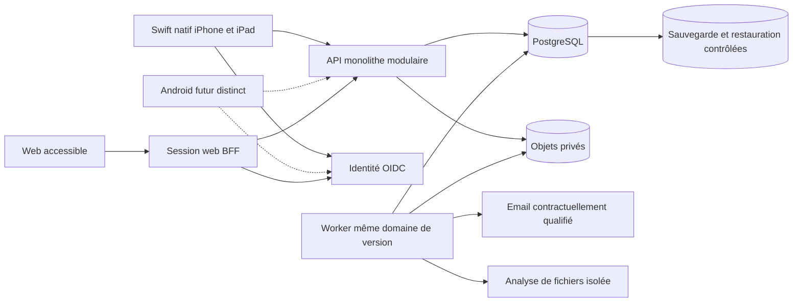

# Architecture cible et décisions techniques argumentées

> Drivy · Dossier de conception 3.13 · 20 septembre 2026
> Statut : proposition de référence, à valider avant réalisation. [Index](../README.md).

## Contraintes et niveau d’engagement

**VER (audit historique)** : l’archive contient un client SwiftUI et une API TypeScript. **Décision du porteur, confirmée dans la conversation : Drivy iPhone/iPad en Swift natif.** Ce choix ne reconduit ni les écrans ni le découpage de l’ancien projet. Web de gestion et support tablette restent demandés ; Android sera un client futur distinct. **HYP** : ressources réduites, sans taille d’équipe ni budget établis. Le coût d’un second client mobile doit être planifié, pas masqué par une promesse de mutualisation intégrale.

La proposition est une architecture nouvelle ; conserver PostgreSQL ou TypeScript n’est pas une reprise automatique de l’ancien découpage. Ces choix sont recommandés pour les contraintes de données, les transactions et la mutualisation. Le schéma, les interfaces et les domaines sont redéfinis.

## ADR01 · Swift natif Apple, web distinct et Android futur

**ACCEPTÉ : application iPhone/iPad écrite en Swift natif.** **REC : SwiftUI pour la présentation, UIKit ponctuellement si un besoin mesuré le justifie ; MapKit et Core Location en intégration directe.** SwiftUI et UIKit peuvent coexister [S97](../06-gouvernance/sources.md#s97). Le choix natif est une décision produit, pas une preuve automatique de performance ou de fiabilité.

Le frontend web React DOM/TypeScript avec Vite et BFF Fastify reste la proposition de référence. La base PostgreSQL, les services métier et le worker ne sont pas réécrits en Swift. Le web élève peut servir le pilote sur Android, mais ne remplace pas une app Android de terrain.

| Voie | Statut et conséquences |
|---|---|
| Swift iPhone/iPad, web séparé | Décision de référence pour Apple ; compositions spécifiques téléphone/tablette, contrats serveur communs. |
| Kotlin/Jetpack Compose pour Android | Recommandation future à approuver ; second client avec ses propres intégrations et tests. |
| Client mobile à interface partagée | Alternative comparée puis non retenue par le porteur pour Apple ; ne pas la réintroduire sans décision explicite. |
| Web seulement | Conservé pour la gestion et l’accès élève connecté, pas pour la collecte Apple en arrière-plan. |

**Mutualisation retenue :** OpenAPI, fixtures JSON, vocabulaire, références de règles et tokens sémantiques. Des clients Swift, TypeScript et éventuellement Kotlin interprètent ces contrats. Ne pas prétendre importer du domaine TypeScript dans Swift ou partager les vues entre SwiftUI et Android. Les validations clientes aident l’utilisateur ; transactions, droits et calculs commerciaux restent autoritaires au serveur.

**Séquençage recommandé :** pilote iPhone+iPad+web ; Android préparé par contrats et inventaire des écarts, puis prototype natif au jalon GA0 avant son développement complet. Un build Android n’est plus un préalable implicite à G0 Apple. Appareils, minimums d’OS et ressources restent à approuver. [Architecture du client Swift](architecture-client-swift.md).

## ADR02 · Monolithe modulaire transactionnel

**REC : une API TypeScript/Fastify**, une base PostgreSQL et un worker de tâches issu du même dépôt. Les modules exposent des services applicatifs, pas leurs tables à toute l’application. Pas de microservices, bus distribué, moteur de workflow généraliste ou cache Redis requis au pilote.

Modules proposés : **Accès**, **Formation**, **Planification**, **Restitution pédagogique**, **Documents**, **Règlements**, **Communications**, **Vie privée/exploitation**. Une commande traverse les domaines via une orchestration explicite et une transaction partagée lorsque l’invariant l’exige. CompleteLesson ne repose pas sur trois appels HTTP indépendants susceptibles de réussir partiellement.

Comparer : fonctions serverless + base imposeraient de traiter durée des transferts, connexions SQL et ordonnanceur ; microservices imposeraient davantage de contrats et réconciliation. Aucun besoin observé ne justifie ce coût initial. Le monolithe peut être extrait ultérieurement si une contrainte mesurée apparaît, pas par anticipation spéculative.

## ADR03 · Base relationnelle et migrations SQL explicites

**REC : PostgreSQL**, avec schéma versionné et accès SQL typé ; les requêtes transactionnelles critiques restent explicites. Un ORM peut servir aux opérations simples, mais ne doit pas masquer les contraintes d’exclusion, les clés composites ou les niveaux de verrouillage. Les contraintes et intervalles sont documentés officiellement [S25](../06-gouvernance/sources.md#s25), [S27](../06-gouvernance/sources.md#s27).

Firestore ou une base documentaire demanderait de réimplémenter davantage de cohérence croisée entre disponibilités, leçons, personnes et journal financier. Une base locale synchronisée automatiquement comme autorité de réservation masquerait la décision serveur. PostgreSQL est choisi pour les invariants de ce produit, pas parce qu’il figurait déjà dans le dépôt.

## ADR04 · Identité déléguée, autorisation conservée dans Drivy

**REC : OIDC Authorization Code avec PKCE**, fournisseur maintenu ; **ZITADEL est le candidat de référence à qualifier**, pas un hébergeur suisse contractuellement validé par ce dossier. Sa documentation décrit le flux et les types de clients [S31](../06-gouvernance/sources.md#s31). La région, les sous-traitants, le budget, la récupération de compte et la révocation restent des critères de sélection obligatoires.

Mobile : navigateur système, client public sans secret embarqué, état/nonce/PKCE validés, jeton long terme dans coffre système. Web : couche serveur de session (BFF) sur origine maîtrisée, cookie HttpOnly/Secure/SameSite et protection CSRF ; aucun refresh token dans localStorage. L’API ne confond jamais ID token et autorisation d’accès à la ressource. Rôles et affectations sont relus dans la base métier.

Construire son propre stockage de mots de passe n’est pas recommandé. Auto-héberger le fournisseur ajoute une responsabilité d’exploitation et doit être budgété avant validation ; « gratuit à installer » ne signifie pas « gratuit à opérer ».

## ADR05 · Offline borné : préparation, brouillons et capture autorisée

**REC Apple : SQLite chiffré via SQLCipher natif**, clé dans Keychain et files durables explicites. L’éditeur décrit une intégration Apple, dont Swift Package Manager [S104](../06-gouvernance/sources.md#s104). Choisir édition, licence et version après build ; vérifier réellement le chiffrement, les journaux et l’accès sous verrouillage. SwiftData/Core Data ne sont pas des remplacements implicites de cette exigence. Le web initial reste connecté, avec cache mémoire de session uniquement. [Persistance Swift](architecture-client-swift.md#persistance).

Pas de synchronisation opaque « tout hors ligne ». La réservation, les droits, les contrôles de permis, les règlements et la publication sont autoritaires côté serveur. Un constat après leçon peut attendre localement et devenir un conflit. Le détail est dans [Synchronisation](synchronisation.md).

## ADR06 · Fichiers privés et pipeline distinct

Stockage objet compatible S3 privé, fournisseur à qualifier contractuellement. Intention de dépôt, quarantaine, validation/analyse puis publication de métadonnées READY. Les recommandations OWASP conduisent à une défense en profondeur, sans confiance dans l’extension ou le MIME fourni par le client [S32](../06-gouvernance/sources.md#s32). Le scanner peut être un processus du worker isolé ; ses ressources et son accès réseau sont bornés.

Pas de binaire dans les logs, pas d’URL permanente publique, pas de déduplication inter-écoles, pas de transfert de pièces sensibles à un scanner public externe sans analyse et contrat.

## ADR07 · Outbox en base, pas d’envoi dans la transaction HTTP

L’événement métier et le travail d’avis sont inscrits dans la transaction. Un worker réclame les travaux avec verrou et bail, puis gère réessais et état fournisseur. Cela évite de déclarer une réservation échouée à cause d’un email indisponible. La livraison réseau n’est pas exactement-une-fois ; la commande métier l’est au niveau de son identifiant et de ses contraintes. Le destinataire et le contenu sont revérifiés avant chaque envoi.

## ADR08 · Hébergement exploitable, environnement domestique non présumé suffisant

Recommander une production administrée avec sauvegarde vérifiable de base et objets, secrets séparés, journalisation limitée et restauration testée. Hébergement en Suisse est une préférence à confirmer sur toute la chaîne, pas un certificat juridique : fournisseur d’identité, email, support, télémétrie et sauvegardes peuvent introduire des transferts [S17](../06-gouvernance/sources.md#s17), [S20](../06-gouvernance/sources.md#s20).

Le homelab existant peut servir au développement avec données fictives. Sa disponibilité réelle, sa sauvegarde hors site et sa sécurité n’ont pas été vérifiées. Ne pas promettre une production fiable en se fondant sur le nom d’un hyperviseur.

## Composants et responsabilités



Le BFF peut être déployé dans le même service HTTP que l’API ; ce n’est pas un microservice imposé. Le worker a un cycle d’exécution séparé, mais partage version des contrats et déploiement compatible. Les apps ne reçoivent aucune clé de base ou de stockage donnant accès à plusieurs objets.

## Politique de versions, sans numéros inventés

Au jalon G0, consigner macOS, Xcode, compilateur Swift, mode de langage, SDK, minimums iOS/iPadOS, dépendances SwiftPM et empreinte du binaire. Consigner séparément Node LTS maintenu, Fastify, TypeScript et PostgreSQL pour le web/serveur [S29](../06-gouvernance/sources.md#s29), [S30](../06-gouvernance/sources.md#s30). Ces versions n’ont pas été compilées dans cette revue. La matrice [native V3.4](../annexes/matrice-build-mobile-v3-4.json) reste NON QUALIFIÉE.

Geler `Package.resolved`, paramètres de signature, environnement de build et dépendances après qualification. Les lockfiles web/serveur restent séparés ; Android aura les siens à GA0. Ne pas utiliser `latest` en production. Le SDK de compilation, l’OS utilisateur, la version de contrat et le schéma local sont des versions distinctes. Aucune mise à jour de code distante par bundle JavaScript n’est prévue dans le client Apple.

## Frontières qui ne doivent pas disparaître

La vue n’applique pas seule la règle métier. Le client peut expliquer et prévalider, mais la décision vient du service et des contraintes. Le worker ne contourne pas les droits sous prétexte qu’il est interne. Les migrations n’exposent pas de noms ou données élèves dans leur code. Les agents de développement ne reçoivent pas des copies de production pour tester un écran.

## ADR09 · Qualifier la capture Swift avant d’élargir le produit

La technologie Apple est choisie ; G0 vérifie son implémentation, pas un nouveau concours de frameworks. Le prototype doit prouver capture volontaire, stockage chiffré sous verrouillage, interruption et arrêt local sur iPhone et iPad réels. Core Location expose des sessions adaptées au suivi de fond [S99](../06-gouvernance/sources.md#s99), mais leur usage dans Drivy reste à tester.

Un échec entraîne un diagnostic des autorisations, du cycle de vie, de la persistance et des appareils ; ne pas remplacer discrètement le cœur GPS par un produit administratif. Une modification ultérieure de technologie demanderait un nouvel arbitrage explicite. Le web n’enregistre pas de trace de fond ; Android doit satisfaire ses propres essais à GA0 puis avant disponibilité.

## ADR10 · Enregistrement séparé du résultat et de la publication

CaptureSession, chunks et publication sont des agrégats distincts de Lesson et ReportRevision. La leçon peut être terminée alors que l’envoi continue, et sans trace. Une queue locale native chiffrée alimente l’ingestion idempotente ; pas de flux de positions dans le changefeed général ni d’envoi de coordonnées au moteur de notifications. Les APIs de capture sont autorisées par le serveur et bornées ; le client arrête localement sans dépendre de sa réponse réseau.

## ADR11 · Un moteur d’occupation pour conduite et collectif

**Décision :** CourseSession possède les occurrences et inscriptions, Reservation porte les occupations des personnes et salles. Le moteur de planning unique arbitre cours et leçons ; le compteur affiché de places reste une projection. Au pilote, un verrou transactionnel de coordination par école simplifie les courses entre commandes de planning, avant les verrous de série/droits/comptes. Le débit attendu du pilote n’est pas mesuré : profiler avant optimisation fine.

L’alternative « une leçon par participant » dupliquerait l’horaire du formateur et confondrait présence et réservation ; elle est rejetée. Une architecture à services distribués imposerait une coordination inutile pour ce pilote ; les événements sortent via outbox après commit.

## ADR12 · Commerce à droits, pas portefeuille indistinct

ServiceProductVersion et PackOfferVersion définissent les prestations ; Purchase fige la vente ; EntitlementMovement suit les droits ; Account suit l’argent. Une transaction peut immobiliser simultanément une place et un droit. Pas de paiement en ligne, de facture fiscale ou de moteur de coupons arbitraires dans ce premier périmètre. Des comptes contextualisés exposent le même journal F10 via leçon, achat ou inscription.

## ADR13 · Profils de cours datés et validés

Les règles d’une sensibilisation ne sont pas stockées comme constantes dispersées dans le client. Un profil versionné approuvé porte période, critères, structure et références. Une école ne transforme pas une contrainte légale en préférence commerciale. La transition annoncée de 2027 rend cette séparation nécessaire ; l’activation reste bloquée pour les profils non qualifiés [S45](../06-gouvernance/sources.md#s45).

## Modules supplémentaires du monolithe

`capture` : autorisations, chunks, reconstruction et effacement. `replay` : projection sécurisée et annotations liées au bilan. `catalog` : prestations et packs versionnés. `entitlements` : ledger et réservations de droits. `courses` : séries, inscriptions, présence et exigences. `calendar` : projection offres/engagements. `notifications` : campagne, outbox et transports. Les dépendances sont orientées par commandes métier ; aucun module ne contourne directement une table d’un autre pour ajuster un solde.


## ADR14 · Workspace web connecté

Le même déploiement Fastify peut servir le frontend web statique et la session BFF de même origine. Aucun moteur métier parallèle ni copie de Postgres dédiée à l’admin. Le frontend utilise router, client de requêtes et formulaires accessibles à sélectionner/figer en G0. Le routage doit supporter liens directs et rechargement après authentification. Les URLs exposent seulement identifiants autorisés et filtres non sensibles ; pas de date de naissance ou email en query string.

Des tableaux paginés côté serveur couvrent les listes ; exports passent par worker et stockage privé. Pas de moteur BI externe ou data warehouse au pilote. L’API de liste n’embarque pas le profil administratif détaillé ni les coordonnées GPS. Les widgets sont masqués par permission mais aussi absents des réponses interdites.

## ADR15 · Onboarding comme orchestration reprenable

OnboardingProgress conserve progression et version, pas une copie concurrente de tous les agrégats. L’école édite les objets F13/F17/F18 par leurs services ; le wizard relit un état de préparation. Le profil élève possède un agrégat administratif séparé de Person et des synthèses de liste. Les déclarations de formation passent par TrainingRequest ; l’approbation et la création Training sont atomiques. Les notices et politiques sont versionnées. Voir [transactions V3](transactions-v3.md).

## ADR16 · Archivage avec contrôle des dépendances

Une preview est une photographie explicative liée à un acteur et versions, non une réservation de droits. Un commit prend le verrou de coordination de l’école puis du dossier et revalide tous les prérequis avant archivedAt. Le lot est une enveloppe de commandes indépendantes, avec résultat par ligne ; pas de transaction géante ni de mode forcer. Un tombstone de dossier archivé et la projection d’accès sont distincts : Membership n’est pas révoquée.

## ADR17 · Mesures dérivées de sources identifiées

F23 lit des agrégats SQL dans un snapshot cohérent, sans dupliquer le journal de paiements. M06 dérive ses mouvements par id unique et rattache les reversals à leur cible économique. Les métriques avec filtres incompatibles indiquent non applicable plutôt qu’une ventilation inventée. La réponse contient definitionsVersion, computedAt/dataAsOf, période, unités et compteurs d’incomplétude. Un futur cache devra être partitionné par école et scope et invalidé après correction ; aucun cache partagé autorisant une fuite n’est ajouté au pilote.

## Arborescence proposée du dépôt futur

```text
apps/apple/          # projet Xcode : application Swift iPhone/iPad
apps/web/            # React DOM : personnel et accès élève
apps/android/        # réservé au client futur, pas créé par cette documentation
services/api/        # Fastify et BFF ; domaine serveur autoritaire
services/worker/     # fichiers, exports, notifications et travaux
contracts/openapi/   # contrat de référence ; pas une copie divergente par langage
contracts/fixtures/  # jeux fictifs et résultats attendus communs
clients/             # adaptateurs/génération Swift, TypeScript, futur Kotlin
server-packages/     # code TypeScript éventuellement partagé API/worker seulement
design/tokens/       # valeurs sémantiques, adaptées par chaque client
docs/                # références, décisions, contrôles
```

Plan de dépôt, pas fichiers d’application créés. Le découpage interne Apple est décrit dans [architecture-client-swift](architecture-client-swift.md). Démarrer avec des modules logiques maîtrisables ; ne pas imposer une bibliothèque ou un package par écran. Des codes communs au serveur ne deviennent pas du code mobile partagé.

## ADR18 · Client Apple natif : responsabilités explicites

SwiftUI présente des projections ; les modèles d’écran sont isolés sur `MainActor`. Le service de collecte est possédé à la racine applicative, avec adaptateur Core Location et journal chiffré indépendant des vues. MapKit ne détient ni le droit de collecte ni le compte d’un pack. Authentification système, Keychain, notifications APNs et réseau URLSession disposent de frontières testables.

Les acteurs Swift ne rendent pas automatiquement un bloc contenant `await` indivisible ; protéger les transitions et revalider la génération après suspension [S101](../06-gouvernance/sources.md#s101). Une implémentation documentaire détaillée, ses limites et les tests se trouvent dans [architecture-client-swift](architecture-client-swift.md), [iOS](integration-ios-ipados.md) et [transverse](integration-mobile-transverse.md).

Les bibliothèques exactes restent des recommandations à qualifier. Aucun module partagé JavaScript ni pont d’interface multiplateforme n’est requis par ce choix.

## ADR19 · Support, distribution et Android fondés sur des preuves

**REC :** qualifier iOS/iPadOS 26 et 27, avec minimum commercial à décider. La [matrice V3.4](../annexes/matrice-build-mobile-v3-4.json) distingue choix de pile, versions exactes et résultats réellement obtenus. Android reste un client futur ; G0 vérifie la portabilité des contrats et GA0 éprouve la première tranche native Android avant son engagement de livraison.

Le code Apple est distribué en binaire signé via les canaux de test/publication retenus. La configuration distante peut activer une fonction déjà livrée, pas télécharger un nouveau moteur d’exécution métier. Une app ne promet pas de bloquer une mise à jour décidée par l’OS. Elle évite ses propres interruptions forcées et conserve un journal permettant la réconciliation après remplacement du processus. Migrations atomiques, refus de downgrade incompatible et compatibilité serveur sont vérifiés avant rollout.

Les [16 exigences MX et 68 cas MOB](../05-realisation/qualification-mobile-ui-ux.md) complètent les 434 scénarios T. Les canaux bêta restent séparés ; aucune compatibilité physique ni exécution n’est déduite du mot « natif ».
