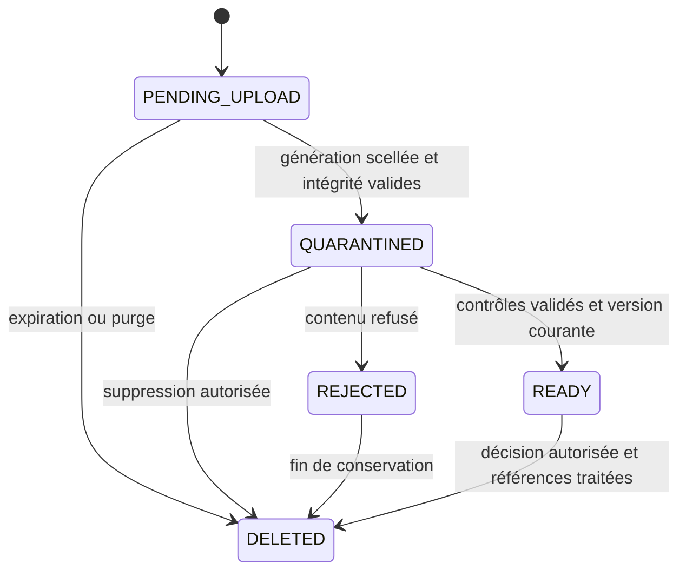

# Fichiers, temps, formats et communications

> Drivy · Dossier de conception 3.13 · 20 septembre 2026
> Statut : proposition de référence, à valider avant réalisation. [Index](../README.md).

## Dépôt de pièces et identité scolaire

Références : [R21–R22](../03-fonctionnel/regles-etats.md#r21), [R33](../03-fonctionnel/regles-etats.md#r33), [sécurité](securite-vie-privee.md). `Document` appartient à un élève et, selon finalité, à une formation ou une leçon. `SchoolAsset` porte le logo sans faux propriétaire élève. Les deux réutilisent le pipeline de stockage, pas leurs règles de lecture.

### Octets déposés, octets contrôlés et octets servis

**Constat externe :** une URL présignée S3 peut être utilisée plusieurs fois avant expiration et remplacer un objet de même clé [S128](../06-gouvernance/sources.md#s128). Le nom aléatoire d’une clé n’est donc pas, à lui seul, une garantie d’immuabilité. **Profil Drivy proposé :** dépôt intégral PUT conditionnel, puis scellement interne avant analyse. Un autre fournisseur doit démontrer un invariant équivalent avant d’être qualifié ; aucun repli silencieux en dépôt écrasable.

| Étape | Invariant et résultat |
|---|---|
| Intention authentifiée | Vérifier école, personne, finalité, taille déclarée, MIME et SHA-256. Créer un identifiant et une clé de staging privés non réutilisés. Le hash porte sur les octets après conversion locale éventuelle. Aucun chemin ne vient du nom original. |
| PUT de staging | Le ticket expose `method=PUT`, URL HTTPS, expiration et en-têtes signés autorisés. Corps binaire brut complet, `if-none-match: *`. En S3, le bucket doit imposer cette écriture conditionnelle, pas seulement le client [S129](../06-gouvernance/sources.md#s129). La taille et le hash effectifs sont contrôlés à la finalisation ; une taille déclarée ne prouve pas une limite de stockage appliquée par le fournisseur. Quotas, nettoyage et ingress sont à qualifier. |
| Scellement | Le service confirme que l’intention vise le bon objet, fige une version précise ou copie une génération vers une clé privée que le ticket de dépôt ne peut jamais écrire. Vérifier taille/hash et identité de la version source, y compris autour d’une copie. Referencer la génération scellée par compare-and-set en base. Une éventuelle recréation de staging après purge n’est ni analysée ni servie à sa place. |
| Quarantaine | QUARANTINED ne donne aucun aperçu. Le worker ne lit que la génération scellée : signature réelle, analyse, décodage borné, retrait des métadonnées nécessaires. Scanner indisponible : rester en quarantaine. Limites de pixels, pages, durée, mémoire et concurrence fixées au déploiement ; un fichier de moins de 10 MiB peut encore saturer un décodeur [S130](../06-gouvernance/sources.md#s130). |
| Dérivé et promotion | Un dérivé éventuel reçoit sa propre clé immuable, son hash, MIME, taille et version de transformation. Recontrôler ses propriétés avant READY. La transaction courte vérifie version/génération/status et autorisation de traitement ; une suppression ou révocation pertinente concurrente gagne selon l’ordre de commit. Ne pas tenir des verrous SQL pendant le scan. Résultat obsolète : abandon, purge de ses dérivés, jamais remise à READY. |
| Lecture | La passerelle authentifiée sert uniquement la génération canonique autorisée, sous type détecté, `Content-Disposition` sûr, `nosniff` et `private, no-store`. Les nouveaux tickets/requêtes recontrôlent droits et statut ; un ticket ne suffit pas sans session. Aucun redirect vers une URL objet autonome. |

Le checksum déclaré décrit l’original envoyé. `Document.bytes/detectedMime` et `SchoolAsset.bytes/detectedMime` en READY décrivent le contenu canonique servi. L’original scellé et le dérivé ont des hashes/tailles distincts dans le modèle. Une image réencodée doit toujours satisfaire la limite propre à sa finalité. READY n’est ni une preuve d’authenticité du permis ni sa validation pédagogique.

Une pièce rejetée est remplacée par un nouvel objet ; elle n’est pas remise à READY par un bouton. L’effacement s’applique au staging, versions scellées et dérivés selon politique ; conserver un tombstone technique minimal pour interdire la résurrection par tâche retardée. Une purge de contenu n’invente pas une invalidation pédagogique : [R110](../03-fonctionnel/regles-etats.md#r110) reste applicable.

### Reprise des dépôts sans fichier fantôme

Le pilote assure une **reprise de workflow**, pas un upload multipart ni une reprise au dernier octet. Les limites de taille R33 permettent un nouveau PUT complet si nécessaire. Le brouillon texte n’est jamais supprimé avec le transfert.

| Situation observée | Action et effet attendu |
|---|---|
| Réponse du PUT perdue | Lire le statut puis appeler la finalisation authentifiée avec la même intention. Si le fournisseur répond 412 à un nouveau PUT conditionnel, cela peut signifier que le premier a abouti ; ce code ne suffit pas à afficher READY. Le service vérifie les octets. |
| Ticket encore valide, aucun objet | Réessayer le même corps complet et les mêmes en-têtes. Ne pas changer le fichier derrière `uploadId`. |
| URL expirée, objet complet présent | La finalisation peut sceller les octets après expiration de l’URL, tant que l’intention n’est ni clôturée/purgée ni interdite et que ses droits courants sont valides. Expiration du transport et suppression de l’intention sont distinctes. |
| URL expirée et dépôt absent, ou intention purgée | Réconcilier les opérations connues, puis proposer explicitement une nouvelle intention avec nouvelle clé d’opération. L’ancienne reste invisible et sera nettoyée ; elle ne remplace pas le nouvel objet. Les références du brouillon sont modifiées explicitement. Pas de renouvellement implicite par rejeu de la création. |
| Document déjà QUARANTINED/READY | Ne pas déposer de nouveau corps. Lire son état ; finaliser à nouveau reste sans second effet. |
| Compte/école/droits changés | Aucun envoi sous le nouveau compte pour l’ancien dossier ; appliquer la politique de file chiffrée et de purge. L’URL technique encore valide n’autorise pas une finalisation métier refusée. |

La durée de vie de l’intention en attente et le nettoyage du staging sont des paramètres de déploiement à approuver, supérieurs à la seule validité de l’URL lorsqu’une finalisation tardive est permise. Les morceaux GPS restent sur leur propre contrat : cette politique de pièces ne les remplace pas.

### Deux transports distincts, aucune propagation de secrets

Le client URLSession sépare la session API authentifiée et la session de PUT objet. Les origines exactes (schéma/hôte/port) et la passerelle attendue sont qualifiées par environnement, sans comparaisons de suffixe de domaine. Refuser URL avec userinfo, fragment, schéma non HTTPS, origine inconnue ou redirect. Ne jamais transmettre le bearer Drivy, le cookie du BFF, un reçu de suppression ou un ticket d’une autre portée au stockage. Les seuls en-têtes supplémentaires d’un PUT sont l’allowlist canonique, avec longueur calculée par la pile HTTP ; ne pas relayer un `Authorization` arbitraire reçu dans un JSON.

Les URL signées et query strings de tickets sont des secrets temporaires [S128](../06-gouvernance/sources.md#s128) : pas de logs, télémétrie ni capture d’erreur les contenant. Le BFF web conserve ses protections CSRF ; les lectures de contenu recontrôlent les droits. Les règles s’appliquent aussi aux logos et exports, pas seulement aux photos élèves.

**Choix caméra/galerie.** Demander la permission au moment de l’action, offrir un fichier déjà disponible comme alternative. Si le téléphone fournit HEIC/HEIF, proposer conversion locale en JPEG/PNG dans le build natif validé ; sinon expliquer les formats acceptés sans transformer l’erreur en échec général du bilan. Les images de permis ne sont ni améliorées par IA ni certifiées authentiques. La conversion et la taille finale doivent être vérifiées avant intention d’envoi.

**Publication avec pièce en attente.** L’utilisateur voit la liste des pièces non prêtes. Il peut attendre ou publier le texte en confirmant explicitement leur exclusion. Une pièce exclue ne sera pas attachée après coup à une révision immuable ; ajouter ultérieurement exige une nouvelle révision. Le statut de scan READY ne vaut jamais approbation du permis : cette décision demeure humaine et liée à Training.version.

**Logo scolaire.** Seul ADMIN envoie un JPEG/PNG dans les limites R33, puis choisit cet asset READY dans la configuration versionnée. Les autres membres voient le logo courant autorisé. Le changement ne modifie ni contrastes sémantiques ni navigation. Nom seul en repli ; l’ancien logo reste courant tant que le nouveau n’est pas prêt. Retrait du pointeur et purge d’anciens assets suivent la politique scolaire, sans supprimer une pièce élève par erreur.

## Réservations et fuseaux horaires

La règle [R31](../03-fonctionnel/regles-etats.md#r31) fait autorité. Les disponibilités hebdomadaires sont exprimées en heure locale scolaire avec dates d’application ; les réservations confirmées sont des instants avec fuseau conservé. Utiliser une bibliothèque IANA maintenue et geler sa version avec les tests. Ne pas calculer Zurich par un offset constant `+01:00`.

| Cas synthétique | Entrée | Résultat attendu |
|---|---|---|
| Rendez-vous ordinaire | 24.09.2026, 14:00 Europe/Zurich | `2026-09-24T12:00:00Z`, affiché 14:00 scolaire. |
| Passage au printemps | 29.03.2026, 02:30 Europe/Zurich | Heure inexistante : refuser et demander une autre heure, pas décaler silencieusement. |
| Passage à l’automne | 25.10.2026, 02:30 Europe/Zurich | Deux occurrences : sélectionner `+02:00` ou `+01:00`, conserver le choix. |
| Appareil en voyage | Téléphone à Lisbonne, leçon à Zurich | Heure principale de l’école explicitement libellée ; aucune mutation de réservation. |
| Fin contiguë | Première leçon finit 11:00, suivante débute 11:00 | Autorisé seulement si le tampon moniteur et les autres contraintes le permettent. |
| Expiration d’une pièce | Date civile 25.10.2026 | Comparaison par date scolaire selon politique approuvée ; pas minuit UTC implicite. |

Les cas 2026 de changement d’heure sont des valeurs de recette vérifiées par la base IANA de l’environnement documentaire ; ce n’est pas une prédiction qu’aucune règle de fuseau ne changera ultérieurement. Mettre à jour les données de fuseau et la recette au gel de version.

Le pilote refuse une leçon traversant le minuit local scolaire afin de limiter les ambiguïtés de disponibilité ; cela ne signifie pas qu’un tel cours serait illégal. Les leçons moto groupées, ressources véhicules et séances couvrant plusieurs jours nécessitent U09 et un modèle différent. Le tampon de déplacement proposé est manuel et explicite, pas un itinéraire géographique calculé en cachette.

## Montants, textes et langue

Montants entiers en centimes CHF ; afficher `90.00 CHF` ou format local cohérent, mais transporter `9000`. Calculer total des charges, net encaissé et solde depuis les écritures. Arrondi de TVA, facture légale, avoir global et rapprochement bancaire sont hors pilote ; ne pas les simuler par des champs de commentaire. Un reçu de saisie interne doit être libellé « Enregistrement interne » et non « Facture ».

Langue de lancement proposée : français suisse ; architecture de chaînes localisables. Aucune traduction allemande ou portugaise n’est déclarée prête. Séparer clé de traduction et code d’erreur ; pluriels et formats passent par le moteur de localisation. Conserver noms propres et texte utilisateur tels que saisis, sans traduction automatique de bilan. Les codes de catégorie sont des identifiants métier, pas des chaînes à traduire librement.

Les limites R33 comptent les points de code Unicode ; ne pas les mesurer tantôt en octets, tantôt en unités UTF-16. Normalisation et recherche d’accents doivent préserver l’original. Les noms, lieux et identifiants longs doivent se replier sans recouvrir une action. Définir les formats de téléphone selon usages réels de l’école, sans forcer un numéro exclusivement suisse pour un élève étranger.

## Matrice de communications du pilote

Cette matrice précise les événements visés par [R26](../03-fonctionnel/regles-etats.md#r26). Les destinataires sont recalculés au traitement, pas figés comme des droits éternels dans l’outbox. Pas d’envoi aux membres révoqués. Les adresses proviennent du compte/contact vérifié selon finalité ; changement d’adresse en cours de livraison impose nouveau contrôle.

| Événement confirmé | Destinataires | In-app / email | Contenu et suppression de doublons |
|---|---|---|---|
| Invitation créée/renvoyée | Adresse visée | Pas encore de compte / oui | École, rôle proposé, lien à usage contrôlé ; renvoi invalide lien précédent. |
| Leçon créée | Élève, moniteur désigné | Oui / oui | Date scolaire, durée et lien ; pas de bilan ni pièce. |
| Leçon déplacée/annulée | Élève, moniteur concerné | Oui / oui | État actuel et changement utile ; distinguer ancien et nouveau créneau. |
| Résultat complété sans bilan publié | Auteur et personnel opérationnel autorisé | Oui / non | Confirmer fait enregistré ; ne pas annoncer un bilan non partagé à l’élève. |
| Bilan publié/corrigé/retiré | Élève, auteur ou moniteurs affectés concernés | Oui / oui à l’élève | Mention neutre et lien authentifié ; aucun texte pédagogique dans le message externe. |
| Pièce rejetée / permis à renouveler | Auteur concerné et contrôleur habilité | Oui / email neutre lorsque action nécessaire | Motif détaillé seulement dans l’application autorisée. |
| Mouvement financier enregistré/corrigé | Élève, auteur, ADMIN concerné | Oui / non au pilote | Journal accessible ; pas de prétendu reçu de PSP. |
| Rôle/affectation modifié | Personne concernée et ADMIN auteur | Oui lorsque encore autorisé / notification de sécurité minimale | Aucun contenu scolaire dans un message à un ancien membre. |
| Demande de données reçue / réponse prête | Demandeur vérifié et responsable désigné | Oui / oui neutre | Référence, étape et lien protégé, pas d’archive en pièce jointe email. |
| Sauvegarde brouillon / synchronisation technique | Aucun destinataire externe | État local seulement / non | Éviter bruit et fuite de texte ; audit technique minimal si nécessaire. |

Une unicité `(eventId, recipient, channel)` évite les doublons internes. Le worker peut subir un crash après acceptation par le fournisseur mais avant enregistrement local : utiliser la clé d’idempotence fournisseur si disponible ; sinon documenter un risque résiduel de doublon, ne pas promettre exactement une livraison. Pas de pièce sensible dans les données du prestataire email.

États d’une tentative : QUEUED → PROCESSING → SENT → DELIVERED lorsque le fournisseur fournit une preuve exploitable, ou FAILED. DELIVERED n’est pas une preuve de lecture. Les événements in-app et leurs `viewedAt` sont par destinataire. Une réponse email de l’élève rejoint le contact opérationnel de l’école choisi au paramétrage ; elle n’est pas ingérée dans une messagerie Drivy absente du pilote.

Une modification récente rend une confirmation précédente potentiellement obsolète. Avant émission, le worker relit l’état et peut regrouper les événements non encore envoyés par leçon/destinataire ; le message doit décrire l’état confirmé actuel. Il ne transforme pas une annulation en simple erreur de notification. Les échecs prolongés apparaissent dans l’administration avec un moyen de contact alternatif, pas dans le statut métier de la leçon.

## Dates de cours, payloads GPS et canaux V2

Chaque occurrence porte startAt/endAt UTC et timeZone IANA ; la série affiche toutes les dates dans le fuseau de l’école, Europe/Zurich par défaut proposé. Une heure locale ambiguë au changement saisonnier doit être explicitement résolue ; une heure inexistante est refusée. Les dates d’effet contractuelles et réglementaires sont des dates locales interprétées par leur politique, pas des timestamps arbitraires à minuit UTC.

Les chunks GPS suivent leur propre manifeste et pipeline privé : hash, taille, staging durable, validation puis reconstruction. Ils ne sont pas envoyés en pièce jointe de notification. Les preuves de présence collective suivent le pipeline document sécurisé existant, mais ont une finalité et une audience propres ; ne pas les joindre à une liste email de tous les participants.

La matrice de service complète figure dans [F19](../03-fonctionnel/calendrier-notifications.md). Publication : intention de campagne, pas réservation. Déplacement et annulation : avis aux inscrits indépendamment de leur statut d’exigence. Rappel : invalider la version précédente avant émission. Un token push invalide est retiré ; aucun abonnement marketing n’est créé automatiquement. Le libellé du cours et les dates visibles dans un message ne permettent pas d’accéder à des données sans authentification.

## Variantes V3

**Photo de profil :** purpose PROFILE_PHOTO, JPEG/PNG≤2MiB, décodage et retrait EXIF ; aucun lien formation/leçon. Les contrôles bytes/MIME/hash et autorisations restent ceux de F09 avec restriction supplémentaire. Le champ est facultatif et le repli est un avatar initiales.

**Exports de gestion :** UTF‑8, séparateur et conventions affichés dans manifest, colonnes déterministes et versionnées ; neutralisation de formules testée [S57](../06-gouvernance/sources.md#s57). Les montants sont calculés en centimes, conversion affichée en CHF, pas flottants monétaires internes. Génération privée,10k lignes/24h proposées, purge objets et dérivés. L’export de droits personnels demeure séparé.

**Dates du profil :** birthDate est une date civile, jamais minuit UTC converti selon le téléphone. Périodes statistiques : dates civiles inclusif/exclusif dans le fuseau de l’école, mapping UTC côté serveur pour les événements. Les contre-écritures conservent recordedAt et une date économique source pour ne pas confondre correction et remboursement.

**Invitations/liens profonds :** token à usage unique non transmis aux analytics ni logs ; supprimer du navigateur après échange sûr. Destination interne bornée, réauthentification et relecture des droits ; une notification ne réserve aucune place lors de l’ouverture ou de la fin du wizard.

## Systèmes mobiles

Les permissions d’import ne sont pas un accès global anticipé à tous les fichiers. La [politique mobile transverse](integration-mobile-transverse.md) précise sélection explicite, fichier local réellement disponible, protection des copies, calendrier interne sans permission OS superflue et notifications au contenu minimal. Temps monotone/budget de capture et heure affichée sont distingués ; le changement de fuseau ne modifie pas un engagement ou une échéance stockée.

## Contrôles de provenances et de permissions
L’import HEIC→JPEG déjà prévu et le hash de la version réellement envoyée restent inchangés : cette revue n’invente pas une nouvelle chaîne de fichiers. Pour les pièces d’exigence, distinguer remplacement/invalidation métier et purge selon politique approuvée (R110). Aucun moteur de validation ne déduit COMPLETED du seul format ou du statut READY.

Pour les mesures, l’horodatage source et l’horloge monotone de durée ont des fonctions différentes (R111). Pour les notifications, token global d’installation et route scolaire ne sont pas interchangeables (R112). Les données de trajet, noms, téléphones, tokens et preuves restent interdits dans les logs techniques ordinaires ; seuls les codes d’écart agrégés sont diagnostiques.

## Représentation des exports et téléchargement vérifiable

`Export.kind` détermine le format : STUDENT_LIST et METRICS sont des CSV UTF-8 ; PRIVACY reste l’archive ZIP de la procédure F14. Après génération complète, le service fixe `contentType`, `fileName`, `bytes`, `sha256`, `expiresAt` et, pour la gestion, `columnsVersion` et `rowCount`. Avant READY et après expiration/échec, les quatre métadonnées de contenu projetées sont nulles ; les preuves internes éventuelles restent soumises à conservation. Le fichier finalisé n’est plus modifié à la même génération.

AP91 expose les deux media types et renvoie un flux complet 200. Le nom technique utilise caractères sûrs et extension conforme, sans nom/prénom, donnée privée, chemin ou CR/LF. La vue ne renomme pas un ZIP en .csv pour corriger une réponse inattendue. Une interruption de téléchargement nécessite un nouveau flux complet après recontrôle ; la reprise 206/Range n’est pas promise par ce contrat.

À la génération et au téléchargement, recontrôler le demandeur, la portée de l’école et chaque autorisation indispensable au manifeste figé. Si une affectation requise a disparu, refuser cet export et proposer une régénération sous les droits actuels ; ne pas tronquer silencieusement l’ancien fichier ni laisser subsister les données retirées derrière une autorisation générale. L’export de gestion neutralise les cellules de tableur selon [S57](../06-gouvernance/sources.md#s57) ; l’échappement CSV seul ne désactive pas une formule.

Le client ne propose une sauvegarde externe explicite qu’après contrôle de type, taille et intégrité. Il distingue cette copie volontaire du cache privé. Une copie partagée hors Drivy n’est ni révocable ni nettoyée par une déconnexion. La réponse `Cache-Control: private, no-store` protège le comportement des caches HTTP conformes, pas les copies déjà confiées à une autre application [S131](../06-gouvernance/sources.md#s131).
