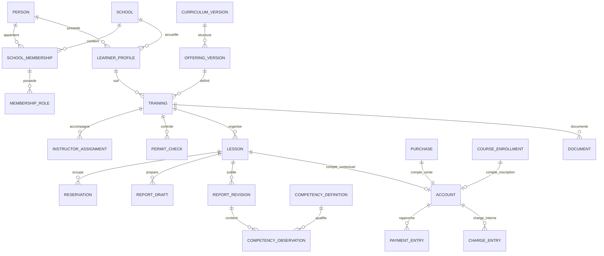
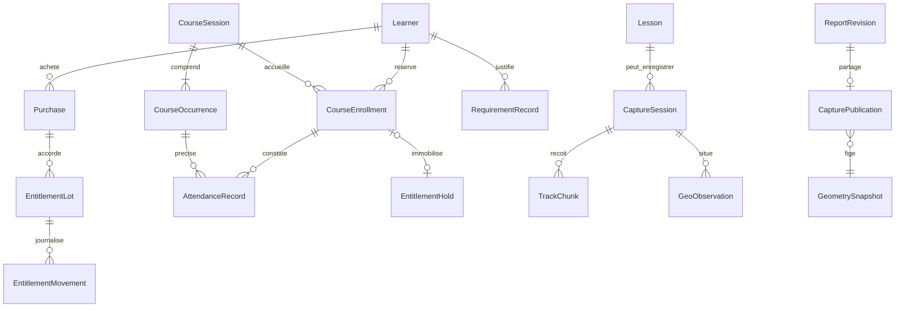
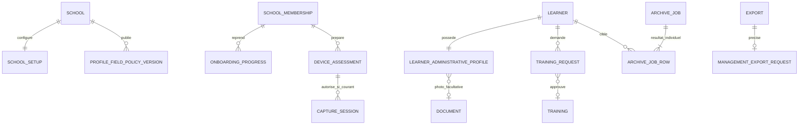

# Modèle de données, contraintes et cycles de vie

> Drivy · Dossier de conception 3.13 · 20 septembre 2026
> Statut : proposition de référence, à valider avant réalisation. [Index](../README.md).

## Conventions normatives proposées

Identifiants publics : UUID aléatoires ; ils ne portent ni nom, ni email, ni catégorie. Toute entité scolaire possède `school_id`, `created_at`, `updated_at` lorsque mutable et `version` lorsqu’une mutation utilisateur existe. Les instants sont `timestamptz`, les dates civiles `date`, la devise `CHF`, les montants `bigint` en centimes avec borne de transport JSON documentée. Une version est incrémentée atomiquement, jamais calculée par l’horloge du client.

Les clés étrangères scolaires utilisent `(school_id, id)` vers une clé unique de la table parente. Un simple `training_id` globalement unique ne suffit pas à exprimer l’invariant d’école dans le schéma. Les contraintes métier principales sont [R01–R108](../03-fonctionnel/regles-etats.md). Les migrations n’utilisent pas des suppressions en cascade générales pour clore un élève.

## Registre logique consolidé

Les tables de versions successives sont regroupées ici par identifiant présenté. **Les 101 entrées ci-dessous ne signifient pas 101 tables SQL** : elles incluent attributs, projections, DTO et groupes de concepts. Ce relevé ne valide donc pas non plus un objectif arbitraire de « 88 entités ». Un objet est justifié par le parcours qu’il sert ; son existence ne suffit pas à imposer un module au premier incrément. Le [registre de périmètre](../05-realisation/perimetre-premiere-livraison.md) précise la première tranche et la nécessité. Les champs du contrat ne deviennent pas automatiquement des colonnes.

Les répétitions exactes sont retirées ; les compléments de champs/contraintes d’un même identifiant sont réunis dans sa ligne actuelle. Les groupes explicitement nommés avec « / » doivent être décomposés lors de la conception physique, sans créer une table dont le nom serait ce groupe. Les diagrammes et illustrations SQL ci-dessous restent documentaires, non déployés.

| Objet décrit | Première tranche | Champs ou structure actuels | Contraintes et cycle de vie |
|---|---|---|---|
| Person | G1 | id, display_name, preferred_locale<br>accessState ACTIVE/CLOSING/DELETED et version d’accès ; porte globale verrouillée avant les écoles, indépendamment du statut des appartenances | Identité humaine globale ; données scolaires hors de cette table.<br>[R104](../03-fonctionnel/regles-etats.md#r104) et [ordre](transactions-v2.md#autorisation-et-commit)<br>Créée à première identité valide ; effacement global seulement après analyse des appartenances restantes. |
| IdentityLink | G1 | issuer, subject, person_id | Unique `(issuer, subject)` ; email vérifié est un attribut, pas une clé métier universelle de dossier.<br>Géré par authentification ; changement d’email ne change pas les formations. |
| School | G1 | id, name, state, time_zone, current_settings_version | DRAFT/ACTIVE/ARCHIVED ; fuseau IANA.<br>Création contrôlée ; archivage instruit. |
| SchoolMembership | G1 | id, school_id, person_id, status, access_epoch | Unique `(school_id, person_id)` ; ACTIVE/REVOKED.<br>Rôles multiples via table dédiée ; révocation ne supprime pas les auteurs historiques. |
| MembershipRole | G1 | membership_id, school_id, role | Unique rôle par appartenance ; ADMIN/INSTRUCTOR/LEARNER.<br>Changements audités et protégés contre retrait du dernier ADMIN. |
| MembershipGrant | G1 | membership_id, school_id, grant | `permit_review`, `cash_record`, CONFIGURE_CATALOG, SELL_SERVICES, MANAGE_COURSES, TAKE_ATTENDANCE, VALIDATE_REQUIREMENT, REVIEW_REGULATORY_PROFILE, MANAGE_LEARNER_ARCHIVES, VIEW_SCHOOL_METRICS, VIEW_FINANCIAL_METRICS, EXPORT_MANAGEMENT ; portées détaillées dans les permissions.<br>Révocable, déclenche mise à jour d’epoch. |
| LearnerProfile | G1 | id, school_id, person_id, membership_id, contact_fields, archived_at | Unique profil scolaire par personne ; rattachement LEARNER actif pour parcours courant.<br>Archivage après traitement du futur ; identité conservée séparément. |
| Invitation | G1 | id, school_id, email, token_hash, roles, expires_at, state, accepted_by | Jeton haché unique ; états PENDING/ACCEPTED/REVOKED/EXPIRED.<br>Consommation atomique ; pas de réutilisation d’un ancien code. |
| SchoolPolicyVersion | G1 | id, school_id, category_code, procedure_text, cancellation_policy_text, source_urls, approved_by, approved_at | Procédure relue et approuvée avant activation de l’offre ; pas de moteur automatisé de droit cantonal.<br>Versions immuables, `OfferingVersion.policy_version` pointe ici. |
| SchoolSettingsVersion | G1 | id, school_id, revision, effective_at, settings | Version immuable des paramètres applicables.<br>Nouvelle version pour changement ; ancienne conservée si référencée. |
| OfferingVersion | G1 | id, school_id, offering_key, category_code, curriculum_version_id, enabled, policy_version | Clé logique stable `offering_key`, numéro de version distinct ; référentiel et politique documentaire valides avant activation.<br>Désactivation pour le futur seulement. |
| Training | G1 | id, school_id, learner_profile_id, offering_key, offering_version_id, status, started_on, closed_on | Index unique partiel `(school_id, learner_profile_id, offering_key)` pour ACTIVE/PAUSED ; une nouvelle version de l’offre ne contourne pas cette contrainte. Plusieurs catégories admises.<br>ACTIVE ↔ PAUSED ; clôture COMPLETED/CANCELLED ; nouveau cycle par nouvel id. |
| InstructorAssignment | G1 | id, school_id, training_id, instructor_membership_id, valid_from, valid_to | Formation et membre de même école ; rôle INSTRUCTOR actif.<br>Retrait avec analyse des leçons et brouillons. |
| PermitCheck | G1 | id, school_id, training_id, document_id nullable, physical_seen, category, valid_until, decision, reviewer, reviewed_at | Pièce READY ou attestation physique explicite ; décision humaine.<br>Append-only ; nouvelle pièce entraîne nouveau contrôle en attente. |
| AvailabilityRule | G2 | id, school_id, instructor_membership_id, weekdays, local_start, local_end, valid_from, valid_to, version | Intervalles locaux valides, dates d’application cohérentes, calendrier de l’école.<br>Modification prévisualisée, sans invalidation silencieuse de leçons. |
| Closure | G2 | id, school_id, instructor_membership_id, start_at, end_at, private_reason, version | Début < fin ; motif privé non exposé à l’élève.<br>Ajout/refus sous les mêmes verrous que la réservation. |
| Lesson | G2 | id, school_id, training_id, instructor_membership_id, planned_start, planned_end, time_zone, meeting_point, price_snapshot_cents, buffer_snapshot_minutes, status, version | Formation et moniteur compatibles ; personne élève dérivée de formation.<br>Transitions R39 ; aucune suppression courante. |
| Reservation | G2 | id, school_id, lesson_id?, occurrence_id?, enrollment_id?, resource_kind, resource_id, occupied_range, active | Origine explicite ; moniteur/salle pour occurrence, élève pour inscription ; contraintes d’exclusion communes.<br>active signifie occupation effective, y compris historique réalisé ; une annulation autorisée libère les créneaux concernés, pas le simple passage du temps. |
| LessonOutcome | G2 | lesson_id, school_id, actual_start, actual_end, anomaly_flags, reason, revision | Historique des constats/corrections ; heures réelles différentes des heures prévues.<br>Nouvelle révision lors de correction, pas effacement du fait antérieur. |
| LessonPreparation | G2 | lesson_id, school_id, goals, administrative_check_note, version | 0 à 3 objectifs ; IDs de compétences versionnées facultatifs.<br>Modifiable avant résultat clos ; jamais convertie automatiquement en observation. |
| LearnerWish | G2 | id, school_id, training_id, lesson_id nullable, text, author, version | Auteur élève concerné ; formation explicite.<br>Peut rester pertinent après annulation, sans être imposé au prochain programme. |
| CurriculumVersion | G1 | id, school_id, category_code, revision, approved_by, approved_at | Version immuable ; aucun catalogue présenté comme standard légal sans validation. |
| CompetencyDefinition | G1 | id, school_id, curriculum_version_id, stable_key, label, description, sort_order | Identifiant stable pour une version ; correspondance inter-versions explicite, jamais par simple texte égal. |
| OutcomeApproval | G2 | id, school_id, lesson_id, lesson_version, account_version, publication_version, proposal_hash, approver, expires_at, consumed_at | Approbateur affecté, validité courte, contenu et versions immuables ; consommation atomique avec correction. |
| ReportDraft | G2 | id, school_id, lesson_id, author_membership_id, base_publication_version, worked_on, observation_text, next_step, observations, attachments, version | Un brouillon courant par auteur/leçon ; privé ; transitions contrôlées. |
| ReportRevision | G2 | id, school_id, lesson_id, sequence, author, published_at, correction_reason, payload<br>textObservations, snapshots autonomes de texte/version sans références au brouillon ou à la géométrie | Immuable après publication ; numéro unique par leçon.<br>[R46](../03-fonctionnel/regles-etats.md#r46) |
| ReportPublication | G2 | lesson_id, school_id, current_revision_id nullable, version | Pointeur atomique, retrait motivé possible ; ne détruit pas révisions. |
| CompetencyObservation | G2 | id, school_id, training_id, lesson_id, report_revision_id, competency_definition_id, level, context, observed_at | Révision et formation cohérentes ; seule la révision publiée courante participe à la projection. |
| TrainingProgressProjection | G2 | school_id, training_id, competency_definition_id, source_revision_id, source_lesson_id, observed_at, level, context | Dérivée, supprimable/recalculable ; pas source primaire de vérité. |
| Document | G1 | id, school_id, owner_profile_id, training_id nullable, lesson_id nullable, purpose, audience, state, version, sealed_generation_id, canonical_artifact_id, deleted_at | Portée cohérente ; READY ne vise que la génération contrôlée ; tombstone empêche une promotion tardive. Mime/taille projetés depuis le contenu canonique. |
| SchoolAsset | G1 | id, school_id, purpose LOGO, state, version, sealed_generation_id, canonical_artifact_id, deleted_at | Pas de propriétaire élève. Logo READY courant seulement ; image JPEG/PNG admissible, nom scolaire en repli. |
| UploadIntent | G1 | id, school_id, document_id nullable, asset_id nullable, staging_key, ticket_expires_at, cleanup_after, expected_size, expected_mime, expected_sha256, state, sealed_generation_id | Exactement un propriétaire Document ou SchoolAsset de même école ; clé jamais réaffectée. État interne OPEN/SEALED/ABANDONED ; aucune réouverture implicite. Expiration d’URL distincte du nettoyage. |
| FileGeneration | G1 | id, school_id, owner_kind, owner_id, upload_intent_id, source_storage_version, source_key, source_sha256, source_bytes, sealed_at | Identifie les octets originaux figés, non écrasables via URL client ; une génération scellée par intention. La stratégie stockage/version/copie est qualifiée avant lancement. |
| FileArtifact | G1 | id, generation_id, role, object_key, storage_version, sha256, bytes, detected_mime, transform_version, scan_evidence, deleted_at | Original/aperçu/canonique distingués. Chaque sortie est immuable. La promotion CAS de l’objet propriétaire et de sa génération interdit les résultats de scan obsolètes. |
| ReportAttachment | G2 | school_id, report_revision_id, document_id | READY et même élève/formation ; relation explicite au moment de publication. |
| Account (vue contextuelle LessonAccount) | G2 | id, school_id, lesson_id?, purchase_id?, enrollment_id?, version | Un propriétaire exactement, FK scolaires et unicité par propriétaire. Les routes de leçon sont une vue du même compte ; soldes dérivés du journal commun. |
| ChargeEntry | G2 | school_id, account_id, type INITIAL/ADJUSTMENT/REVERSAL, amount_signed_cents, reason, operation_id, author | Total de charge jamais négatif ; écriture initiale unique par événement de réalisation/vente/inscription, corrections explicites. |
| PaymentEntry | G2 | school_id, account_id, type RECEIPT/REFUND/REVERSAL, amount_cents, method, occurred_on, recorded_at, reversal_of nullable, operation_id | Montant positif, remboursements bornés et référence non inversée deux fois. |
| Operation | G1 | school_id nullable pour commandes globales, actor_person_id, operation_id, command_type, payload_hash, resource_id, result_summary, committed_at<br>Réservation d’intention, hash et preuve durable | Unique `(actor_person_id, operation_id)` ; contexte scolaire ou global et type de commande vérifiés avant lecture du résultat. Preuve de non-double-effet, sans contenu sensible inutile.<br>Le marqueur en cours ne prouve pas le commit ; récupération de crash contrôlée avant reprise. |
| AuditEvent | G1 | school_id, actor, resource_type/id, action, reason, operation_id, server_time | Append-only pour rôles applicatifs ; accès dédié ; limites de rétention. |
| OutboxEvent | G1 | school_id, id, event_type, resource_id, revision, state, lease_until, attempts | Créé dans transaction métier ; charge utile minimale ; réessais idempotents. |
| InAppNotification | G1 | school_id, recipient_person_id, event_id, resource_id, viewed_at nullable | Unicité événement/destinataire ; lecture recalculée selon droits. |
| DeliveryAttempt | G1 | event_id, recipient_ref, channel, provider_id, state, attempted_at, reason_code | Livraison séparée de l’état métier ; ne pas journaliser le texte du bilan. |
| SchoolSyncClock | G1 | school_id, committed_sequence | Compteur verrouillé transactionnel, garantit ordre de publication des mutations scolaires. |
| ProjectionEvent | G1 | school_id, sequence, ordinal, resource_type/id, operation UPSERT/DELETE<br>Types de domaines enrichis alignés sur SyncChange | Flux minimal ; données filtrées par droits au moment de lecture.<br>Invalidation scoped/epoch ; ni points bruts ni permission transportée. |
| BootstrapSnapshot | G1 | id, school_id, person_id, access_epoch, watermark, expires_at, private_pages_ref | Vue cohérente paginée, temporaire et privée. |
| PrivacyRequest | G1 | school_id, requester, type, state, verified_at, decision, hold_reason, export_ref | Instruction et portée explicites, pas effacement aveugle. |
| RetentionPolicyVersion | G1 | school_id, category, duration, justification, approved_by, effective_at | Approuvée avant pilote ; l’app n’invente pas le droit applicable. |
| DeletionTombstone | G1 | school_id, resource_type/id, approved_at, purge_state, retention_hold | Réappliqué après restauration et propagation aux projections. |
| RecordingChoice | G2 | school_id, learner_id, lesson_id?, status, notice_version_id, recorded_by, recorded_at, source | ALLOWED / REFUSED / UNKNOWN ; un accord ne dépasse pas la finalité/version ; source SELF ou RECORDED_VERBAL. |
| CaptureSession | G2 | id, school_id, lesson_id, learner_id, instructor_id, device_id, choice_id, authorized_at, expires_at, stopped_at?, cutoff_at?, capture_state, sync_state, version | Une active par leçon et moniteur ; autorisation explicite ; pas de création en mode sans GPS. |
| TrackSegment | G2 | school_id, capture_id, id, segment_index, start_reason, end_reason?, started_at, ended_at? | Index unique par capture ; rupture explicite, pas interpolation entre segments. |
| TrackChunk | G2 | school_id, capture_id, segment_id, chunk_index, sequence_start, sequence_end, hash, storage_key, acknowledged_at | Unicité capture/segment/chunk ; hash stable, stockage privé ; pas de coordonnées dans outbox générale. |
| CaptureManifest | G2 | capture_id, expected_chunks, expected_points, last_sequence_by_segment, received_at, version | Réconciliation explicite ; incomplet reste PARTIAL. |
| GeoObservation | G2 | id, school_id, lesson_id, training_id, author_membership_id, draft_id?, origin, observed_at?, event_kind, event_status?, capture_id?, segment_id?, point_sequence?, text, competency_id?, version | `observed_at` est figé au déclenchement confirmé ensuite ; le contexte de panneau non enregistré n’est pas une entité. Pendant la leçon : origin LIVE, draft_id nul ; après R15, rattachement au brouillon du même auteur sous verrou. Ancre facultative complète ; repère non qualifié non publiable ; thème/statut distincts des notes finales. |
| GeometrySnapshot | G2 | id, school_id, capture_id, capture_version, manifest, created_at | Ensemble immuable des chunks/segments publiés et lacunes ; soumis aux retraits et à la purge. |
| CapturePublication | G2 | id, school_id, capture_id, report_revision_id UNIQUE, geometry_snapshot_id, observations_snapshot, published_at, withdrawn_at?<br>Stockage du snapshot distingué de sa projection `availability` | Au plus une capture par révision au pilote ; versions/textes/ancrages figés, droits courants et purge des dérivés.<br>Les vues WITHDRAWN/DELETED ne contiennent plus de coordonnées ou ancrages ; purge des objets associés suivant R48. |
| SchoolSite / Room | G1 | id, school_id, name, address, time_zone / site_id, approved_capacity, enabled | Salle et site dans la même école ; ne pas confondre capacité matérielle avec plafond de profil. |
| ServiceProductVersion | G1 | id, school_id, product_key, version, type, category_code?, site_id?, duration_minutes?, unit_label, unit_price_cents, valid_from, valid_until?, terms_version_id | Version immuable après vente ; unité explicite ; référence à Offering distincte. |
| PackOfferVersion / PackComponent | G2 | id, school_id, offer_key, version, total_cents, terms_version_id / product_version_id, quantity, option_key? | Pas de packs récursifs ; composants référencés et total explicite. |
| Purchase | G2 | id, school_id, learner_id, offer_version_id?, accepted_components_snapshot, total_cents, policy_snapshot, rights_activation_mode, created_at | Prix/conditions immuables ; compte unique ; corrections tracées. |
| EntitlementLot | G2 | id, school_id, learner_id, purchase_id, product_version_id, granted_quantity, expires_at?, version<br>`usableQuantity` projetée, suspension ou désactivation sans effacer le registre | Bénéficiaire et service compatibles ; pas d’équivalence implicite de durées.<br>Recalcul avec finance ; au service, `0 <= usable <= available`. Ne pas matérialiser une valeur périmée comme autorisation. |
| EntitlementMovement | G2 | id, school_id, lot_id, type, quantity, reservation_ref?, source_movement_id?, operation_id, occurred_at<br>preuve de remise facultative uniquement sur CONSUME direct EXAM_SUPPORT/EXTERNAL_SERVICE ; pas une nouvelle table de paiement | Append-only ; mouvements liés ; RESTORE ne duplique pas la restauration.<br>[R107](../03-fonctionnel/regles-etats.md#r107) |
| EntitlementHold | G2 | id, school_id, lot_id, lesson_id?, enrollment_id?, quantity, status | Un propriétaire ; consommation/libération atomique ; les mouvements font foi. |
| RegulatoryProfileVersion (API : RegulatoryProfile) | G1 | id, school_id, jurisdiction, course_type, effective_from/to, structure_rules, eligibility_rules, evidence_rules, approved_by/at, source_urls, status | Référence approuvée et datée par école ; profils 2027 non qualifiés restent DRAFT_REQUIRES_REVIEW. Sources publiques communes possibles ; adoption d’école explicite. |
| CourseTemplate | G3 | id, school_id, product_version_id, requirement_type, title, profile_version_id | Modèle configurable, pas un horaire ni une présence. |
| CourseSession | G3 | id, school_id, template_id, product_version_id, profile_version_id, capacity, status, offer_revision, version, audience, terms_snapshot, enrollment_deadline, cancellation_deadline<br>`requirementTypeSnapshot` non nul, lié au modèle copié, profil/produit compatibles<br>teachingLanguage choisie explicitement avant publication, immuable ensuite | Séries et capacité validées ; offre_version stable face aux simples changements de places.<br>Figé à publication ; un PUT du modèle n’a aucun effet transitif.<br>[R105](../03-fonctionnel/regles-etats.md#r105) |
| CourseOccurrence | G3 | id, school_id, session_id, block_code, start_at, end_at, time_zone, room_id, instructor_membership_id, version | Une occurrence réservée par série ; ressources non chevauchantes ; structure de profil respectée. |
| CourseEnrollment | G3 | id, school_id, session_id, learner_id, enrollment_cycle, accepted_offer_revision, status, source, registered_by, payment_mode, hold_id?, account_id?, version | Unicité élève/série, même pour concurrence manuel/app. Réinscription après annulation réutilise la relation avec nouvel événement et accord. |
| AttendanceRecord | G3 | id, school_id, occurrence_id, enrollment_id, enrollment_cycle, status, marked_by, marked_at, evidence_document_ids, version<br>`enrollmentCycle`, unicité école/occurrence/inscription/cycle | Un état courant par école/occurrence/inscription/cycle, révisions auditées ; pas de suppression d’un passé tenu.<br>Pas de relevé fictif version 0. Création version 1 ; corrections versionnées sur cycle courant. |
| RequirementRecord | G1 | id, school_id, learner_id, type, status, source, evidence_document_ids, reviewed_by/at, version | Un état courant par exigence ; preuve requise pour COMPLETED/EXEMPT. |
| RequirementTrainingLink | G1 | school_id, requirement_id, training_id, approved_profile_version_id | Plusieurs formations couvertes seulement par règle validée, pas par correspondance de libellé. |
| CampaignIntent / NotificationRecipient | G3 | school_id, id, session_id, publication_revision, state / learner_id, kind, eligibility_checked_at | Unique campagne/élève/type ; ciblage relu et identité minimale. |
| DevicePushRegistration | G1 | id, person_id, school_id?, device_id, provider_token_encrypted, platform, state<br>route de la liaison vers une appartenance scolaire et sa version ; deliveryEnvironment, bindingVersion dans projection | Token secret révocable, accès du compte courant, jamais utilisé comme droit d’accès.<br>Plusieurs écoles autorisées du même propriétaire, jamais deux propriétaires actifs pour un même tuple. Une révocation scolaire ne supprime pas les routes d’autres écoles du même compte. |
| SchoolSetup | G1 | school_id, current_step, completed_steps, version, configured_by, last_saved_at, status | Un par école ; pas copie des offres. Créé avec provision ; mutations réservées ADMIN. |
| School.configuration_version | G1 | valeur monotone | Incrémentée par configuration ayant effet sur readiness ; activation vérifie la valeur. School DRAFT ajouté explicitement. |
| OnboardingProgress | G1 | school_id, person_id, membership_id, kind, current_step, policy_version_id, skipped_optional_steps, status, version, last_saved_at | Unique par appartenance/kind. Généré lors d’acceptation ; pas par GET. Le statut READY est dérivé des prérequis présents. |
| LearnerAdministrativeProfile | G1 | learner_id, school_id, first_name, last_name, birth_date?, postal_address?, photo_document_id?, version, entered_by, source | Un par dossier scolaire. Noms null autorisés tant que profil non confirmé ; complétion exige valeurs. Lecture détaillée distincte des listes. |
| ProfileFieldPolicyVersion | G1 | school_id, state, effective_from, field_rules, notice_version_id, approved_by | Champs/finalités/stades bornés ; version publiée immuable. Pas de champs arbitraires ni photo obligatoire. |
| TrainingRequest | G1 | learner_id, offering_version_id, state, submitted_by, training_id?, decision_by?, reason?, version | Au plus une PENDING par offre/dossier ; décision et création Training atomiques. |
| ArchivePreview | G4 | school_id, actor_membership_id, created_at, expires_at, selection_hash, row_versions, impacts | Éphémère15min proposée ; ne réserve ni dossier ni place. Aucun secret/bilan dans impacts non autorisés. |
| ArchiveJob / ArchiveJobRow | G4 | auteur, opération, preview_id, statut, lignes learner/version/result, finished_at | Maximum50 ; effet idempotent par job/ligne ; droits relus ; résultats mixtes autorisés. |
| DeviceAssessment | G1 | school_id, membership_id, device_id, model, OS/build, qualification_version, state, assessed_at, expires_at | Lié au compte et appareil ; pas coordonnées requises pour diagnostic. Non transposable via partage de connexion. |
| ManagementExportRequest | G4 | export_id, school_id, actor, kind, filters, columns_version, definitions_version?, data_as_of, expires_at | Réutilise Export privé, distingue PRIVACY/STUDENT_LIST/METRICS. Aucun lien public ; revalidation des droits. |
| MetricsSnapshot | G4 | snapshot borné pour export, période/filtres, définitions, unités et résultats | Dérivé et temporaire, jamais source financière primaire ; purge avec export. |
| CourseEnrollment / EnrollmentCycle | G3 | `acceptedCommercialSnapshot`, `acceptedSelfCancellationDeadline` par cycle | Reconfirmation de dates ne change pas le prix accepté. Historique de cycle conservé même si la relation courante est réutilisée. |
| LessonCommercialRevision | G2 | ID, leçon, révision, sélection, prix, durée prévue, auteur, date, motif ; unicité leçon/révision | Append-only ; projection Lesson expose `commercialRevisionVersion`. |
| LessonPreparation / Preparation | G2 | plannedWaypoints, liste ordonnée privée ; identifiant unique par liste, bornes géographiques, initialisation [] | [R102](../03-fonctionnel/regles-etats.md#r102) |
| CalendarOffer / engagement collectif | G3 | Projection de la langue, sans filtrer les engagements personnels | [R105](../03-fonctionnel/regles-etats.md#r105) |
| AccountDeletionPreview | G4 | Identité propriétaire, version, expiration, état d’appartenances et information de traitement<br>manifeste privé complet avec total et pages, version/hash global ; table enfant ou stockage borné par pages, sans limite utilisateur à 100 écoles | [Contrat global](../03-fonctionnel/compte-suppression-globale.md)<br>[Suppression](../03-fonctionnel/compte-suppression-globale.md) |
| AccountDeletionRequest | G4 | Personne propriétaire, statut/version, preuve de confirmation, dates, politique/rétentions, prochain suivi ; unicité partielle non terminale | [R103/R104](../03-fonctionnel/regles-etats.md#r103) |
| AccountDeletionSchoolTask | G4 | Demande globale + école, étape/état idempotents, décision de rétention limitée au responsable compétent | [Orchestration](../03-fonctionnel/compte-suppression-globale.md) |
| AccountDeletionReceipt | G4 | Hash du secret, expiration, portée unique status ; secret rejouable chiffré et borné | [Reçu](../03-fonctionnel/compte-suppression-globale.md) |
| SegmentManifest | G2 | lastSequence nullable uniquement si aucun point ; alors aucun chunk attendu | [R43](../03-fonctionnel/regles-etats.md#r43) |
| CourseSession / EnrollmentCycle | G3 | clôture et RELEASE des HOLD non utilisés dans le même commit ; historique de présence inchangé | [R106](../03-fonctionnel/regles-etats.md#r106) |
| PackOfferVersion / Purchase | G2 | basePriceLines et optionPrices ; snapshots de lignes/options, total catalogue et dérogation approuvée dans l’achat | [R108](../03-fonctionnel/regles-etats.md#r108) |
| NotificationPreferences | G1 | une ligne version 1 par appartenance, initialisée à l’entrée ; GET sans création ni consentement fabriqué | [Notifications](../03-fonctionnel/calendrier-notifications.md) |
| CourseRightSettlement | G3 | id, inscription, cycle, source_credit_movement_id, version, statut, résolution, consumption_movement_id?, motif, resolved_by/at | Au plus un suivi REVIEW_REQUIRED par cycle ; historique par mouvement source conservé. Aucun mouvement nouveau par simple lecture. CourseEnrollment expose le dernier suivi, null si jamais requis. |
| RequirementDecision | G1 | décision immuable par RequirementRecord/version, profil, auteur/date, basis de source/cycle/versions des présences et pièces | Index inverses sur les sources ; décision courante nulle lorsque le statut n’est plus final. L’historique restreint n’est pas un accès permanent aux pièces purgées. |
| RequirementDecisionBasis | G1 | sourceKind, sourceEnrollmentId/cycle?, attendanceVersions, documentVersions | Source interne exacte, ou preuves externes, ou règle d’exemption. Unicité par identifiant dans les listes, pas seulement égalité JSON entière. Auteur/profil conservés par la décision englobante. |
| PushInstallationBinding | G1 | application serveur, environnement, empreinte de token, propriétaire, installation, binding_version, état | Un routage global par tuple technique ; chiffrement du token, pas exposition au client dans la lecture. Le serveur authentifie séparément le compte. |


## Identité, appartenance et formation


`Training.status=COMPLETED` n’est pas une certification de réussite délivrée par le canton. Un résultat officiel éventuellement enregistré ultérieurement aura sa propre source et sa propre date. Les coordonnées nécessaires à un rendez-vous ne deviennent pas un droit de lecture de toutes les informations d’identité.

## Planning et leçon


Les disponibilités ne sont pas dupliquées dans une table de milliers de créneaux vendables au pilote. Le moteur calcule des suggestions ; Reservation est la preuve d’engagement. Les occupations sont locales à l’école : le modèle ne prétend pas détecter les engagements cachés chez un autre établissement.

## Pédagogie et documents


La projection est calculée depuis les révisions actuellement publiées. Lorsqu’une révision est remplacée ou retirée, les compétences concernées sont recalculées à partir de toutes les observations éligibles, pas corrigées par simple addition/soustraction. Le contenu d’un brouillon supprimé localement n’est pas une révision publiée retirée.

## Règlements et fonctions transversales


Les sessions web et appareils sont des données d’accès isolées du domaine pédagogique. Les identifiants de session et de fournisseurs ne sont pas exposés aux élèves dans les exports sans analyse de pertinence. Les tables de travail éphémères possèdent une date d’expiration et un nettoyage testé.

## Relations principales



ChargeEntry représente une charge interne, pas une facture fiscale. Les clés scolaires composites, non dessinées pour la lisibilité, s’appliquent à chaque relation métier.

## Illustration des contraintes, non script de déploiement

Le fragment suivant illustre l’intention de schéma. Ce dossier ne l’exécute pas ; l’équipe produira une migration testée avec les tables, index, rôles et politiques complets.

```sql
-- Illustration documentaire uniquement : les tables parentes et FK scolaires
-- doivent être créées dans une migration réelle avant utilisation.
CREATE EXTENSION IF NOT EXISTS btree_gist;
CREATE TABLE reservation (
  id uuid PRIMARY KEY,
  school_id uuid NOT NULL,
  lesson_id uuid,
  occurrence_id uuid,
  enrollment_id uuid,
  resource_namespace text NOT NULL CHECK (resource_namespace IN ('PERSON', 'ROOM', 'VEHICLE')),
  resource_id uuid NOT NULL,
  occupied_range tstzrange NOT NULL,
  active boolean NOT NULL,
  CHECK (
    (lesson_id IS NOT NULL AND occurrence_id IS NULL AND enrollment_id IS NULL)
    OR (lesson_id IS NULL AND occurrence_id IS NOT NULL)
  ),
  CHECK (NOT isempty(occupied_range)),
  CHECK (NOT lower_inf(occupied_range) AND NOT upper_inf(occupied_range)),
  CHECK (lower_inc(occupied_range) AND NOT upper_inc(occupied_range)),
  EXCLUDE USING gist (
    school_id WITH =,
    resource_namespace WITH =,
    resource_id WITH =,
    occupied_range WITH &&
  ) WHERE (active)
);
```

La contrainte interdit les doubles occupations de la même personne, quel que soit son rôle dans les deux rendez-vous. Le namespace PERSON est commun à l’élève et au moniteur : leurs rôles ne séparent pas les exclusions. ROOM/VEHICLE utilisent leurs propres identifiants. La migration complète ajoute les FK composites vers leçon/occurrence/inscription et valide la cohérence occurrence-inscription ; ce fragment n’est pas un schéma exécutable complet. Une personne ne peut pas être à la fois le moniteur et l’élève d’une même leçon. Les conflits de fermeture ne sont pas entièrement couverts par cette seule table ; toutes les écritures de planning prennent les mêmes verrous de ressources dans un ordre déterministe et revérifient les règles.

Les définitions PostgreSQL d’intervalles et exclusions fondent ce choix [S25](../06-gouvernance/sources.md#s25), [S27](../06-gouvernance/sources.md#s27). Les clés d’index proposées doivent être testées sur un volume synthétique, pas ajoutées sans requêtes réelles.

## Contrôle d’accès en base

Activer RLS sur les tables scolaires et utiliser un rôle applicatif qui ne soit ni superutilisateur, ni BYPASSRLS, ni propriétaire non soumis aux politiques. Examiner `FORCE ROW LEVEL SECURITY` et les privilèges du rôle de migrations. La documentation précise les exceptions de rôles et de propriétaire [S26](../06-gouvernance/sources.md#s26).

Le contexte d’école est défini par l’API après authentification dans la transaction, puis réinitialisé ; un en-tête client libre n’est pas une politique de sécurité. RLS défend contre certains oublis de filtre, pas contre tout SQL arbitraire exécuté avec un compte sur-privilégié. Les droits par formation restent vérifiés dans le service et les projections ; les tests doivent utiliser le rôle de production, pas seulement un propriétaire de base.

## Suppression et intégrité historique

Pas de cascade depuis Person vers toutes les écoles. Pas de cascade depuis Lesson vers paiements ou révisions publiées. Une purge autorisée suit le graphe des pièces et références, supprime les projections, traite les liens et crée un tombstone. Un document partagé par plusieurs révisions n’est purgé physiquement qu’après décision sur toutes ses références et leur conservation. Le simple retrait de l’interface ne vaut pas purge de l’objet.

Pour une migration ancienne, les champs sans équivalence fiable sont conservés dans une zone d’archive restreinte avec provenance ; ils ne sont pas projetés comme des valeurs nouvellement validées. Voir [Migration](../05-realisation/migration.md).

## Entités GPS et publication


Les points bruts peuvent être conservés dans des objets chiffrés par chunks, avec métadonnées relationnelles ; la projection simplifiée est recalculable et explicitement dérivée. Le choix de compression et d’index spatial reste un détail de prototype à valider. Aucun besoin de base géospatiale supplémentaire n’est démontré pour le pilote.

## Catalogue, achats et ledger


Account contient `CHECK (num_nonnulls(lesson_id, purchase_id, enrollment_id)=1)` conceptuel avec FK composites scolaires et index uniques partiels. L’API expose ownerType/ownerId ; l’API contextuelle LessonAccount est une vue de cet agrégat, pas un second journal. Un règlement n’est pas dupliqué par composant de pack.

## Séries, présences et exigences


Tous les objets d’école utilisent les contraintes school_id des fondations. RegulatoryProfileVersion est une ressource scolaire de référence contrôlée, non un simple paramètre commercial ; aucun élève d’une autre école n’est exposé par ses règles.

## Diagramme complémentaire aligné sur les agrégats



Le lien entre inscription et exigence est une preuve/validation métier, pas une cascade « inscription = complété ». Le lien entre compte et son propriétaire est exclusif. Les exports/effacements traversent aussi chunks, dérivés et tombstones, sans cascade générale sur toutes les données du dossier.

## Modèle V3 : nouveaux agrégats et projections


**Extensions de champs existants :** Learner.archived_at/by/reason, version ; Membership ne change pas lors d’archivage. Document.purpose ajoute PROFILE_PHOTO avec contraintes spécifiques F09. CaptureSession lie son assessment et applique l’unicité device non terminale. Les noms AdministrativeProfile (API) et LearnerAdministrativeProfile (modèle) désignent le même agrégat, de même Learner (API) et LearnerProfile (nom historique SQL).

Les champs de contact de Learner sont des projections scolaires du profil administratif une fois confirmé. Les anciennes routes de modification de contact F02 doivent écrire le même agrégat par service, pas deux sources divergentes. firstName/lastName restent personnels à l’école ; Person.displayName n’est pas automatiquement changé. Le JSON de profil est borné par schéma, pas un champ libre opaque.

### Relations supplémentaires



### Index et cohérence

Index `(school_id, archived_at, id)` pour filtre courant ; index de recherche borné sans exposer des données d’autres écoles ; index `(school_id, learner_id, state)` sur formations/demandes ; `(school_id,actual_start,status)` pour activité ; `(school_id,occurred_on,id)` et reversal_of pour paiements. Les indexes exacts sont confirmés par plans de requête sur fixtures et données synthétiques volumineuses, pas créés aveuglément.

Les trois unicités CaptureSession non terminales sont distinctes : leçon, moniteur, appareil. Toutes les commandes pouvant créer un blocage d’archivage vérifient Learner actif sous coordination appropriée. L’aperçu ne remplace pas la contrainte ; un job par lot ne fait pas croire à une transaction globale.

### Rétention

Politique approuvée avant données réelles. Brouillons de setup/profil sans relation poursuivie doivent avoir durée/règle de relance puis suppression, à décider par responsable ; le dossier n’invente pas une durée légale universelle. Préviews15min, exports24h, assessment24h sont valeurs produit proposées ; politiques de purge des journaux/évidences de décision plus longues à qualifier. Un nom supprimé peut nécessiter pseudonymisation des anciens agrégats selon finalité/conservation ; ne pas reconstruire l’identité depuis statistiques ou archives.

<a id="précisions-de-modèle-v31"></a>
## Statuts, snapshots et occupation historique
`School.status` vaut DRAFT, ACTIVE ou ARCHIVED ; DRAFT autorise la configuration par ADMIN mais pas l’exploitation courante. `MembershipGrant` comprend les douze valeurs canoniques du schéma Member : permit_review, cash_record, CONFIGURE_CATALOG, SELL_SERVICES, MANAGE_COURSES, TAKE_ATTENDANCE, VALIDATE_REQUIREMENT, REVIEW_REGULATORY_PROFILE, MANAGE_LEARNER_ARCHIVES, VIEW_SCHOOL_METRICS, VIEW_FINANCIAL_METRICS, EXPORT_MANAGEMENT. Le contrat OpenAPI et la matrice d’actions définissent les valeurs exactes, pas cette phrase comme un second enum.

`GeometrySnapshot(id,schoolId,captureId,captureVersion,manifest,createdAt)` conserve les références aux chunks immuables effectivement sélectionnés et les lacunes. `CapturePublication` référence ce snapshot et sa ReportRevision ; les textes et ancrages publiés sont des copies de version. Pas de jointure de lecture élève vers GeoObservation mutable. La purge de la géolocalisation couvre snapshots, index, miniatures et ancrages ; l’immuabilité historique n’interdit pas le retrait autorisé.

`Reservation.active` signifie occupation métier effective, pas « date encore future ». Le simple passage du temps ne libère pas l’historique des leçons effectuées. Seules les transitions explicitement autorisées libèrent/remplacent les occupations ; une correction rétroactive vérifie encore R10.

<a id="contraintes-v3-2"></a>
<a id="précisions-relationnelles-de-la-revue-v32"></a>
## Contraintes relationnelles et cycles
Le détail des transitions reste normatif dans [R11–R13](../03-fonctionnel/regles-etats.md#r11), [R48](../03-fonctionnel/regles-etats.md#r48), [R51–R54](../03-fonctionnel/regles-etats.md#r51) et [R59–R63](../03-fonctionnel/regles-etats.md#r59). Les égalités/sommes, relations de cycle et comparaisons de dates sont des contraintes de service/base, pas des garanties du seul JSON Schema.


<a id="compléments-de-modèle-v35"></a>
## Préparation, offres et suppression globale
Les DTO publics ne donnent pas accès aux tâches internes inter-écoles. Les schémas SQL/migrations restent à réaliser, sans cascade destructrice implicite depuis Person. Un compte supprimé ne délie pas les règles de rétention justifiées ; le manifeste distingue effacement, anonymisation effective et rétention. La suppression géographique inclut aussi les repères de préparation et leurs dérivés.

<a id="précisions-relationnelles-v36"></a>
## Structures de publication, segments et préférences
Le changement accessState ne supprime pas Person en cascade ; les rétentions autorisées et tombstones restent appliqués. Les dates de remise ne sont pas des dates d’encaissement. Les prix de base détaillés sont des snapshots commerciaux, non une allocation comptable automatique du prix entre droits.

### Coordination de la suppression globale

Toute séquence abrégée de verrous métier dans ce document s’applique **après** la porte d’accès des personnes et la vérification transactionnelle du périmètre. L’ordre complet et les modes nécessaires sont définis une seule fois dans [Autorisation et frontière de commit](transactions-v2.md#autorisation-et-commit). Le chemin du worker de suppression dispose d’un mandat restreint ; il n’accorde pas une session normale à un compte CLOSING. La concurrence réelle reste à tester sur PostgreSQL.

<a id="modèles-complétés-v37"></a>
## Preuves, régularisations et installations push
L’agrégat d’inscription change de version quand son suivi de droit change. La commande et les mouvements acquièrent les verrous R109 dans l’ordre global. Une invalidation de preuve efface la basis **courante** de RequirementRecord, mais conserve le journal de décision minimisé et sa raison ; ne pas conserver de contenu personnel supprimé dans le snapshot pour contourner l’effacement. La définition des rétentions reste à approuver.

La V3.7 corrige la ligne abrégée AttendanceRecord : l’unicité est bien école/occurrence/inscription/**cycle**, selon R63. L’API ne doit jamais déduire un cycle historique à partir du cycle actuel.

<a id="exports-et-générations-de-fichiers-v310"></a>
## Générations immuables de fichiers et exports
Le contenu binaire des exports dispose lui aussi d’un identifiant de génération interne immuable, d’une clé privée, de `content_type`, `file_name`, `byte_count` et `sha256`. L’API ne révèle pas la clé de stockage. Le manifeste de portée, la date des données et la version des colonnes restent liés à ce contenu exact. Une régénération donne un nouvel export ; un ancien READY n’est pas réécrit sous le même ticket. Les quatre métadonnées projetées de contenu sont nulles hors READY, même si une trace interne minimale subsiste.

Pour une pièce, une intention appartient exclusivement à un document ou à un logo. La finalisation ne crée pas un faux `document_id` pour les assets. Intention, génération et propriétaire partagent l’école ; cette cohérence est une contrainte transactionnelle/clé étrangère, pas une validation déduite d’un nom de fichier. [Pipeline canonique](fichiers-temps-communications.md#scellement-fichiers).
