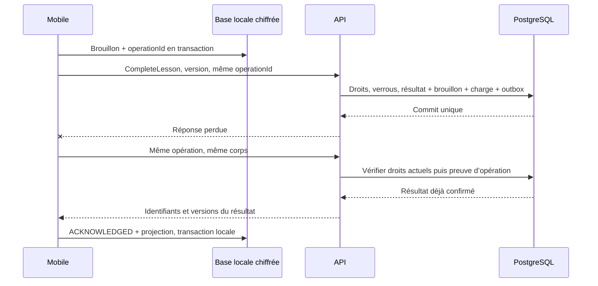

# Synchronisation, concurrence et continuité hors ligne

> Drivy · Dossier de conception 3.13 · 20 septembre 2026
> Statut : proposition de référence, à valider avant réalisation. [Index](../README.md).

## Journal et reprise des observations de séance

Les observations LIVE sont des intentions persistées distinctes du flux GPS et du constat. À réseau absent, les enregistrer sous le lease courant avec operationId stable ; ne pas créer de brouillon ni publier. Envoyer les chunks dépendants avant une observation ancrée. ANCHOR_NOT_READY est un refus transitoire non commité ; OBSERVATION_REVIEW_REQUIRED demande une revue humaine après publication, pas une boucle de retry. Les versions changent lors du rattachement à AP49 et doivent être relues avant AP54. Leçon annulée, droits retirés ou lease expiré : pas de réactivation ni de transfert sous un autre compte. Voir [R46](../03-fonctionnel/regles-etats.md#r46) et [cycle complet](../03-fonctionnel/gps-replay.md#saisie-pendant-lecon).

**Intention de panneau et outbox sont distinctes.** L’ouverture de « Signaler » fige l’instant et l’ancre candidate sans créer d’entrée AP162. Au choix explicite du statut, effectuer la validation locale puis la journalisation atomique ; les appuis rapides répétés sont sérialisés sur cette même intention. Réutiliser la clé uniquement pour la même charge. L’arrivée de nouveaux points pendant le choix ne change pas l’ancre ; les chunks nécessaires restent acquittés avant l’observation. Une révocation connue bloque l’ancre. L’annulation d’une commande remise au transport est une réconciliation suivie, si nécessaire, de retrait, pas un simple effacement d’écran.

## Contrat de continuité

Référence normative : [R11–R12](../03-fonctionnel/regles-etats.md#r11), [R27–R28](../03-fonctionnel/regles-etats.md#r27), [R34](../03-fonctionnel/regles-etats.md#r34) et [R37](../03-fonctionnel/regles-etats.md#r37). Le but n’est pas de rendre toutes les commandes disponibles sans serveur. Le moniteur doit pouvoir retrouver son contexte préparé et conserver son bilan, sans créer une réservation fictivement confirmée ni rétablir un accès retiré.

Le serveur est autorité des engagements, des droits, du résultat confirmé et des révisions publiées. Le téléphone est autorité temporaire du texte personnel encore non envoyé. Une donnée reçue ne remplace jamais silencieusement ce texte. Le client web pilote ne conserve pas de dossiers dans IndexedDB, un service worker ou localStorage ; ses formulaires en mémoire avertissent avant navigation, mais fermer le navigateur peut perdre un brouillon non envoyé. Cette différence est affichée, pas cachée sous une promesse de parité hors ligne.

## Projection native autorisée

Après connexion, préparer une projection par `(personId, schoolId)`, avec base chiffrée et clé distincte. **Fenêtre produit proposée** : leçons des 7 jours précédents et 14 jours suivants ; formations actives autorisées, référentiels correspondants, progression et jusqu’aux 10 derniers bilans publiés par formation. Cette borne limite l’exposition ; l’historique complet reste accessible connecté. Une leçon ouverte en ligne peut être ajoutée explicitement à la projection avec la même date de péremption. Le nombre exact de dossiers pouvant être préparés doit être éprouvé sur téléphone modeste avant pilote.

La projection contient noms utiles des élèves, offres, contrôles de permis sous forme de statut administratif, leçons, préparations, souhaits, révisions partagées, métadonnées de pièces, brouillons serveur dont l’utilisateur est l’auteur, notifications et journal financier autorisé. Un solde hors ligne porte sa date et n’autorise aucune écriture. Pas de binaire de permis par défaut, pas de drafts d’autrui, pas de données d’une école non sélectionnée. Les droits limitent également les champs : ADMIN seul ne reçoit pas le texte pédagogique. L’API peut rendre des collections vides, jamais un faux texte masqué seulement dans l’interface.

Un fichier choisi pour envoi différé est copié dans le stockage privé chiffré lié au même contexte. Son URI d’origine ne suffit pas : l’autorisation du sélecteur peut expirer. Vérifier la copie, puis nettoyer après confirmation serveur et décision utilisateur sur toute pièce rejetée. Les exports libres de brouillons verrouillés ne constituent pas une stratégie de récupération.

## Initialisation cohérente et pagination

`createSnapshot` vérifie les droits actuels et crée un instantané temporaire de la projection autorisée sous transaction de lecture cohérente, avec un watermark scolaire. Le serveur matérialise les pages privées avant de répondre ; il ne conserve pas une transaction de base ouverte pendant toutes les requêtes du téléphone. Chaque page est liée à l’utilisateur, l’école, l’epoch et l’instantané. Expiration proposée : 10 minutes. Un snapshot expiré ou de mauvaise portée ne se poursuit pas depuis une page arbitraire.

Le client écrit toutes les pages dans une zone locale provisoire. Après vérification de la dernière page et de l’epoch, il remplace la projection dans **une transaction SQLite**, puis mémorise le watermark. Une interruption conserve l’ancienne projection encore autorisée et ne présente pas la moitié d’un dossier comme complet. Les brouillons locaux sont dans des tables séparées : recharger une projection ne les supprime pas automatiquement.

Les collections d’une page peuvent être partielles et vides. Les relations peuvent arriver dans une page suivante ; les clés étrangères locales ne sont rendues contraignantes qu’au basculement, après contrôle de complétude. Tous les éléments appartiennent au même snapshot. Un changement de droits pendant sa construction ou sa lecture invalide les pages restantes et impose une nouvelle initialisation.

## Flux de changements sans perte à la frontière de commit

Un simple identifiant auto-incrémenté alloué au début d’une transaction n’est pas un ordre garanti de commit. Le contrat utilise `SchoolSyncClock` : chaque transaction scolaire qui modifie une ressource synchronisable verrouille la ligne d’horloge en fin de traitement, incrémente le compteur, écrit ses `ProjectionEvent` avec ordinaux, puis conserve le verrou jusqu’au commit. La transaction suivante n’obtient pas une séquence visible avant la précédente. Un rollback ne publie aucun événement.

Le curseur est opaque, authentifié et lié à `(école, personne, accessEpoch, filtres, watermark, position)`. Il contient la séquence et l’ordinal pour ne pas perdre le second événement d’une même transaction. Le watermark fixe la borne haute d’une lecture paginée ; les changements suivants seront récupérés après cette borne. Une réponse vide peut avancer le curseur jusqu’au watermark, y compris lorsque des événements ne sont pas autorisés pour cette personne. Le nombre ou le type des objets filtrés n’est pas dévoilé.

Un événement UPSERT indique un identifiant et une version, pas un accès universel à son contenu. Le client recharge la ressource ou la projection correspondante par l’API autorisée. Une lecture peut déjà retourner une version plus récente : la conserver, puis ignorer les versions plus anciennes reçues ensuite. Pour un ensemble dérivé, comme la progression, remplacer l’ensemble autorisé reçu et non additionner des pourcentages. DELETE retire la projection locale, mais ne prouve pas une purge physique des archives serveur. Les renommages, modifications de référentiel applicables et changements de journal financier doivent aussi générer un événement.

Conservation proposée du journal de changements : 30 jours. Un curseur antérieur au journal disponible renvoie `410 CURSOR_EXPIRED` et exige un snapshot. Une epoch différente ne se résout pas par rattrapage incrémental : verrouiller l’ancien contexte, demander la nouvelle portée, reconstruire. Ni un curseur fourni par le téléphone, ni un ancien accès à un objet ne constitue une autorisation.

## Outbox locale et preuve de non-double-effet

Une commande locale stocke : `operationId`, école/personne, type, identifiants visés, version de base, epoch connue, corps canonique, date de création, état, nombre d’essais et dernier code non sensible. Le texte et le corps sont chiffrés. La création du brouillon et de la commande doit être atomique localement. Modifier substantiellement une commande déjà envoyée crée une nouvelle opération après résolution ; ne pas réutiliser sa clé avec une autre charge.

L’expiration d’un cache de réponse HTTP n’autorise pas un second paiement. Les effets sensibles gardent une contrainte d’unicité de l’opération liée à leurs écritures. La durée de conservation de cette preuve suit l’objet métier et sa politique, pas une simple fenêtre de 24 heures. La réponse récupérée est re-filtrée selon les droits actuels ; on ne conserve pas indéfiniment un corps complet de bilan dans Operation.

Au pilote, synchronisation au premier plan, au retour réseau et par action Actualiser. Proposition : interrogation au plus toutes les 30 secondes lorsque le planning est réellement visible, interrompue à l’arrière-plan. Les tâches d’arrière-plan constituent une optimisation éventuelle, jamais la seule garantie de livraison. Le client Swift utilise URLSession et une file native durable ; cette passe ne construit aucun binaire. Les transferts système de fond restent une optimisation à qualifier, pas une dépendance de la reprise [intégration native](architecture-client-swift.md#api-swift).

## Matrice de reprise

| Situation | Traitement automatique | Action et preuve visibles |
|---|---|---|
| Réseau coupé / timeout | Garder même opération ; délai exponentiel avec jitter et plafond proposé de 5 minutes. | En attente sur cet appareil, dernier essai ; bouton Réessayer. |
| 401 | Une tentative de renouvellement via mécanisme officiel ; sinon réauthentification. | Brouillon conservé chiffré, pas supprimé pour résoudre l’erreur. |
| 403 / appartenance retirée | Arrêt des essais, verrouillage du contexte. | Contact de l’école et référence technique, aucun affichage du contenu retiré. |
| 409 SLOT_CONFLICT | Aucun nouvel essai automatique de réservation. | Reprendre choix du créneau ; ancienne réservation préservée. |
| 409 OUTCOME_CHANGED | Ne pas recréer un résultat déjà corrigé par une autre personne. | Conserver les notes autorisées et ouvrir E21. |
| 412 VERSION_CONFLICT | Recharger la version autorisée ; ne pas écraser. | Comparaison base/serveur/local ; appliquer uniquement une décision explicite. |
| 422 | Arrêt des essais du même corps. | Champs à corriger ; une nouvelle commande utilise une nouvelle clé. |
| 429 | Respecter Retry-After ; aucun rafraîchissement en boucle. | Attente expliquée, brouillon intact. |
| 5xx | Réessais bornés ; retrouver résultat par operationId après timeout ambigu. | Incident et référence de diagnostic, pas double message de réussite. |
| 410 snapshot/cursor | Nouvelle initialisation de projection. | Préserver brouillons autorisés, signaler actualisation. |

## Fusion de texte et correction de résultat

L’écran E21 montre la version de base, la version serveur actuelle et les modifications locales. Pas de fusion automatique par « dernier horodatage reçu ». Pour des notes sans conflit de droit, l’utilisateur peut choisir une version ou reconstruire un nouveau brouillon en copiant explicitement ses propres passages. Le bouton de publication reste soumis à la version de publication actuelle.

Une leçon annulée pendant que le moniteur rédige hors ligne ne redevient pas COMPLETED à la reconnexion. Les notes peuvent servir à l’instruction d’une correction, mais ne constituent pas cette correction. La commande CorrectOutcome valide séparément les engagements, le compte financier et l’approbation pédagogique. Un ancien résultat à 09 h arrivé après celui de 14 h peut être enregistré dans l’historique autorisé sans devenir la dernière observation de la formation.

## Durée d’accès et horloge

La lease signée indique personne, école, epoch, issuedAt et expiresAt. Le client compare heure serveur de référence et temps monotone écoulé ; un changement de date du téléphone ne rallonge pas l’accès. Après redémarrage ou détection d’incohérence rendant l’échéance invérifiable, demander une connexion plutôt que prolonger arbitrairement. À expiration, fermer les vues et empêcher le déchiffrement applicatif normal ; aucune promesse d’effacement inviolable sur appareil compromis.

Les sauvegardes système ne doivent pas réintroduire une clé et des données scolaires en clair. La politique de backup des fichiers natifs et du stockage de clés fait partie du spike de sécurité. Les captures d’écran déjà prises et les données déjà lues ne peuvent pas être récupérées à distance. Ces limites doivent figurer dans la notice aux écoles.

## Recette de synchronisation obligatoire

Tester coupure avant commit, après commit avant réponse, pendant transaction locale et au milieu d’un snapshot ; changement d’epoch pendant pagination ; deux appareils ; ancien curseur ; retrait d’affectation ; changement d’heure et redémarrage. L’acceptation exige à la fois absence de doubles effets, conservation du texte autorisé et absence de fuite de données révoquées. Voir [tests](../05-realisation/tests-recette.md) et [exploitation](../05-realisation/deploiement-exploitation.md).

## Capture GPS et offres collectives

Les points GPS ne passent pas par le changefeed ordinaire des dossiers. Une outbox spécialisée native stocke chunks chiffrés et manifestes ; acquittement par identité/hash, reprise hors ordre et contrôle du cutoff. La capture peut continuer dans la borne autorisée sans réseau ; son démarrage initial exige serveur au pilote. À la clôture, le collecteur local s’arrête avant toute tentative réseau. Un résultat de leçon en attente n’autorise pas à continuer la collecte.

Le cache de calendrier contient uniquement les engagements autorisés et offres datées, avec leurs identifiants d’occurrence pour déduplication. Une capacité en cache est informative. Les commandes d’inscription, reconfirmation, présence et achat ne sont pas synchronisées comme des écritures optimistes arbitraires : elles demandent un résultat serveur courant.

L’autorisation de capture R42 et la lease de lecture hors ligne sont deux permissions distinctes. Le client exige les deux pour les actions qui en dépendent, applique la borne la plus restrictive et revalide après redémarrage/incertitude d’horloge. La fin de validité interdit de nouvelles collectes, mais n’efface pas sans procédure les données déjà collectées ; le transfert différé reste soumis aux droits actuels et à la politique de conservation.

Un changement d’inscription ou d’exigence invalide les projections de calendrier/ciblage, pas les achats historiques. Une suppression de trace émet des tombstones pour les captures, dérivés et marqueurs. La restauration d’un cache ou d’une sauvegarde réapplique ces suppressions avant exposition.

## V3 : états partagés, stockage adapté

OnboardingProgress et profil administratif sont sauvegardés par commandes versionnées et relus par identité/école. La progression ne vaut pas autorisation ni snapshot de tous les champs. Web : mémoire de session uniquement, no-store pour réponses privées, pas de persistence client de formulaires contenant naissance/adresse. App native : les éventuels brouillons existants suivent F12 ; les nouvelles étapes de configuration/inscription/archivage/finance exigent confirmation serveur.

Une tablette utilise le même moteur natif et sa propre clé/appareil. Changer l’orientation, largeur ou page ne recrée pas la capture. Deux appareils connectés ne constituent pas une capture distribuée ; chaque queue reste attachée au device autorisé, sans reprise GPS live automatique.

L’archivage émet une projection Learner archived, retire les offres et nouvelles actions sans DELETE de Membership. La révocation émet son événement d’accès et purge selon accessEpoch. Les statistiques ne sont pas répliquées comme vérité locale : elles sont datées et recalculées sur serveur ; les filtres et résultats sont purgés lors du changement d’école.

Une commande tardive visant un dossier archivé est refusée/placée en conflit avec un code distinguant archivage, révocation et version. Le système ne prétend pas détecter des brouillons non envoyés. Une remise en cohérence doit préserver les droits et la preuve de l’événement réel, pas réactiver une relation par effet secondaire.

## Autorisations GPS séparées et pagination de relecture

AP154 délivre deux preuves à portées distinctes : `signedCaptureAuthorization`, bornée par expiresAt pour la collecte locale, et `signedUploadAuthorization`, bornée par uploadDeadline pour l’envoi de mesures antérieures au cutoff. AP156 exige cette seconde preuve **et** la session authentifiée/droits courants. Une autorisation de transfert ne permet jamais de commencer ou prolonger une collecte. Aucun validateur n’ignore l’expiration d’un jeton pour autoriser une nouvelle action. Les deux preuves sont liées à la même capture, école, personne et appareil ; révocation/purge restent contrôlées au serveur.

Le curseur de replay contient snapshot/reconstructionVersion, segmentIndex et dernière séquence, plus identité/école/epoch. Une page transporte au plus 1 000 points au total ; un long segment peut continuer sur la page suivante. `continuesFromPreviousPage` et `continuesOnNextPage` sont des limites de transport, pas des pauses GPS. Les bornes sequence évitent doublon/perte ; la continuation d’un segment n’introduit pas de lacune inventée. Les annotations revues sont copiées une seule fois par identifiant. Une reconstruction privée modifiée pendant pagination impose un nouveau parcours de lecture cohérent plutôt qu’un mélange de versions.

## Opération encore en cours : reprise sans seconde intention

[R12](../03-fonctionnel/regles-etats.md#r12) distingue réponse perdue, commande connue en cours et résultat confirmé. Une réservation interne d’opération lie auteur, école, clé et hash canonique avant les effets. Sa preuve de commit reste atomique avec les effets métier ; le cache HTTP ne remplace pas cette preuve. Un worker de reprise ne déclare une opération échouée/rejouable qu’après exclusion d’un commit concurrent et recherche de la preuve durable. Un crash ne doit pas laisser une intention bloquée éternellement ni autoriser deux exécutions.

AP72 rend 202/PENDING si l’intention est encore connue en cours, 200 pour sa preuve commitée, ou le rejet terminal autorisé. Un résultat inconnu rend 404 sans affirmer que rien ne s’est produit : le client rejoue la requête initiale et sa clé. Il n’essaie jamais une nouvelle clé parce qu’un délai a expiré. Le corps différent avec même clé reste IDEMPOTENCY_MISMATCH, et la restitution relit les droits actuels.

## Matrice des domaines incrémentaux

| Domaine | Initialisation et lecture | Événement et invalidation |
|---|---|---|
| Domaines déjà présents dans SnapshotPage | Instantané atomique existant, curseur/epoch | UPSERT/DELETE autorisés, relecture de projection. |
| COURSE_SESSION, COURSE_ENROLLMENT | API de cours/calendrier ; cache enrichi de lecture connectée | INVALIDATE et relecture des offres/engagements touchés ; DELETE enlève la projection. |
| REQUIREMENT, PURCHASE, ENTITLEMENT | API spécialisée après connexion, date de fraîcheur visible | INVALIDATE et relecture ; aucun solde local ne confirme une transaction. |
| RECORDING_CHOICE, CAPTURE | API spécialisée ; les positions utilisent toujours leurs routes privées | Invalider métadonnées/replay ; DELETE purge toutes les pages et dérivés de la capture. Un refus connu déclenche l’arrêt selon R42. |
| ADMINISTRATIVE_PROFILE, PROFILE_POLICY | API autorisée par champs, hors snapshot de base | Invalider les champs et tâches d’onboarding dépendantes, ne pas garder une ancienne valeur comme validée. |

Lors d’un nouveau snapshot, d’un changement d’école ou d’epoch, vider les caches enrichis puis les recharger si nécessaire. Les brouillons locaux autorisés restent dans leur circuit séparé. Le flux fournit des identifiants, pas des coordonnées ou un accès au contenu. Sur retrait de scope, ne pas envoyer des identifiants étrangers : utiliser l’invalidation d’epoch existante. Rétention de cursor et fenêtre hors ligne restent bornées ; « synchro » ne garantit pas un arrêt instantané d’un appareil déconnecté.

## Réalisation native, stockage et mise à jour

Les [frontières mobiles](integration-mobile-transverse.md) détaillent le cycle natif, le verrouillage, les clés, les sauvegardes et le point sûr d’application d’une mise à jour. Elles n’autorisent aucune nouvelle mutation hors ligne. Le processus natif Swift ne doit pas être supposé continuellement exécutable en fond ; le collecteur qualifié et ses écritures durables respectent les limites documentées ci-dessus. La réconciliation après arrêt forcé rend le trajet partiel au lieu d’inventer les points absents.

## Liaison avec le client Swift natif

Les invariants ci-dessus restent identiques. Le [coordinateur Swift](architecture-client-swift.md#capture) détient le journal indépendamment des vues, revalide après suspension et ne confond pas annulation de tâche UI avec annulation serveur. Le [client HTTP](architecture-client-swift.md#api-swift) conserve ETags, clés d’opération, absence/null et erreurs ; les DTO conditionnels ne sont pas simplifiés pour un générateur. Android implémentera les mêmes contrats séparément.

## Révocation globale et repères
La révision de Preparation comprend plannedWaypoints ; leurs caches suivent le scope et les tombstones des données géographiques. La langue des offres est invalidée avec la série, jamais inférée côté client. À PROCESSING de suppression globale, révoquer sessions et epochs applicables selon [R104](../03-fonctionnel/regles-etats.md#r104) ; le reçu n’autorise aucun rejeu de commande scolaire. L’app hors ligne ne reçoit pas instantanément cette révocation : les bornes locales continuent de s’appliquer, puis réconciliation et purge au retour. Les commandes globales en 202 sont reprises par leur POST/idempotence et AP195, pas par la recherche scolaire AP72.

## Données de publication et préférences à synchroniser
Les annotations textuelles publiées suivent ReportRevision dans le snapshot et le flux existants ; elles ne passent pas par la file de points GPS. La remise de service, la correction du prix et les libérations de clôture invalident PURCHASE/ENTITLEMENT/COURSE_SESSION et les vues concernées au même commit. Aucun nouveau type de synchronisation ni droit d’écriture hors ligne n’est créé. Le manifeste vide et ses champs null sont conservés tels quels, sans inventer un point pour satisfaire le décodeur.

### Coordination de la suppression globale

Toute séquence abrégée de verrous métier dans ce document s’applique **après** la porte d’accès des personnes et la vérification transactionnelle du périmètre. L’ordre complet et les modes nécessaires sont définis une seule fois dans [Autorisation et frontière de commit](transactions-v2.md#autorisation-et-commit). Le chemin du worker de suppression dispose d’un mandat restreint ; il n’accorde pas une session normale à un compte CLOSING. La concurrence réelle reste à tester sur PostgreSQL.

## Dépendances et restrictions des écritures hors ligne
La régularisation invalide COURSE_ENROLLMENT/ENTITLEMENT et la projection scolaire concernée ; l’invalidation de preuve invalide REQUIREMENT et les vues qui le consultent. Les objets relus sont filtrés par droits courants ; aucune basis obsolète ne satisfait localement un nouveau préalable. Les corrections et validations restent des décisions serveur ; le cache peut expliquer un état ancien mais pas le confirmer.

Les points suivent [R111](../03-fonctionnel/regles-etats.md#r111) : capturedAt n’est jamais la date d’upload. Les tokens APNs sont récupérés au système à la connexion/au lancement ; une commande de réinscription tardive doit revalider propriétaire/génération et environnement, pas réutiliser un token persistant déclaré éternel. Une réponse d’un ancien compte ne met pas à jour la liaison du nouveau.

## Réconciliation des dépôts de pièces

Une clé idempotente de création renvoie le ticket initial, même expiré. Le client conserve l’identité du document et réconcilie son état ainsi que la finalisation avant de proposer un nouveau dépôt. Le workflow complet est dans [reprise des pièces](fichiers-temps-communications.md#reprise-depot) ; il ne remplace pas les chunks/manifeste du GPS. Une finalisation tardive ne ressuscite pas un objet purgé. La couverture d’une scène en arrière-plan n’annule ni synchronisation ni capture autorisée.
