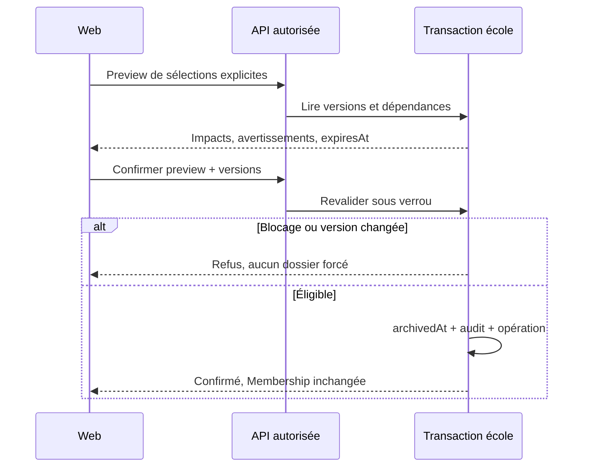

# Transactions V3 : accueil, archivage, appareils et mesures

> Drivy · Référence de conception 3.14 · 20 septembre 2026
> Conception proposée ; aucune implémentation ou recette produit revendiquée. [Index](../README.md).

## Portée

Ce document complète les [transactions GPS, packs et cours](transactions-v2.md), toujours applicables. Les règles canoniques R73–R100 sont dans [Règles](../03-fonctionnel/regles-etats.md). Les noms de tables sont conceptuels ; les extraits ne sont pas une migration SQL livrée. Les séquences scolaires ci-dessous commencent après la porte d’accès d’identité ; l’ordre complet unique est [identité → école → dépendances](transactions-v2.md#autorisation-et-commit). Aucun exemple abrégé « verrou école » ne dispense de cette étape.

## TX3-01 · Provision, invitation et activation de l’école

La provision pilote par opérateur autorisé crée School DRAFT, SchoolSetup version1 et invitation au responsable, avec événement d’audit. L’invitation garde la sécurité F02 et n’attribue les rôles qu’après acceptation de la bonne identité. Il n’existe pas de route de provision publique dans l’API documentaire. Un outillage opérateur futur doit avoir sa recette avant le premier pilote.

L’ADMIN complète les agrégats F13/F17/F18 par leurs commandes ; saveSchoolSetup conserve seulement étape/progression. Une commande validant une section n’exécute pas implicitement tous les autres domaines. Un échec sur une offre n’efface pas le contact scolaire déjà sauvegardé.

Pour activateSchool : authentifier et autoriser ADMIN ; vérifier operationId/payload et If-Match ; prendre verrou école ; relire configurationVersion, notices/politiques approuvées et prérequis activationReady calculés sur la configuration DRAFT, sans exiger ACTIVE ; passer DRAFT→ACTIVE et marquer SchoolSetup COMPLETED ; écrire Operation/Audit/Outbox atomiquement ; commit ; seulement ensuite afficher espace actif. Si le contexte a changé depuis la revue : conflit ou SETUP_INCOMPLETE, pas activation partielle.

**Readiness matériel :** SchoolReadiness renseigne CAN_CAPTURE pour le contexte de l’acteur. Sans appareil fourni/préparé, ce point reste non prêt avec DEVICE_REQUIRED et ne bloque pas CAN_USE_WORKSPACE. Il ne prétend pas que tous les téléphones de l’école ont été testés. Les limites juridiques et de profil s’appliquent indépendamment.

## TX3-02 · Entrée d’une personne et reprise multi-appareils

L’acceptation d’invitation F02 crée/réutilise Membership et Learner sans formation implicite. Elle initialise OnboardingProgress par kind applicable, le profil administratif scolaire minimal et les préférences de notification personnelles, version1, avec les défauts documentés dans F19. Aucun RecordingChoice n’est créé implicitement. Avant que les noms aient été confirmés, ce profil peut contenir firstName/lastName null avec readiness MINIMAL ; les commandes permettant de terminer le profil exigent les deux valeurs non vides. Ce stade n’est pas une inscription confirmée à un cours.

Le profil scolaire porte source/acteur ; les noms administratifs ne remplacent pas le nom de connexion. Le client sauvegarde via If-Match ; la lecture de progression n’a pas d’effet de création. Le retour vers l’app/web lit le même objet. CompleteMyOnboarding verrouille le progrès, recalcule minimum/politique applicable et marque COMPLETED ; il ne crée aucune Training, place, paiement ou RecordingChoice. Si des données manquent pour une future action, ce sera un prérequis ciblé R81, non un échec caché du wizard.

Photo : intention F09 puis fichier READY ; saveAdministrativeProfile ne peut pointer que le document privé de ce learnerId avec purpose PROFILE_PHOTO. L’effacement du fichier retire la référence et rend l’avatar initiales, pas un profil invalide. Le réencodage retire les métadonnées de localisation.

## TX3-03 · Approuver une formation souhaitée

Le choix élève crée TrainingRequest PENDING, clé unique active `(schoolId,learnerId,offeringVersionId)` ; avoir déjà une Training compatible est signalé. Décision ADMIN : verrou école puis demande/dossier ; vérifier version, Learner actif, catégorie/offre disponible, référentiel approuvé et instructorMembershipId autorisé. Créer Training et affectation (ou relier une Training compatible après revue explicite), mettre demande APPROVED avec trainingId et auteur ; audit/outbox/Operation puis commit. Un rejet ne touche aucun PermitCheck.

Approbations concurrentes de deux demandes pour même cycle sont bornées par l’unicité Training existante. Ne pas relier automatiquement deux formations de catégories différentes. La déclaration d’exigence déjà accomplie utilise RequirementRecord F18 et sa vérification, pas cette commande.

## TX3-04 · Prévisualisation et archivage individuel

L’aperçu lit uniquement les dossiers autorisés et calcule blocages connus : formations ACTIVE/PAUSED, engagements futurs, constats obligatoires non résolus, HOLD, captures non terminales et soldes débiteurs. Les comptes historiques équilibrés ne bloquent pas. Les droits disponibles non réservés créent un avertissement, pas une annulation. L’aperçu est sauvegardé avec auteur/école/versions/hash des sélections, expiresAt proposé +15minutes. Il ne verrouille pas l’école pendant ces15minutes.

Commit AP17 : vérifier auteur/périmètre/aperçu/date et If-Match du dossier ; verrou école puis Learner ; relire les dépendances et les droits actuels ; si blocage ou versions changées, refuser sans mutation. Sinon archivedAt, archivedBy, reason et version changent ; Membership reste inchangée. Audit, projection de dossier archivé, retrait de ciblage d’offres et Operation sont atomiques. L’outbox retire les annonces de nouveaux cours mais ne supprime pas les bilans publiés.

**Transactions concurrentes :** nouvelle réservation, inscription, nouvelle Training, nouvelle charge/vente et démarrage capture doivent vérifier le dossier actif sous la même coordination/contrainte appropriée. Une écriture financière de correction sur archive suit un parcours autorisé F10 ; si elle crée une obligation, elle est visible et ne provoque pas une restauration implicite. La capture locale déjà non connue n’est pas niée ; un upload/constat tardif est gardé en conflit selon F12 et traité sous droits valides. Une révocation peut interdire sa réintégration : le logiciel ne promet pas de conserver indéfiniment une queue sans autorisation.

## TX3-05 · Lot et restauration

startBulkArchive crée un job avec les lignes explicites issues d’un aperçu. Un worker réclame le job par bail puis exécute la transaction précédente par ligne, sous la même Operation dérivée du job+learnerId. Chaque ligne relit habilitation, version, impacts et avertissements acceptés. Un arrêt worker reprend les lignes non conclues sans rejouer les effets des autres. COMPLETED signifie toutes lignes réussies/idempotentes ; PARTIAL signifie résultats mixtes ; FAILED aucune réussite avec erreurs terminales. Un échec réseau transitoire garde un réessai borné documenté, pas un résultat ARCHIVED fictif.

Une restauration vérifie version/droits puis met archivedAt/by/reason courant à null avec historique d’audit conservé. Membership, Training, Enrollment, droits contractuels et choix GPS ne changent pas. Si la personne veut revenir dans une formation, F03/F02 appliquent leurs règles séparées.

## TX3-06 · Diagnostic et capture tablette

Le diagnostic reçoit code modèle/OS/build, permission, précision/âge de mesure et stockage ; il ne reçoit pas obligatoirement de coordonnées. Le serveur compare un profil de qualification approuvé (matériel/build/minimums définis par essais G0) puis rend QUALIFIED, UNSUPPORTED ou NEEDS_CHECK. TTL proposé24heures maximum, invalidation immédiate dès changement de build, profil, système, utilisateur ou permission connu. Les seuils de précision/âge/stockage sont **à mesurer et geler en G0**, pas des valeurs garanties inventées.

startCapture exige deviceAssessmentId du même auteur/appareil et courant ; contrôle OS local juste avant démarrer. Transaction école puis capture : unicités non terminales distinctes par lessonId, instructorMembershipId et deviceId. L’expiration de l’autorisation devient état terminal au traitement et ne prolonge pas la capture offline ; l’OS/serveur peuvent ne pas être joignables, mais la limite locale reste opposable. Le téléphone et la tablette ne s’échangent aucun bail de capture implicitement.

Une rotation détruit éventuellement une vue mais pas le contrôleur de collecte situé hors du cycle de vie de l’écran. Le code exact dépend du client natif à qualifier. Une trace locale réellement perdue ne peut pas être reconstituée par le lecteur HTML ou la documentation.

## TX3-07 · Lecture de mesures et export

Les métriques lisent un instantané cohérent des tables source. M01/M02/M03 utilisent résultats réels ; M04 une cohorte terminale par date prévue ; M05 un snapshot par série ; M06 des PaymentEntry uniques et leurs inversions ; M07 la dette actuelle ; M08/M09 des actions encore requises. Les définitions sont dans [F23](../03-fonctionnel/statistiques.md), pas recopiées dans le frontend.

M04 renvoie un breakdown (annulées, absences, total terminal, non clôturées et taux) ; pas un unique score. Les séries temporelles, lorsqu’elles sont demandées, s’appliquent seulement aux mesures de période et sont plafonnées ; les instantanés ne deviennent pas des courbes historiques inventées.

L’export garde type/colonnes/filtres/definitionsVersion/dataAsOf et auteur dans une requête privée. Le worker recontrôle les droits puis produit au plus10000lignes. Pour grands traitements futurs, ne pas maintenir une transaction SQL ouverte indéfiniment : extraire un snapshot borné puis formater. Le fichier est privé, disponible au plus24heures ; le téléchargement est à nouveau autorisé. Changement de scope/grant annule ou interdit le téléchargement.

Neutraliser les cellules textuelles susceptibles d’être interprétées comme formules, échapper séparateurs/guillemets et tester Excel/LibreOffice cibles ; le formatage d’export ne modifie pas la base. Révocation et expiration purgent le fichier, mais pas une copie volontairement enregistrée sur l’ordinateur de l’utilisateur. Cette limite est affichée.

## Invariants à mesurer et non supposés

Le débit permis par un verrou d’école, le temps des agrégats, le comportement du BFF, la qualité GNSS d’une tablette et la résistance d’un collecteur aux interruptions exigent des essais. Ce document n’est ni un benchmark de charge, ni une preuve de chiffrement, ni une validation juridique. Les scénarios T163–T232 décrivent la recette à effectuer.

## Cohérence des préconditions d’archivage

TX3-04 et TX3-05 interrogent aussi les CourseEnrollment avec `financialFollowUp != NONE` et les suivis financiers rattachés au dossier. Un compte momentanément équilibré ne prouve pas qu’un remboursement a été effectué. `ARCHIVE_FINANCIAL_FOLLOW_UP_REQUIRED` bloque sans produire de contre-écriture. Une capture non terminale est bloquante ; une collecte terminale en attente de transfert est signalée séparément. Les commandes tardives suivent F12 : aucune nouvelle collecte ou publication après archive par simple réessai.

## Readiness générale et contrôle de l’action

GET SchoolReadiness ne reçoit pas de lessonId ni de sessionId : les capacités sont donc des indicateurs de préparation de l’école et de l’appareil éventuel, pas une garantie d’admissibilité d’une transaction donnée. Planifier, capturer, publier et s’inscrire revalident toujours le dossier, la prestation et les contraintes courantes. `activationReady` exige les prérequis scolaires de R74, pas les étapes facultatives de l’assistant.

Le PATCH AdministrativeProfile est partiel et contrôle chaque champ transmis. AP16 est conservé pour les coordonnées simples mais appelle le même service : sous verrou Learner puis profil, sa version attendue doit refléter toute écriture administrative précédente. Une écriture AP176 incrémente la version de Learner et celle du profil ; AP16 fait de même. Ainsi deux versions parallèles ne peuvent écraser silencieusement les mêmes contacts. displayName reste un nom d’affichage, pas un remplacement de firstName/lastName.

## Archivage et routage des notifications
L’aperçu/commit d’archive relisent les suivis R109 sous verrou au même titre que les autres obligations ; AP201 concurrent invalide ou actualise l’aperçu selon ses versions, jamais de compensation cachée. R112 regroupe le token globalement sans contourner le périmètre scolaire des routes : changement de propriétaire, versions des routes et outbox sont coordonnés. La déconnexion ne possède pas une capacité de rappel d’un push accepté par APNs. Le contexte externe doit rester minimal avant ce point irréversible.
