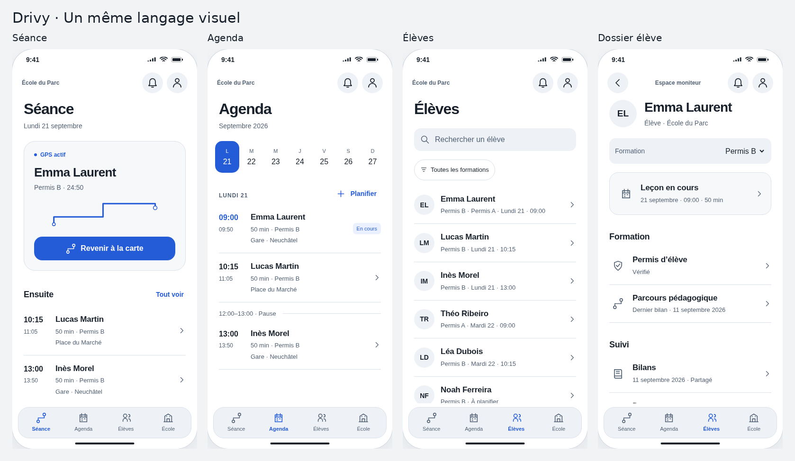

# DESIGN · Drivy / Cartographie native

> Référence visuelle 3.17 · 20 septembre 2026 · Direction appréciée, nouvelles déclinaisons à valider.

## Voir avant de lire

**[Ouvrir l’application unifiée](APPLICATION.html)**. La séance, l’agenda, la liste d’élèves, le dossier et le bilan utilisent les mêmes composants. **[Accès direct à la carte](LECON.html)** : même fabrication, autre point d’entrée.

[Version sombre](assets/application-v3-17/00_parcours_moniteur_sombre.png) · [Bilan et élève](assets/application-v3-17/00_bilans_et_eleve.png) · [Fenêtre iPad](assets/application-v3-17/17_ipad_dossier.png) · [Grand texte](assets/application-v3-17/18_grand_texte.png).

Dans l’atelier, les réglages de revue changent rôle, taille, apparence et état. Ils ne font pas partie de l’application destinée au moniteur. La planche « Composants » permet de comparer les primitives ; elle n’ajoute aucune destination au produit.

## Cohérence de construction

`atelier/ui.js` centralise les composants ; `workspace.js` compose les parcours hors carte ; `app.js` conserve la carte. Les boutons, champs, lignes, observations et feuilles sont réellement appelés depuis une source commune. Le [registre d’usage](composants-usage.json) relie les 49 écrans aux composants. La [couverture](04-ecrans-reference.md) distingue 20 compositions actuelles / 17 écrans, six écrans encore illustrés seulement dans l’ancienne galerie et 26 écrans non dessinés.

Une même action n’utilise pas deux versions concurrentes. Une action différente ne doit pas être déguisée en contrôle identique : navigation, sélection, enregistrement et publication conservent leurs conséquences distinctes. La carte peut avoir un en-tête immersif, tandis qu’un dossier utilise un titre et une liste. Le web et Android traduiront les mêmes rôles dans leurs composants natifs, pas dans un clone pixel à pixel.

## Références

[Direction](01-direction-artistique.md) · [Composants](02-composants.md) · [Cartographie](03-cartographie.md) · [Textes et états](05-contenu-etats.md) · [Recette](06-livraison-validation.md) · [Design system](../02-experience/design-system.md) · [Recherche complémentaire](../01-recherche/coherence-application.md).

La [galerie complémentaire](MAQUETTES.html) conserve les cours, achats, onboarding et gestion encore non repris. Elle ne concurrence pas les nouveaux rendus des mêmes variantes. Les huit [SVG de carte](PASSAGE_FIGMA.md) restent ceux de V3.16 : aucun nouveau fichier .fig ni Auto Layout n’est livré.

## Fabriquer et vérifier

`python annexes/generer-atelier.py` produit APPLICATION et LECON depuis un même template, les sources de `atelier/`, les fixtures et les tokens canoniques. `python annexes/exporter-application.py --chromium CHEMIN` capture les nouvelles compositions. Les captures ne distribuent aucun fichier de police.

L’[audit courant](../06-gouvernance/audit-corrections-v3-17.md) et les [rapports](../06-gouvernance/revue-coherence.md) détaillent la portée. Carte fictive, mémoire volatile, réservations/publications simulées, aucun GPS ou serveur. Les nouvelles pages ne convertissent pas une leçon active quelconque en bilan. Aucune qualification SwiftUI, route ou Figma. Les 434 scénarios métier et 68 scénarios mobiles restent NOT_EXECUTED sur l’application.
