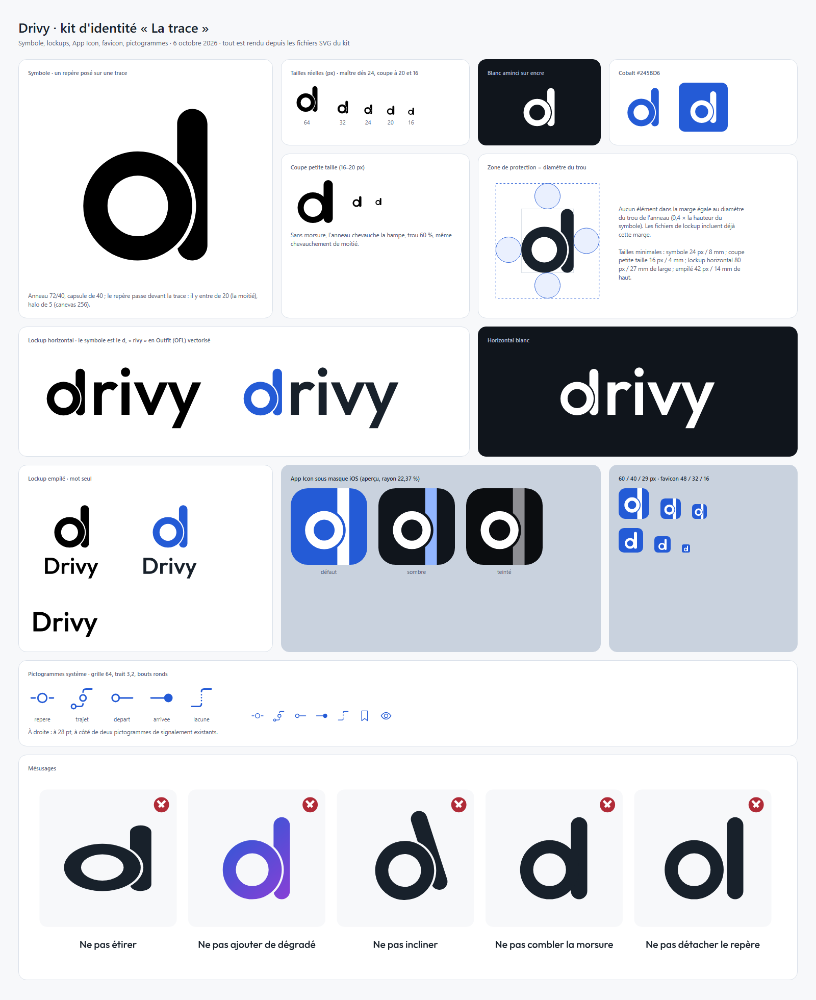
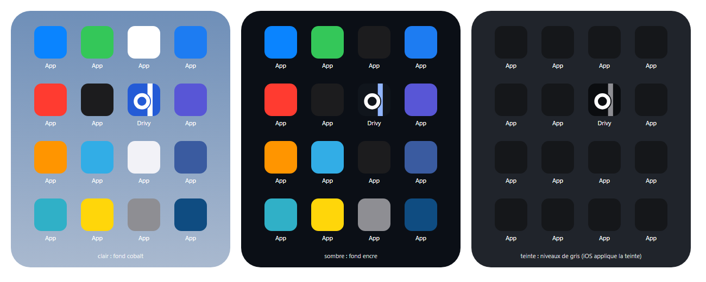

# Drivy Brand System — « La trace »

Version 1.1 · 9 octobre 2026 · **intégration engagée à la demande du porteur**. La proposition du 6 octobre est maintenant implémentée sur les parcours décrits dans [le suivi d’intégration](brand-integration-20261009.md) ; les images de ce document restent les maquettes de conception. Les résultats de qualification figurent dans [STATUS](STATUS.md). Démarche, audit et directions écartées : [passe de marque du 6 octobre](brand-pass-20261006.md). Fichiers : [assets/brand-20261006](assets/brand-20261006).

Ce document complète [DESIGN.md](../../DESIGN.md) : il ne remplace ni les tokens natifs 3.8 ni la direction web « Bureau », il dit ce qui rend Drivy reconnaissable et comment le rester.

## 1. Idée de marque

**Chaque leçon laisse une trace.**

Une leçon de conduite est une ligne qui porte des moments. Drivy est le carnet de route de l'apprentissage : il garde ce qui s'est passé sur la route et le rend lisible pour le moniteur, l'élève et l'école. C'est la suite directe de la promesse de conception « le trajet devient le support de l'explication ».

## 2. Personnalité

| Drivy est | Drivy n'est pas |
|---|---|
| calme, factuel | enthousiaste, motivant |
| précis | technique ou froid |
| accompagnant | scolaire, punitif |
| professionnel au quotidien | administratif |
| sobre | décoré |

Trois mots : **trace, repère, calme**. Pour le moniteur, un outil qui ne gêne pas la conduite. Pour l'élève, un fil qu'il peut relire. Pour l'école, un dossier propre. Aucune performance : pas de score, pas de classement, pas de statistique de vitesse ou de distance mise en avant.

## 3. Principes

1. **Deux primitives, toujours ensemble.** La trace (trait à bouts ronds) et le repère (disque annelé posé dessus). Rien d'autre n'est « de marque ».
2. **Trois états, partout les mêmes.** Plein = parcouru, acquis, passé. Rail gris = à venir. Pointillé = inconnu (lacune GPS, envoi en attente). Le pointillé ne veut jamais dire « futur ».
3. **Un repère est posé sur une ligne.** Jamais d'anneau isolé pour décorer.
4. **Le vivant est en cobalt, le passé à l'encre.** Trace en cours, repère courant, action primaire, sélection : cobalt. Vignettes, portion passée d'un rail : encre.
5. **Une ligne par écran, deux au plus.** Au-delà, la signature devient un motif.
6. **Là où rien n'est une ligne, on ne force rien.** Profil, réglages, formulaires et grille de signalement restent natifs.

## 4. Logo

**Idée.** Le « d » de Drivy est un repère posé sur une trace : un anneau parfait passe devant une capsule verticale et la mord de son halo, comme les repères mordent la trace sur la carte.

- **Construction** (canevas 256, grille de 8) : anneau de rayons 72 et 40, capsule large de 40, l'anneau entre de 20 dans la capsule, halo de 5. Formes remplies, un contour par pièce, aucun `<text>`.
- **Coupe petite taille** (16 à 20 px) : sans morsure, anneau 80/48 chevauchant une hampe de 48.
- **Couleurs** : cobalt #245BD6, encre #18212B, blanc (version amincie pour fond sombre). Une seule couleur à la fois.
- **Wordmark et lockups** : horizontal, le symbole sert de « d » suivi de « rivy » ; empilé, symbole au-dessus de « Drivy ». Caractère Outfit, graisse 540, SIL OFL 1.1, vectorisé. À valider : le lockup horizontal se lit « drivy » en bas de casse.
- **Zone de protection** : le diamètre du trou de l'anneau, sur chaque côté.
- **Tailles minimales** (trouvées par rendu) : symbole 24 px, coupe petite taille 16 px, lockup horizontal 80 px de large, empilé 42 px de haut. Impression, calculé et non éprouvé : 8, 4, 27 et 14 mm.
- **Où** : écran de lancement et de connexion, en-tête du web, page de connexion Keycloak, e-mails et documents. Nulle part ailleurs dans l'app.
- **Mésusages** : étirer, incliner, ajouter un dégradé, combler la morsure, détacher le repère de la trace.
- **Défauts connus** : les deux jonctions entre morsure et hampe sont des angles vifs ; la hampe ne fait que 15 unités à sa taille, non éprouvé en impression ; aucune recherche d'antériorité.

Fichiers et journal des passes : [kit](assets/brand-20261006/kit/kit.md).

## 5. App Icon

La trace traverse la tuile de haut en bas à fond perdu, décalée à droite : elle continue hors de l'icône. Le repère passe devant et la mord. Ce n'est pas le logo centré sur un carré.

- **Cotes** (1024) : bande de x 624 à 784, repère de rayons 256 et 140 entrant de 80 dans la bande, halo 32.
- **Variantes** : défaut (fond cobalt, formes blanches), sombre (fond #10151C, trace #91B5FF, repère blanc), teintée (niveaux de gris sur fond sombre). PNG 1024 opaques fournis.
- **Calques** pour Icon Composer (fond, trace, repère) : [app-icon-layers.md](assets/brand-20261006/kit/app-icon-layers.md).
- **Favicon web** : coupe petite taille sur tuile cobalt, SVG et PNG 32, 180, 192, 512.
- **Limites** : masque iOS approché (rayon 22,37 %) ; à 29 px l'icône se lit anneau et bande plus que « d » ; Liquid Glass et le mode teinté ne sont pas vus sur appareil.
- **Reproduction** : `scripts/generate-app-icon.ps1` synchronise désormais les trois PNG du kit versionné et leur catalogue. L’ancien dessin procédural ne peut plus écraser l’icône.

## 6. Couleur

Rien n'est repeint. Le cobalt est conservé : il est déjà réservé à l'action, à la sélection et à la trace, et c'est cette discipline, pas la teinte, qui le rend reconnaissable. Un seul token est ajouté.

| Rôle | Clair | Sombre | Usage |
|---|---|---|---|
| `accent` · Cobalt Drivy | #245BD6 | #91B5FF | action primaire, sélection, trace vivante, repère courant |
| `accentPressed` | #1947AD | #B4CCFF | état pressé |
| `accentSoft` | #EAF0FE | #233859 | fond de sélection |
| `text` · Encre | #18212B | #F2F5FA | texte, trace passée, départ et arrivée |
| `muted` | #536174 | #B0BCCC | métadonnées, icônes de ligne |
| `canvas` | #F7F8FA | #10151C | fond groupé |
| `surface` | #FFFFFF | #19222E | pages, panneaux, disque d'un repère |
| `surfaceMuted` | #EEF2F7 | #222E3E | bouton secondaire, vignette de trace |
| `border` | #D9E0E9 | #34445A | filet 0,5 pt |
| `controlBorder` | #78869A | #71849D | contour de contrôle, **station creuse, pointillé de lacune** |
| **`rail`** (nouveau) | #C3CDD9 | #3A4757 | trait du rail « à venir » uniquement |
| `success` / `warning` / `danger` | #17633D / #7A4D00 / #B02B37 | #98DBB4 / #F2CB83 / #FFADB4 | anneau et glyphe d'un repère d'observation, messages |

Contrastes mesurés (WCAG 2, calculés depuis ces valeurs) : cobalt sur surface 5,93:1, sur canvas 5,58:1, blanc sur cobalt 5,93:1 ; cobalt sombre sur surface sombre 7,83:1 ; `controlBorder` sur surface 3,70:1, sur canvas 3,48:1, sur surfaceMuted 3,29:1, en sombre 4,19:1 ; trace cobalt sur fond de carte gris #E4E8EE 4,82:1. Le `rail` ne fait que 1,61:1 sur blanc : il ne porte donc jamais seul une information, d'où la station creuse en `controlBorder`.

Règles :
- les sémantiques n'apparaissent que dans l'anneau et le glyphe d'un repère, toujours avec un libellé ; jamais en aplat de surface dans une liste ;
- la carte est grise : la trace et la position sont ses seules couleurs ;
- aucun dégradé, aucune seconde couleur de marque ;
- à unifier : le web utilise #285CC4 et trois bleus sombres coexistent (#91B5FF, #9ABEFF, #7AA2FF). Cible : #245BD6 / #91B5FF partout, après nouvelle mesure des 52 couples web.

## 7. Typographie

SF Pro système sur iPhone et iPad, Source Sans 3 sur le web : inchangés. La personnalité vient du traitement, pas d'une police.

- **L'heure est une graduation.** Heures et durées en chiffres tabulaires semibold, alignées à droite contre le rail ; libellés en regular. Début en `headline`, fin en `footnote` `muted`.
- **Un grand chiffre par écran de terrain.** Chrono de leçon et heure de la prochaine leçon en `largeTitle` bold tabulaire. Nulle part ailleurs.
- **Titres à gauche, graisse plutôt que taille.** Échelle Dynamic Type existante ; pas de capitales espacées, pas de SF Rounded, pas de mono hors code d'invitation.
- **Nom de la marque** : « Drivy », capitale initiale dans un texte, jamais abrégé en « D ».

## 8. Iconographie

- SF Symbols monochromes en `muted` pour la navigation et les lignes : inchangé.
- Les 12 pictogrammes de signalement (grille 64, trait 3,2, bouts et jonctions ronds, filaires) restent la famille de référence.
- Cinq pictogrammes système rejoignent cette famille, même construction : **poser un repère** (bouton Signaler), **trajet**, **départ**, **arrivée**, **lacune**. Fichiers dans le kit.
- Règle de création : un pictogramme sur mesure n'existe que si aucun SF Symbol ne dit la chose ; il se dessine sur la grille 64, trait 3,2, sans remplissage, sans perspective, lisible à 28 pt.

## 9. Formes, rayons, surfaces

- Rayons continus 12 (champ) / 16 (contenu) / 24 (panneau de carte) : inchangés. Boutons 52 pt, 64 pt en terrain.
- **Trace** : 3 pt dans l'interface, 6 pt sur la carte avec halo 11 pt, 2 pt dans une vignette. Bouts ronds, jamais de flèche.
- **Repère** : disque `surface`, anneau 3 pt, halo `surface` de 2 pt qui interrompt la ligne. Station 10 pt, repère courant 14 pt, repère de carte 28 pt (40 pt sélectionné).
- **Vignette de trace** : carré 44 pt, rayon 12, fond `surfaceMuted`.
- Surfaces calmes : filet 0,5 pt plutôt qu'ombre ; ombre réservée aux panneaux flottant sur la carte ; Liquid Glass réservé aux boutons ronds de carte.

## 10. Cartographie

- Style : `MapStyle.standard(elevation: .flat, emphasis: .muted, pointsOfInterest: .excludingAll)`, contrôles système masqués. À qualifier sur appareil, en clair et en sombre.
- Trace : deux `MapPolyline` superposées, halo `routeHalo` 11 pt puis `route` 6 pt, bouts et jonctions ronds. Aperçu du bilan : 8 et 4 pt.
- Lacune GPS (silence de plus de 15 s) : polyligne en pointillé `controlBorder` entre les deux fragments. Elle relie deux points connus, elle n'invente pas de position : c'est un segment droit, tireté, sans halo.
- Départ : anneau encre 14 pt. Arrivée : disque encre plein 14 pt, en bilan et replay seulement. Pendant la leçon, la fin de la trace est la position.
- Position : disque blanc 34 pt à flèche cobalt orientée (inchangé).
- Repères d'observation : 28 pt, anneau 3 pt de la couleur de l'appréciation, glyphe 12 pt bold, centrés sur la trace ; anneau en tirets tant que l'envoi est en attente.
- Jamais : dégradé de vitesse, couleur par segment, épingle en goutte, plusieurs traces de couleurs différentes.

## 11. Composants signature

| Composant | Rôle | Remplace |
|---|---|---|
| `DrivyTraceLine` + `DrivyMarker` | les deux primitives, en `Shape` | — |
| `DrivyCompetencyTrack` | niveau d'une compétence : 3 stations (en découverte, avec accompagnement, autonome) ; rail vide = pas encore vue | `DrivyCompetencyMeter` (3 points) |
| `DrivyTimeRail` | journée ou liste horaire : heures, rail vertical, une station par leçon | lignes à filets d'Aujourd'hui et de l'Agenda du jour |
| `DrivyDossierThread` | « dernière leçon évaluée → prochaine étape » | deux blocs de texte |
| `DrivyTraceThumbnail` | silhouette du trajet d'une leçon réalisée, à l'encre | rien (les listes n'ont pas d'image) |
| `DrivyMomentsThread` | observations d'une leçon le long d'un rail, dans le bilan | liste simple |
| `DrivyReplayScrubber` | existant ; aligné : pouce = repère courant, filet entre pastille et piste | lui-même |
| pictogramme « poser un repère » | bouton Signaler | `text.bubble.fill` |

Chaque composant porte un libellé accessible complet (« Priorités, avec accompagnement, niveau 2 sur 3 ») : la position seule n'est jamais l'information.

Dans le code, `DrivyThreadItem` porte les fils de l’agenda, de la progression et des observations ; `DrivyLessonRow` le compose pour les horaires. `DrivyCompetencyMeter` reste un adaptateur vers `DrivyCompetencyTrack` lorsque le texte adjacent fournit déjà la lecture accessible. Les marqueurs cartographiques utilisent `SchoolMapObservationMarker` et `SchoolMapEndpointMarker`. `DrivyTraceThumbnail` attend le contrat de géométrie autorisée des listes ; aucune silhouette n’est inventée.

## 12. Illustration

Aucune. La seule image de Drivy est la trace réelle d'une leçon. États vides : un rail gris et une phrase, pas de dessin.

## 13. Mouvement

Un seul geste : **tracer, puis poser**.

| Token | Valeur | Usage |
|---|---|---|
| `DrivyMotion.trace` | `trim` 0 → 1, 0,35 s, ease-out | le trait se dessine |
| `DrivyMotion.settle` | échelle 0,9 → 1, 0,18 s, sans rebond | le repère se pose, après le trait |
| `press`, `feedback`, `context` | existants | inchangés |

Trois endroits seulement : lancement de l'app (le symbole se trace), ouverture du bilan en fin de leçon (la trace de l'aperçu, puis ses repères), changement de niveau d'une compétence. En conduite : aucune animation hors retour d'appui ; poser un repère garde son haptique `.success` après écriture durable. Reduce Motion : fondu simple, tokens à `nil` comme aujourd'hui.

## 14. Règles d'utilisation

| À faire | À ne pas faire |
|---|---|
| Poser un repère sur une ligne | Utiliser un anneau seul comme puce ou décoration |
| Rail gris pour « à venir », pointillé pour « inconnu » | Pointillé pour « à venir » |
| Vignette de trace à l'encre dans une liste | Vignette en cobalt, ou carte miniature en couleur |
| Un rail par écran | Un rail par carte ou par section |
| Cobalt pour l'action primaire et le repère courant | Cobalt sur les icônes de ligne, les titres, les surfaces |
| Libellé du niveau à côté du parcours | Parcours seul, sans texte |
| Logo à la connexion et au lancement | Logo dans une barre de navigation, un état vide, un pied de page |
| Carte grise, une trace | Dégradé de vitesse, plusieurs couleurs de trace |
| Heures tabulaires alignées contre le rail | Kilomètres, allure, vitesse maximale en vedette |
| Contrôles natifs dans Profil et les formulaires | Rail décoratif dans un formulaire |

## 15. Par public et par surface

- **Moniteur (iPhone, iPad, en voiture)** : carte grise, grand chrono, Signaler dominant, repères sur la trace. Densité faible, cibles de 64 pt.
- **Élève** : le fil du dossier, le parcours par compétence, le bilan avec son fil des moments. Ton factuel, tutoiement.
- **École (web bureau)** : la grammaire entre par le planning (rail horaire), le dossier (fil, parcours) et le symbole dans l'en-tête ; listes compactes et tableaux inchangés.
- **Documents** (e-mail d'invitation, futur bilan PDF) : lockup en tête, encre sur blanc, cobalt pour un seul lien ou bouton, parcours et fil des moments repris tels quels.
- **École partenaire** : nom et logo de l'école à côté du contenu, jamais mêlés au symbole Drivy ; l'accent reste cobalt.

## 16. Test de reconnaissance

Retirer le logo et le nom d'une capture. Drivy doit rester identifiable par : la carte grise à trace unique et repères annelés, le rail horaire, le parcours de compétence, la vignette de trace, le grand chiffre tabulaire. Résultat attendu : oui sur Aujourd'hui, Agenda, dossier, leçon en cours, bilan, replay, progression ; non, et c'est voulu, sur Profil, réglages, formulaires et feuille Signaler.
